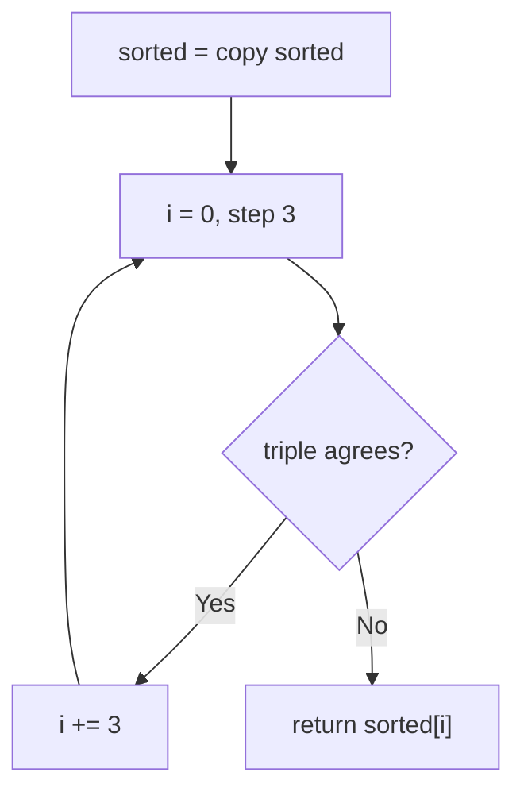
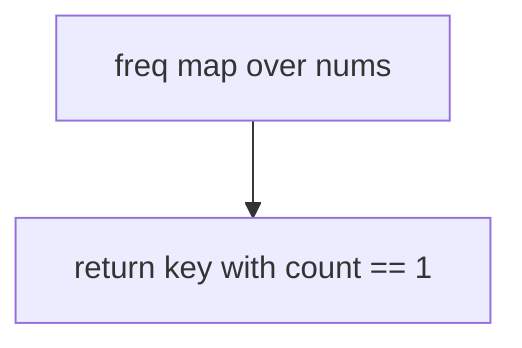
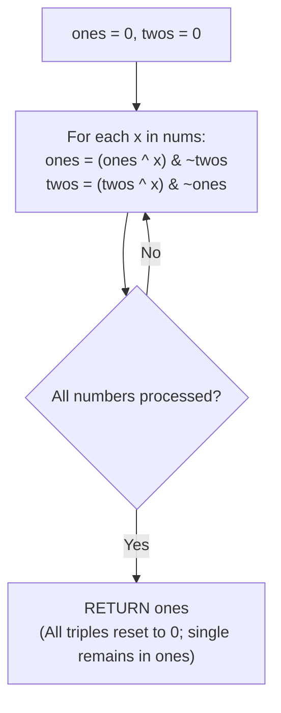

# 137. Single Number II

- **LeetCode Link**: `https://leetcode.com/problems/single-number-ii/`
- **Difficulty**: Medium
- **Pattern Category**: Bit Manipulation / Modular Bit Counting
- **Prerequisite Primer**: `00-foundations/01-js-interview-runtime-quirks.md`

---

## 1. Problem Overview & Edge Case Matrix

### Problem Statement
Given an integer array `nums` where every element appears three times except for one, which appears exactly once. Find the single element. Follow-up: implement with linear runtime and constant extra space.

```
Example 1:
Input: nums = [2,2,3,2]
Output: 3

Example 2:
Input: nums = [0,1,0,1,0,1,99]
Output: 99
```

### Visual Problem Representation
```
[2,2,3,2]:  binary: 10,10,11,10
  bit 0: three 0s... count: positions: bit0: 0+0+1+0 = 1 -> mod 3 = 1
  bit 1: 1+1+1+1 = 4 -> mod 3 = 1
  result bits: 11 = 3 ✓ (tripled bits vanish mod 3)
```

### Upfront Edge Case Matrix
| Edge Case Category | Specific Input Scenario | Expected Behavior | Pitfall / Risk |
| :--- | :--- | :--- | :--- |
| Single Element | `[2]` | Return `2` | Triple-step loop needing groups |
| Singleton zero | `[2,2,2,0]` | Return `0` | Falsy-value short-circuits |
| Negative singleton | `[-2,-2,-2,-3]` | Return `-3` | Sign-bit mod arithmetic |
| Zero tripled | `[0,0,0,5]` | Return `5` | Zero-count confusion |
| Large values | Near $\pm 2^{31}$ | Exact | 32-bit op truncation |

---

## 2. Level 1: Brute Force Approach

### Intuition & Visual Idea
Sort a copy, then walk triples: the first element disagreeing with its triple-mates is the singleton. $O(N \log N)$ — pairing generalized to tripling.



### Pseudocode
```text
FUNCTION singleNumberIIBruteForce(nums):
    sorted = SORTED-COPY(nums)
    FOR i IN 0, 3, 6, ... < sorted.LENGTH:
        IF sorted[i] != sorted[i+1] OR sorted[i] != sorted[i+2]:
            RETURN sorted[i]
```

### Step-by-Step Dry Run (Visual Trace)
| Step | Iteration / Pointer ($i, j$) | Current Value | State / Sub-array | Action Taken |
| :--- | :--- | :--- | :--- | :--- |
| 0 | sort `[2,2,3,2]` | `[2,2,2,3]` | Triples aligned | — |
| 1 | `i = 0` | `2 == 2 == 2` | Full triple | `i = 3` |
| 2 | `i = 3` | `3 != undefined` | Singleton (missing mates) | Return `3` |

### Modern JavaScript Implementation
```javascript
/**
 * Level 1: Brute Force (sort + triple scan)
 * Time Complexity:  O(N log N) — sort dominates
 * Space Complexity: O(N) — sorted copy
 */
function singleNumberIIBruteForce(nums) {
  // Copy first: the caller's order is none of our business.
  const sorted = [...nums].sort((a, b) => a - b);
  for (let i = 0; i < sorted.length; i += 3) {
    // A complete triple agrees twice; the singleton breaks the pattern.
    // At the tail, sorted[i+1]/[i+2] are undefined !== any number: still correct.
    if (sorted[i] !== sorted[i + 1] || sorted[i] !== sorted[i + 2]) return sorted[i];
  }
}
```

### Complexity Breakdown
- **Time Complexity**: $O(N \log N)$ — sort dominates.
- **Space Complexity**: $O(N)$ — the copy; counting needs no order at all.

---

## 3. Level 2: Optimized Approach

### Intuition & Visual Bottleneck Elimination
Hash-map frequency count, then return the key with count 1. $O(N)$ time, $O(N)$ space — the counting answer, meeting time but not space.



### Pseudocode
```text
FUNCTION singleNumberIIMap(nums):
    freq = EMPTY MAP
    FOR v IN nums: freq.SET(v, (freq.GET(v) ?? 0) + 1)
    FOR [v, c] IN freq:
        IF c == 1: RETURN v
```

### Step-by-Step Dry Run (Visual Trace)
| Step | Pointers / Window | Hash Map / Auxiliary State | Decision Logic | Output Accumulator |
| :--- | :--- | :--- | :--- | :--- |
| 0 | values `2,2,3,2` | `freq = {2:3, 3:1}` | Tally | — |
| 1 | scan entries | `2 → 3` (skip), `3 → 1` | Count-1 found | Return `3` |

### Modern JavaScript Implementation
```javascript
/**
 * Level 2: Optimized (frequency map)
 * Time Complexity:  O(N) — two linear passes
 * Space Complexity: O(N) — one entry per distinct value
 */
function singleNumberIIMap(nums) {
  const freq = new Map();
  for (const v of nums) freq.set(v, (freq.get(v) ?? 0) + 1);
  // Exactly one key holds count 1 (spec guarantee).
  for (const [v, c] of freq) {
    if (c === 1) return v;
  }
}
```

### Complexity Breakdown
- **Time Complexity**: $O(N)$ — two passes; meets the time follow-up.
- **Space Complexity**: $O(N)$ — the map; the space follow-up needs bit arithmetic.

---

## 4. Level 3: Most Optimal / Canonical Approach

### Intuition & Mathematical / Invariant Proof
Bitwise ones/twos state machine: `ones` holds bits seen $1 \bmod 3$ times, `twos` bits seen $2 \bmod 3$ times. Per value `v`: `ones = (ones ^ v) & ~twos` (add newcomers, drop bits graduating to twos); `twos = (twos ^ v) & ~ones` (add second-timers, drop bits graduating to threes — using the UPDATED `ones`, which is load-bearing). Third sightings vanish from both (mod-3 arithmetic per bit, in parallel across all 32 bits). At the end, `ones` IS the singleton. $O(N)$ time, $O(1)$ space — XOR's $K=2$ case generalized to ternary logic.

```
[2,2,3,2]: ones: 0->2->0->3->3? trace: v=2: ones=2,twos=0; v=2: ones=0,twos=2;
  v=3: ones=(0^3)&~2=3&~2=1, twos=(2^3)&~1=1&~1=0; v=2: ones=(1^2)&~0=3, twos=(0^2)&~3=0.
  return ones=3 ✓
```

### Pseudocode
```text
FUNCTION singleNumberII(nums):
    ones = 0; twos = 0   // bit-masks of mod-3 tallies (per-bit, in parallel)
    FOR v IN nums:
        ones = (ones ^ v) & ~twos    // newcomers in, graduates to twos out
        twos = (twos ^ v) & ~ones    // second-timers in, graduates to zero out
    RETURN ones
```

### Step-by-Step Dry Run (Visual Trace)
| Step | Pointer $L$ | Pointer $R$ | Invariant Checked | In-Place State |
| :--- | :--- | :--- | :--- | :--- |
| 1 | `v = 2` | `ones = 2`, `twos = 0` | Seen-once mask | — |
| 2 | `v = 2` | `ones = 0`, `twos = 2` | Graduated to twos | — |
| 3 | `v = 3` | `ones = 1`, `twos = 0` | Newcomer bit + graduate-out | — |
| 4 | `v = 2` | `ones = 3`, `twos = 0` | Singleton isolated | Return `3` |

### Modern JavaScript Implementation
```javascript
/**
 * Level 3: Most Optimal / Canonical (ones/twos ternary state machine)
 * Time Complexity:  O(N) — single pass, optimal lower bound
 * Space Complexity: O(1) auxiliary — two numbers
 */
function singleNumberII(nums) {
  // Per-bit mod-3 tallies, all 32 bits in parallel:
  // ones = bits seen 1-mod-3 times; twos = bits seen 2-mod-3 times.
  let ones = 0;
  let twos = 0;
  for (const v of nums) {
    // Add newcomers to ones, evicting bits that just graduated to twos.
    ones = (ones ^ v) & ~twos;
    // Add second-timers to twos, evicting bits that just graduated to zero.
    // NOTE: uses the UPDATED ones (order is load-bearing, not cosmetic).
    twos = (twos ^ v) & ~ones;
  }
  return ones; // thrice-seen bits vanished; the singleton's bits remain
}
```

### Complexity Breakdown
- **Time Complexity**: $O(N)$ — optimal lower bound; one constant-work step per element.
- **Space Complexity**: $O(1)$ auxiliary — two numbers; meets the full follow-up.

---

## 5. JavaScript-Specific Gotchas & V8 Optimizations
- **GC Pressure**: Avoid allocating objects inside tight loops ($O(N)$ closures). Level 1's sorted copy plus Level 2's `Map` (boxed entries) are the pressure Level 3 removes — two numbers, zero allocation.
- **Type Coercion / Sorting**: `^`, `&`, `~` coerce via ToInt32 — values past $\pm 2^{31}$ WRAP SILENTLY (spec range is int32, exact here; validate otherwise). `~twos` flips ALL 32 bits including the sign — correct within two's-complement masking (the algebra is sign-transparent), but never `~` a double expecting bignum behavior.
- **Index Bounds**: No indices — but the update ORDER (`ones` before `twos`, with `twos` reading updated `ones`) is load-bearing: swapping the lines (or snapshotting old `ones` for both) breaks the graduation chain and returns garbage on the second repeat. `?? 0` (not `|| 0`) for map counts — count `0` never occurs, but the habit prevents falsy-key bugs.

---

## 6. Real-World MAANG Interview Follow-Ups & Extensions

### Follow-Up 1: General K-duplicates (ones/twos/.../Ks machines)
- **Scenario**: Elements appear $K$ times except one (arbitrary $K$).
- **Solution Strategy**: Per-bit counting mod $K$ (loop 32 bits, $O(32N)$ — always correct, always simple); or $K$-state machines for small $K$ (this level IS $K = 3$). Prefer the bit loop in interviews unless $O(1)$-word tricks are demanded.
- **JS Code / Implementation Pattern**:
```javascript
function singleNumberK(nums, K) {
  let result = 0;
  for (let bit = 0; bit < 32; bit++) {
    let count = 0;
    for (const v of nums) count += (v >> bit) & 1;
    if (count % K !== 0) result |= 1 << bit;
  }
  return result;
}
```

### Follow-Up 2: Two singletons among triples (mixed multiplicities)
- **Scenario**: Two values appear once, rest thrice — isolate BOTH.
- **Solution Strategy**: XOR won't isolate (triples don't cancel under XOR)... precisely, mod-3 per-bit residues of the pair XOR narrow candidates; then partition by a differing bit (Single Number III's trick applied to residues). Advanced — state the reduction honestly.
- **JS Code / Implementation Pattern**:
```javascript
function twoSinglesAmongTriples(nums) {
  return partitionByResidueBit(nums); // mod-3 residues + differing-bit split
}
```

### Follow-Up 3: $10^9$-element stream with $O(1)$ RAM (telemetry dedup)
- **Scenario & In-Depth Solution**: Values stream once; only two numbers fit. Level 3 IS the streaming answer (order-free, incremental, constant state) — the same reason XOR streams in Single Number I. No other level adapts.
```javascript
async function streamSingleNumberII(numberStream) {
  let ones = 0, twos = 0;
  for await (const v of numberStream) {
    ones = (ones ^ v) & ~twos;
    twos = (twos ^ v) & ~ones;
  }
  return ones;
}
```

---

## 7. What LeetCode Discuss Says (Language-Independent)

Source: top-voted post by kamyu —
`https://leetcode.com/problems/single-number-ii/solutions/43295/detailed-explanation-and-generalization-i9d5p/`
— 183K views.
Language-independent summary. No new JS here.

### A. Optimal way from Discuss (Two-Bit Modulo-3 Bitwise State Machine)

Isolate the non-triplicated element by tracking the arrival frequency of set bits across all 32 bit positions simultaneously modulo 3:

1. **State Machine Formulation:**
   - Counting modulo 3 requires 3 distinct states per bit: $0 \to 1 \to 2 \to 0$.
   - A minimum of 2 state bits (`twos` and `ones`) are required to encode the count:
     - Count 0: `twos = 0, ones = 0`
     - Count 1: `twos = 0, ones = 1`
     - Count 2: `twos = 1, ones = 0`
     - Count 3 (reset): `twos = 0, ones = 0`
2. **Boolean Transition Equations:**
   - For every incoming number $x$:
     - `ones = (ones XOR x) AND (NOT twos)`
     - `twos = (twos XOR x) AND (NOT ones)`
   - On the 1st occurrence of a bit: `ones` becomes 1 while `twos` remains 0.
   - On the 2nd occurrence of a bit: `ones` resets to 0 while `twos` becomes 1.
   - On the 3rd occurrence of a bit: both `ones` and `twos` are forced back to 0.
3. **Extraction:**
   - Every number appearing 3 times completes the full cycle $0 \to 1 \to 2 \to 0$, leaving 0 in both state registers.
   - The unique element appears exactly once, remaining latched in `ones`.

```text
FUNCTION singleNumber(nums):
    ones = 0
    twos = 0
    FOR EACH x IN nums:
        ones = (ones XOR x) AND (NOT twos)
        twos = (twos XOR x) AND (NOT ones)
    RETURN ones
```

- Time: O(N) — single linear pass through the array with elementary bitwise operations.
- Space: O(1) — exactly two integer registers maintained in memory.



### B. Dry run on LeetCode Example 1 (`nums = [2, 2, 3, 2]`)

- In binary: $2 = 010_2$, $3 = 011_2$.
- Initial: `ones = 000_2, twos = 000_2`.
- **Process 1st `2` ($010_2$):**
  - `ones = (000 ^ 010) & ~000 = 010`
  - `twos = (000 ^ 010) & ~010 = 010 & 101 = 000`
  - State: `ones = 010, twos = 000` (count = 1).
- **Process 2nd `2` ($010_2$):**
  - `ones = (010 ^ 010) & ~000 = 000`
  - `twos = (000 ^ 010) & ~000 = 010`
  - State: `ones = 000, twos = 010` (count = 2).
- **Process 1st `3` ($011_2$):**
  - Bit 0 arrives for 1st time; Bit 1 arrives for 3rd time (transitions $2 \to 0$).
  - `ones = (000 ^ 011) & ~010 = 011 & 101 = 001`
  - `twos = (010 ^ 011) & ~001 = 001 & 110 = 000`
  - State: `ones = 001, twos = 000`.
- **Process 3rd `2` ($010_2$):**
  - `ones = (001 ^ 010) & ~000 = 011`
  - `twos = (000 ^ 010) & ~011 = 010 & 100 = 000`
- Final result: `ones = 011_2 = 3`.

### C. Why Bitwise Counters Beat Bit-Iteration Loops

- Summing bits along 32 separate iterations requires $32 \times N$ loop cycles.
- The two-bit state machine evaluates all 32 bit positions in parallel in 6 bitwise CPU instructions per element, operating in $1 \times N$ time.

### D. Pitfalls from comments

- **Update Ordering:** `twos` must evaluate using the newly computed `ones` value. Computing both from the prior iteration values requires a different boolean formula.
- **Negative Number Handling:** In languages with signed integers, bitwise operations naturally operate on two's complement representations without extra conditional logic for negative numbers.

### E. Companies

- Discuss post itself names none.
  Companies tab on LeetCode is premium-locked.
- External source:
  `https://github.com/liquidslr/leetcode-company-wise-problems`
  (LeetCode company tags, updated June 2025).
- All-time (8): Amazon, Bloomberg, Google, Meta, Microsoft, Oracle, Siemens, Zomato.
- Recent: 30 days — None.
- Recent: 3 months — Amazon, Bloomberg, Google, Microsoft.
