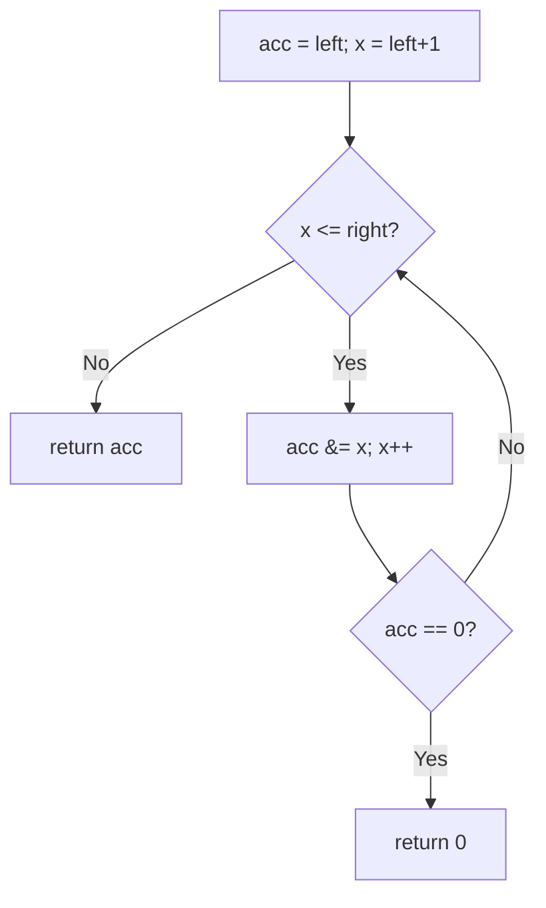
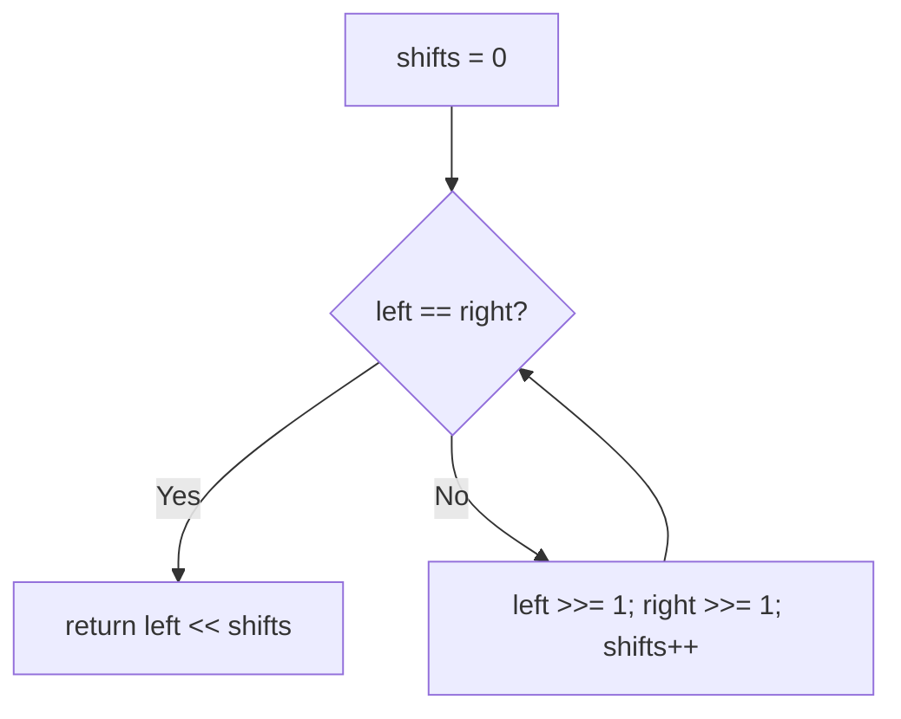

# 201. Bitwise AND of Numbers Range

- **LeetCode Link**: `https://leetcode.com/problems/bitwise-and-of-numbers-range/`
- **Difficulty**: Medium
- **Pattern Category**: Bit Manipulation / Common Prefix
- **Prerequisite Primer**: `00-foundations/01-js-interview-runtime-quirks.md`

---

## 1. Problem Overview & Edge Case Matrix

### Problem Statement
Given two integers `left` and `right` with `left <= right` and `0 <= left, right <= 2³¹ - 1`, return the bitwise AND of all numbers in the range `[left, right]`.

```
Example 1:
Input: left = 5, right = 7
Output: 4
Explanation: 5 & 6 & 7 = 101 & 110 & 111 = 100 = 4.

Example 2:
Input: left = 0, right = 0
Output: 0

Example 3:
Input: left = 1, right = 2147483647
Output: 0
```

### Visual Problem Representation
```
[5,7]:   101
         110      low two bits cycle 01,10,11 across the range -> 0
         111      high bit 1 stable throughout -> 1
         ---      AND = 100 = 4 (common prefix + trailing zeros)
```

### Upfront Edge Case Matrix
| Edge Case Category | Specific Input Scenario | Expected Behavior | Pitfall / Risk |
| :--- | :--- | :--- | :--- |
| Single value | `left == right` | Return the value | Loop needing a range |
| Zero range | `[0,0]` | Return `0` | Falsy-value short-circuits |
| Full span | `[1, 2³¹−1]` | Return `0` (bit 0 flips) | Iterating billions |
| Power boundary | `[8,15]` vs `[8,8]` | `8` vs `8`... `[8,15]` → `8` | Trailing-zero count |
| Max values | Near $2^{31}-1$ | Exact | 32-bit signed op overflow |

---

## 2. Level 1: Brute Force Approach

### Intuition & Visual Idea
AND every number from `left` to `right`, with early exit on zero (absorbing element — nothing recovers from 0). $O(N)$ in range length — fine for tiny ranges, hopeless across billions.



### Pseudocode
```text
FUNCTION rangeBitwiseAndBruteForce(left, right):
    acc = left
    FOR x IN left+1 .. right:
        acc &= x
        IF acc == 0: RETURN 0   // absorbing: AND can only clear more bits
    RETURN acc
```

### Step-by-Step Dry Run (Visual Trace)
| Step | Iteration / Pointer ($i, j$) | Current Value | State / Sub-array | Action Taken |
| :--- | :--- | :--- | :--- | :--- |
| 0 | `acc = 5` | `101` | Seed | — |
| 1 | `x = 6` | `101 & 110 = 100` | Nonzero, continue | `acc = 4` |
| 2 | `x = 7` | `100 & 111 = 100` | Nonzero, continue | `acc = 4` |
| 3 | exhausted | — | — | Return `4` |

### Modern JavaScript Implementation
```javascript
/**
 * Level 1: Brute Force (range fold with zero bailout)
 * Time Complexity:  O(right - left) — billions at max range
 * Space Complexity: O(1) — one accumulator
 */
function rangeBitwiseAndBruteForce(left, right) {
  let acc = left;
  for (let x = left + 1; x <= right; x++) {
    acc &= x;
    // Zero is absorbing under AND: later values can only keep it zero.
    if (acc === 0) return 0;
  }
  return acc;
}
```

### Complexity Breakdown
- **Time Complexity**: $O(\text{right} - \text{left})$ — linear in range length; billions worst case.
- **Space Complexity**: $O(1)$ — single accumulator; time is the catastrophe.

---

## 3. Level 2: Optimized Approach

### Intuition & Visual Bottleneck Elimination
Common-prefix shifts: right-shift both ends until equal (dropping the fluctuating low bits), counting shifts, then shift back. The differing suffix ANDs to zero somewhere in the range — only the shared prefix survives. $O(\log N)$ time, $O(1)$ space.



### Pseudocode
```text
FUNCTION rangeBitwiseAndShifts(left, right):
    shifts = 0
    WHILE left < right:
        left >>= 1; right >>= 1; shifts++
    RETURN left << shifts
```

### Step-by-Step Dry Run (Visual Trace)
| Step | Pointers / Window | Hash Map / Auxiliary State | Decision Logic | Output Accumulator |
| :--- | :--- | :--- | :--- | :--- |
| 0 | `(5, 7)` | differ | Shift both | `shifts = 1`, `(2, 3)` |
| 1 | `(2, 3)` | differ | Shift both | `shifts = 2`, `(1, 1)` |
| 2 | `(1, 1)` | equal | Stop | `1 << 2 = 4` |

### Modern JavaScript Implementation
```javascript
/**
 * Level 2: Optimized (common-prefix shift convergence)
 * Time Complexity:  O(log N) — one shift per bit position
 * Space Complexity: O(1) — two numbers plus a counter
 */
function rangeBitwiseAndShifts(left, right) {
  let shifts = 0;
  // Converge: each shift drops one fluctuating low bit from both ends.
  // (Use >>> for unsigned safety at the 2^31 boundary; >> is exact here
  // since inputs are non-negative int32, but >>> states the intent.)
  while (left < right) {
    left >>>= 1;
    right >>>= 1;
    shifts++;
  }
  // Restore: the converged prefix relocates to its original position.
  return left << shifts;
}
```

### Complexity Breakdown
- **Time Complexity**: $O(\log N)$ — one iteration per bit.
- **Space Complexity**: $O(1)$ — two numbers; the shift-back is exact (see below).

---

## 4. Level 3: Most Optimal / Canonical Approach

### Intuition & Mathematical / Invariant Proof
Brian Kernighan descent on the right end: `n = n & (n-1)` clears the lowest set bit — repeating until `n ≤ m` strips exactly the bits that fluctuate across `[m, n]$. Why: any bit that differs anywhere in the range ANDs to 0, and the lowest set bit of the current `n` always has a smaller in-range number missing it (flip it to 0, keep higher bits — still `≥ m`... precisely, `n - lowbit(n) ≥ m` keeps the loop honest; when it drops below `m`, all remaining set bits are stable across the range). Invariant: the answer for the ORIGINAL range equals the answer for `[m, current-n]$ at every step (cleared bits contributed 0). Terminates with `n` = the common prefix itself = the AND. Same $O(\log N)$ as Level 2, fewer moving parts, no shifts back.

```
[5,7]: n=7 (111): 7&6 = 6 (110) > 5, continue; 6&5 = 4 (100) <= 5, stop -> 4
[1,2³¹-1]: n descends billions of values... in O(bits) steps? Each step clears
  a set bit: at most 31 iterations. The RANGE length never matters.
```

### Pseudocode
```text
FUNCTION rangeBitwiseAnd(left, right):
    n = right
    WHILE n > left:
        n = n & (n - 1)   // amputate the lowest set bit (fluctuating bits die)
    RETURN n
```

### Step-by-Step Dry Run (Visual Trace)
| Step | Pointer $L$ | Pointer $R$ | Invariant Checked | In-Place State |
| :--- | :--- | :--- | :--- | :--- |
| 1 | `m = 5` | `n = 7 (111)` | `7 > 5`: clear lowbit | `n = 6 (110)` |
| 2 | `m = 5` | `n = 6 (110)` | `6 > 5`: clear lowbit | `n = 4 (100)` |
| 3 | `m = 5` | `n = 4` | `4 > 5`? No: stop | Return `4` |

### Modern JavaScript Implementation
```javascript
/**
 * Level 3: Most Optimal / Canonical (Kernighan descent on the right end)
 * Time Complexity:  O(log N) — at most 31 amputations
 * Space Complexity: O(1) auxiliary — one number
 */
function rangeBitwiseAnd(left, right) {
  let n = right;
  // Strip fluctuating bits from the right until inside/level with left:
  // every cleared bit differs somewhere in [left, right], contributing 0.
  while (n > left) {
    n &= n - 1; // amputate the lowest set bit (cf. Number of 1 Bits L3)
  }
  return n;
}
```

### Complexity Breakdown
- **Time Complexity**: $O(\log N)$ — optimal; at most 31 iterations regardless of range length.
- **Space Complexity**: $O(1)$ auxiliary — one number; no shifts, no counters.

---

## 5. JavaScript-Specific Gotchas & V8 Optimizations
- **GC Pressure**: Avoid allocating objects inside tight loops ($O(N)$ closures). All levels allocate nothing per step — Level 1's cost is pure iteration count, not allocation.
- **Type Coercion / Sorting**: Bitwise ops coerce via ToInt32 — inputs ARE int32 per spec (exact), but `n - 1` at `n = 0`... loop guard `n > left ≥ 0` prevents underflow to `-1` (which would loop: `-1 & -2 = -2`, still `> left`? `-2 > 0` false — terminates, but only by luck of signed comparison; the guard order is what keeps it principled). `left << shifts` (Level 2) is exact because the result stays `< 2³¹`... precisely because the converged prefix shifted back cannot exceed the original `right`.
- **Index Bounds**: No indices — but `m`/`n` naming (vs `left`/`right`) must stay consistent per file; the `while (n > left)` STRICT inequality is load-bearing (`>=` would clear one bit too many when `n == left`, destroying the exact-hit case).

---

## 6. Real-World MAANG Interview Follow-Ups & Extensions

### Follow-Up 1: OR / XOR over ranges (sibling queries)
- **Scenario**: Bitwise OR (or XOR) of all numbers in `[left, right]`.
- **Solution Strategy**: OR: common-prefix logic inverts (any bit set ANYWHERE in range survives — find via highest differing bit: answer = next-power-of-two-minus-1 above... precisely, OR = common prefix of left/right with all lower bits set). XOR: pattern repeats every 4 (n%4 trick) — range XOR = `f(right) ^ f(left-1)`.
- **JS Code / Implementation Pattern**:
```javascript
function rangeBitwiseXor(left, right) {
  const fx = (n) => [n, 1, n + 1, 0][n % 4]; // xor(0..n) periodicity
  return fx(right) ^ fx(left - 1);
}
```

### Follow-Up 2: $10^9$ range queries offline (Mo's / prefix structure)
- **Scenario**: Many `[l, r]` AND-queries over a static array (not a contiguous integer range).
- **Solution Strategy**: Sparse table for idempotent ops — but AND over ARBITRARY subarrays isn't prefix-invertible; sparse table gives $O(1)$ per query after $O(N \log N)$ build. Different problem (range query vs integer range) — name the distinction.
- **JS Code / Implementation Pattern**:
```javascript
function sparseTableRangeAnd(arr, queries) {
  return rangeQueryStructure(arr, queries, (a, b) => a & b); // idempotent => sparse table
}
```

### Follow-Up 3: $10^18$-scale ranges with BigInt kernels
- **Scenario & In-Depth Solution**: Bounds past $2^{53}$ (or 64-bit words) — JS bitwise truncates to 32 bits. BigInt ports of Levels 2–3 (`>>`, `&`, `- 1n`) are exact at any width; same loop shapes, `n` suffixes.
```javascript
function rangeBitwiseAndBig(left, right) {
  let n = BigInt(right);
  const m = BigInt(left);
  while (n > m) n &= n - 1n;
  return n;
}
```
