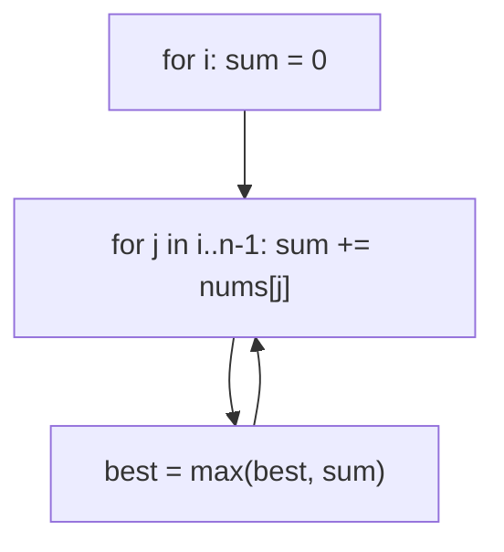
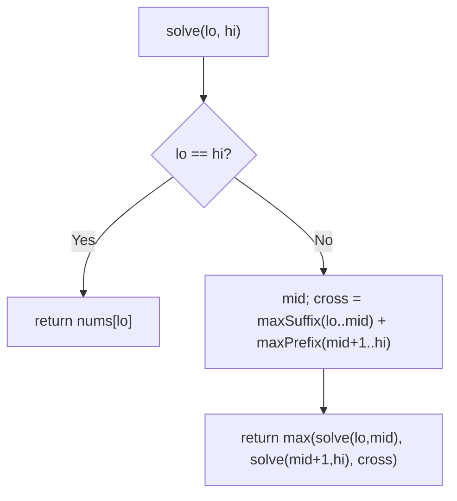
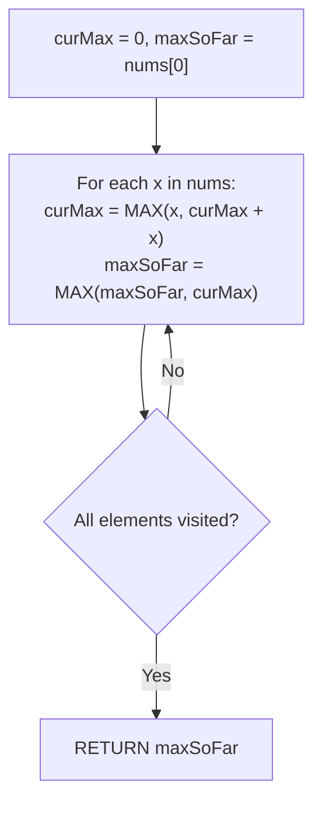

# 53. Maximum Subarray

- **LeetCode Link**: `https://leetcode.com/problems/maximum-subarray/`
- **Difficulty**: Medium
- **Pattern Category**: Kadane's Algorithm / Maximum Segment
- **Prerequisite Primer**: `00-foundations/03-core-algorithmic-patterns.md`

---

## 1. Problem Overview & Edge Case Matrix

### Problem Statement
Given an integer array `nums`, find the subarray with the largest sum, and return its sum. A subarray is a contiguous non-empty sequence.

```
Example 1:
Input: nums = [-2,1,-3,4,-1,2,1,-5,4]
Output: 6
Explanation: [4,-1,2,1] sums to 6.

Example 2:
Input: nums = [1]
Output: 1

Example 3:
Input: nums = [5,4,-1,7,8]
Output: 23
```

### Visual Problem Representation
```
[-2, 1,-3, 4,-1, 2, 1,-5, 4]:  running best:
   -2 -> 1 -> 1 -> 4 -> 4 -> 6 -> 6 -> 6 -> 6   (answer 6)
```

### Upfront Edge Case Matrix
| Edge Case Category | Specific Input Scenario | Expected Behavior | Pitfall / Risk |
| :--- | :--- | :--- | :--- |
| Single Element | `[1]` / `[-1]` | Return the element | Loop needing pairs |
| All negative | `[-3,-2,-1]` | Return `-1` (least bad) | `0`-seeded best (empty subarray) |
| All positive | `[5,4,7,8]` | Whole-array sum | Reset logic misfiring |
| Zeros mixed | `[0,-1,0]` | Return `0` | Falsy-value short-circuits |
| Large values | Near $\pm 10^4$ × $10^5$ length | Exact sum | 32-bit overflow in fixed-width langs |

---

## 2. Level 1: Brute Force Approach

### Intuition & Visual Idea
Enumerate every subarray `[i..j]`, sum each, track the max. $O(N^2)$ (with running inner sums — $O(N^3)$ with re-summation; we use the running variant, still quadratic).



### Pseudocode
```text
FUNCTION maxSubArrayBruteForce(nums):
    best = -Infinity
    FOR i IN 0 .. n-1:
        sum = 0
        FOR j IN i .. n-1:
            sum += nums[j]
            best = MAX(best, sum)
    RETURN best
```

### Step-by-Step Dry Run (Visual Trace)
| Step | Iteration / Pointer ($i, j$) | Current Value | State / Sub-array | Action Taken |
| :--- | :--- | :--- | :--- | :--- |
| 0 | `i = 0` | sums `-2,-1,-4,0,…` | Best climbs slowly | Inner loop |
| 1 | `i = 3` | `4,3,5,6,1,5` | `best = 6` at `j = 6` | Record |
| 2 | remaining starts | no improvement | — | Return `6` |

### Modern JavaScript Implementation
```javascript
/**
 * Level 1: Brute Force (all-subarray enumeration)
 * Time Complexity:  O(N²) — running inner sums (O(N³) with re-summation)
 * Space Complexity: O(1) — two numbers
 */
function maxSubArrayBruteForce(nums) {
  // -Infinity seed (NOT 0): all-negative inputs must return the least-bad element.
  let best = -Infinity;
  for (let i = 0; i < nums.length; i++) {
    let sum = 0;
    for (let j = i; j < nums.length; j++) {
      sum += nums[j]; // extend (never recompute from scratch)
      if (sum > best) best = sum;
    }
  }
  return best;
}
```

### Complexity Breakdown
- **Time Complexity**: $O(N^2)$ — all subarrays enumerated.
- **Space Complexity**: $O(1)$ — two numbers; time is the failure.

---

## 3. Level 2: Optimized Approach

### Intuition & Visual Bottleneck Elimination
Divide and conquer: max subarray lies in the left half, right half, or crossing the middle (max suffix of left + max prefix of right). $O(N \log N)$ — the recurrence that names the technique family.



### Pseudocode
```text
FUNCTION maxSubArrayDivideConquer(nums):
    DEFINE crossSum(lo, mid, hi):
        leftBest = -Infinity; sum = 0
        FOR i FROM mid DOWNTO lo: sum += nums[i]; leftBest = MAX(leftBest, sum)
        rightBest = -Infinity; sum = 0
        FOR i FROM mid+1 TO hi: sum += nums[i]; rightBest = MAX(rightBest, sum)
        RETURN leftBest + rightBest
    DEFINE solve(lo, hi):
        IF lo == hi: RETURN nums[lo]
        mid = (lo + hi) >> 1
        RETURN MAX(solve(lo,mid), solve(mid+1,hi), crossSum(lo,mid,hi))
    RETURN solve(0, n-1)
```

### Step-by-Step Dry Run (Visual Trace)
| Step | Pointers / Window | Hash Map / Auxiliary State | Decision Logic | Output Accumulator |
| :--- | :--- | :--- | :--- | :--- |
| 0 | `solve(0, 8)` | mid `4` | Cross vs halves | Recurse |
| 1 | cross at mid `4` | left-suffix `4`, right-prefix `2` | Cross `= 6` | Candidate |
| 2 | halves recurse | smaller crosses | Max propagates | `6` wins |
| 3 | unwind | — | — | Return `6` |

### Modern JavaScript Implementation
```javascript
/**
 * Level 2: Optimized (divide-and-conquer with crossing sums)
 * Time Complexity:  O(N log N) — linear cross work per level
 * Space Complexity: O(log N) — call stack depth
 */
function maxSubArrayDivideConquer(nums) {
  function crossSum(lo, mid, hi) {
    // Best suffix ending AT mid (must touch the middle from the left).
    let leftBest = -Infinity;
    let sum = 0;
    for (let i = mid; i >= lo; i--) {
      sum += nums[i];
      if (sum > leftBest) leftBest = sum;
    }
    // Best prefix starting AFTER mid (must touch the middle from the right).
    let rightBest = -Infinity;
    sum = 0;
    for (let i = mid + 1; i <= hi; i++) {
      sum += nums[i];
      if (sum > rightBest) rightBest = sum;
    }
    return leftBest + rightBest;
  }
  function solve(lo, hi) {
    if (lo === hi) return nums[lo]; // single element: itself
    const mid = (lo + hi) >> 1;
    // Max lives left, right, or straddling the middle: check all three.
    return Math.max(solve(lo, mid), solve(mid + 1, hi), crossSum(lo, mid, hi));
  }
  return solve(0, nums.length - 1);
}
```

### Complexity Breakdown
- **Time Complexity**: $O(N \log N)$ — linear cross work per level.
- **Space Complexity**: $O(\log N)$ — stack depth; the greedy pass needs none.

---

## 4. Level 3: Most Optimal / Canonical Approach

### Intuition & Mathematical / Invariant Proof
Kadane's rule: extend the running subarray while it helps, restart at the current element when it doesn't — `cur = max(v, cur + v)`, `best = max(best, cur)`. Invariant: `cur` always equals the maximum subarray sum ENDING at the current position (either extend the best ending earlier, or start fresh — those are the only two ways to end here), and `best` is the max over all endings so far. One pass, $O(1)$ space. Seeding both with `nums[0]` (not 0) handles all-negative inputs exactly.

```
[-2,1,-3,4,-1,2,1,-5,4]: cur: -2,1,-2,4,3,5,6,1,5; best: -2,1,1,4,4,6,6,6,6
```

### Pseudocode
```text
FUNCTION maxSubArray(nums):
    best = nums[0]; cur = nums[0]
    FOR v IN nums[1..]:
        cur = MAX(v, cur + v)    // start fresh or extend?
        best = MAX(best, cur)    // record the best ending anywhere
    RETURN best
```

### Step-by-Step Dry Run (Visual Trace)
| Step | Pointer $L$ | Pointer $R$ | Invariant Checked | In-Place State |
| :--- | :--- | :--- | :--- | :--- |
| 1 | `v = -2` | seed | `cur = best = -2` | Start |
| 2 | `v = 1` | `max(1, -2+1) = 1` | Restart beats extend | `cur = 1`, `best = 1` |
| 3 | `v = -3` | `max(-3, 1-3) = -2` | Extend (less bad) | `cur = -2` |
| 4 | `v = 4` → `2,1` → … | `cur` climbs to `6` | `best = 6` | Return `6` |

### Modern JavaScript Implementation
```javascript
/**
 * Level 3: Most Optimal / Canonical (Kadane's rule)
 * Time Complexity:  O(N) — single pass, optimal lower bound
 * Space Complexity: O(1) auxiliary — two numbers
 */
function maxSubArray(nums) {
  // Seed with nums[0] (NOT 0): all-negative inputs return the least-bad element.
  let best = nums[0];
  let cur = nums[0]; // best subarray sum ENDING at the previous position
  for (let i = 1; i < nums.length; i++) {
    // Extend the running subarray, or restart here — whichever is better.
    cur = Math.max(nums[i], cur + nums[i]);
    if (cur > best) best = cur;
  }
  return best;
}
```

### Complexity Breakdown
- **Time Complexity**: $O(N)$ — optimal lower bound; each element folded once.
- **Space Complexity**: $O(1)$ auxiliary — two numbers; the algorithm the module is named for.

---

## 5. JavaScript-Specific Gotchas & V8 Optimizations
- **GC Pressure**: Avoid allocating objects inside tight loops ($O(N)$ closures). All levels allocate nothing per step — Level 1's cost is iteration count, not allocation; never slice subarrays per start index.
- **Type Coercion / Sorting**: `Math.max(v, cur + v)` with numbers — but `undefined + v` is `NaN` (poisons `best` forever since comparisons with `NaN` are false); the `nums[0]` seeds (not index-1 reads) dodge empty-prefix `undefined`.
- **Index Bounds**: No indices in Level 3 (offset loop from 1) — seeding `best = 0` instead of `nums[0]` is THE classic bug (returns 0 for all-negative). The empty-array case is out of spec (non-empty guaranteed); guard at the boundary if callers disagree.

---

## 6. Real-World MAANG Interview Follow-Ups & Extensions

### Follow-Up 1: Return the subarray (indices), not just the sum
- **Scenario**: Report `[start, end]` of an optimal subarray.
- **Solution Strategy**: Track the running start (reset when restarting) and record best bounds on improvement — same loop, two extra variables.
- **JS Code / Implementation Pattern**:
```javascript
function maxSubArrayBounds(nums) {
  let best = nums[0], cur = nums[0], start = 0, bestL = 0, bestR = 0;
  for (let i = 1; i < nums.length; i++) {
    if (nums[i] > cur + nums[i]) {
      cur = nums[i];
      start = i; // restart: new candidate begins here
    } else {
      cur += nums[i];
    }
    if (cur > best) {
      best = cur;
      bestL = start;
      bestR = i;
    }
  }
  return { sum: best, range: [bestL, bestR] };
}
```

### Follow-Up 2: Circular arrays (Maximum Sum Circular Subarray)
- **Scenario**: Subarrays may wrap around the end (LeetCode 918, next guide).
- **Solution Strategy**: Answer = max(linear Kadane, total − min-subarray) with the all-negative guard — Level 3's kernel run twice (max and min), composed once.
- **JS Code / Implementation Pattern**:
```javascript
function maxCircularReview(nums) {
  return maxSubarraySumCircular(nums); // next guide's Level 3
}
```

### Follow-Up 3: $10^9$-element stream with $O(1)$ RAM (telemetry peaks)
- **Scenario & In-Depth Solution**: Values stream once; only running state fits. Level 3 IS the streaming answer (two numbers, order-free... precisely order-DEPENDENT but single-pass) — emit the running best per tick for live dashboards.
```javascript
async function* streamingMaxSubarray(numberStream) {
  let best = -Infinity, cur = -Infinity, started = false;
  for await (const v of numberStream) {
    cur = !started ? v : Math.max(v, cur + v);
    started = true;
    if (cur > best) best = cur;
    yield best;
  }
}
```

---

## 7. What LeetCode Discuss Says (Language-Independent)

Source: top-voted post by Abhishek —
`https://leetcode.com/problems/maximum-subarray/solutions/1595195/cpython-7-simple-solutions-w-explanation-kb6j/`
— 360.5K views.
Language-independent summary. No new JS here.

### A. Optimal way from Discuss (Kadane's Dynamic Programming Algorithm)

Find the maximum sum contiguous subarray in a single linear pass by discarding negative running prefixes:

1. **Dynamic Programming Recurrence:**
   - Define $dp[i]$ as the maximum subarray sum that strictly terminates at index $i$.
   - At each element $nums[i]$, we decide between:
     - Extending the prefix ending at $i - 1$: $dp[i - 1] + nums[i]$
     - Starting a fresh subarray at $i$: $nums[i]$
   - Transition equation:
     $$dp[i] = \max(nums[i], dp[i - 1] + nums[i])$$
2. **Space Optimization to $O(1)$:**
   - Because $dp[i]$ depends only on $dp[i - 1]$, maintain two scalar variables:
     - `curMax`: maximum subarray sum ending at the current position.
     - `maxSoFar`: global maximum subarray sum observed across all positions so far.
   - For every element $x \in nums$:
     - `curMax = max(x, curMax + x)`
     - `maxSoFar = max(maxSoFar, curMax)`
   - Return `maxSoFar`.

```text
FUNCTION maxSubArray(nums):
    curMax = 0
    maxSoFar = nums[0]

    FOR EACH x IN nums:
        curMax = MAX(x, curMax + x)
        maxSoFar = MAX(maxSoFar, curMax)

    RETURN maxSoFar
```

- Time: O(N) — single pass scanning through the array of length $N$.
- Space: O(1) — requires only two scalar variables for running accumulator state.



### B. Dry run on LeetCode Example 1 (`nums = [-2, 1, -3, 4, -1, 2, 1, -5, 4]`)

- Initial state: `curMax = 0, maxSoFar = -2`.
- Step 0 ($x = -2$): `curMax = max(-2, -2) = -2`, `maxSoFar = -2`.
- Step 1 ($x = 1$): `curMax = max(1, -1) = 1`, `maxSoFar = 1`.
- Step 2 ($x = -3$): `curMax = max(-3, -2) = -2`, `maxSoFar = 1`.
- Step 3 ($x = 4$): `curMax = max(4, 2) = 4`, `maxSoFar = 4`.
- Step 4 ($x = -1$): `curMax = max(-1, 3) = 3`, `maxSoFar = 4`.
- Step 5 ($x = 2$): `curMax = max(2, 5) = 5`, `maxSoFar = 5`.
- Step 6 ($x = 1$): `curMax = max(1, 6) = 6`, `maxSoFar = 6`.
- Step 7 ($x = -5$): `curMax = max(-5, 1) = 1`, `maxSoFar = 6`.
- Step 8 ($x = 4$): `curMax = max(4, 5) = 5`, `maxSoFar = 6`.
- Result: `6` (corresponding to contiguous slice `[4, -1, 2, 1]`).

### C. Why Negative Prefix Resetting Is Mathematically Optimal

- If a prefix has a strictly negative sum ($\sum < 0$), attaching it to any subsequent subarray strictly degrades that subarray's sum.
- Discarding negative prefixes and restarting accumulation immediately at the next element guarantees that no suboptimal drag is carried forward.

### D. Pitfalls from comments

- **All-Negative Arrays Trap:** Initializing `maxSoFar = 0` causes the function to return 0 when the entire input array is negative (e.g. `[-3, -2, -5]`). Because the problem requires a non-empty subarray, initializing `maxSoFar = nums[0]` or `-Infinity` is strictly required.
- **Premature Reset:** Resetting before updating `maxSoFar` on single negative values will produce incorrect maximums.

### E. Companies

- Discuss post itself names none.
  Companies tab on LeetCode is premium-locked.
- External source:
  `https://github.com/liquidslr/leetcode-company-wise-problems`
  (LeetCode company tags, updated June 2025).
- All-time (61): Accenture, Accolite, Amazon, Apple, Arista Networks, Atlassian, Autodesk, Bloomberg, ByteDance, Cisco, Citadel, Cognizant, Coupang, Criteo, Dell, Deloitte, EPAM Systems, Goldman Sachs, Google, HCL, Huawei, IBM, Infosys, Intel, LinkedIn, Media.net, Meesho, Meta, Microsoft, Morgan Stanley, Nike, Nvidia, Oracle, PayPal, PhonePe, Salesforce, Samsung, SAP, ServiceNow, Sprinklr, Squarepoint Capital, Swiggy, Target, tcs, Tech Mahindra, Tekion, Tesla, TikTok, Turing, Two Sigma, Uber, Upstart, Vimeo, Visa, Walmart Labs, Wells Fargo, Wix, Yandex, Zeta, Zoho, Zomato.
- Recent: 30 days — Amazon, Infosys, Microsoft, Upstart.
- Recent: 3 months — Amazon, Bloomberg, Google, Infosys, Meta, Microsoft, tcs, Upstart.
