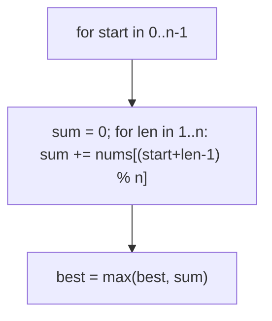
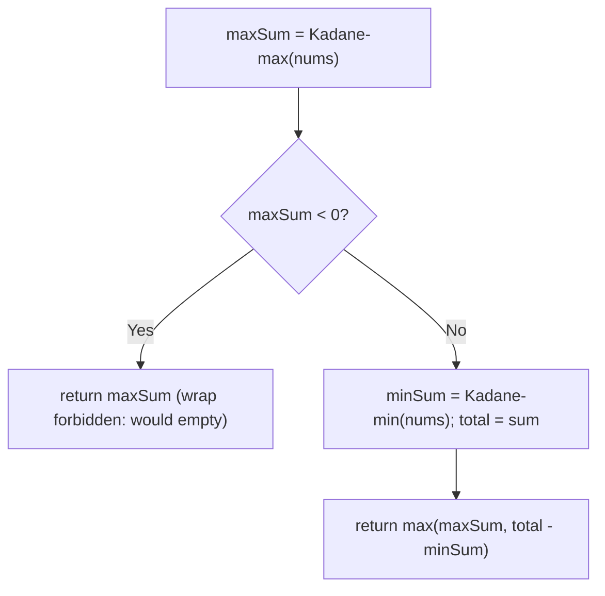
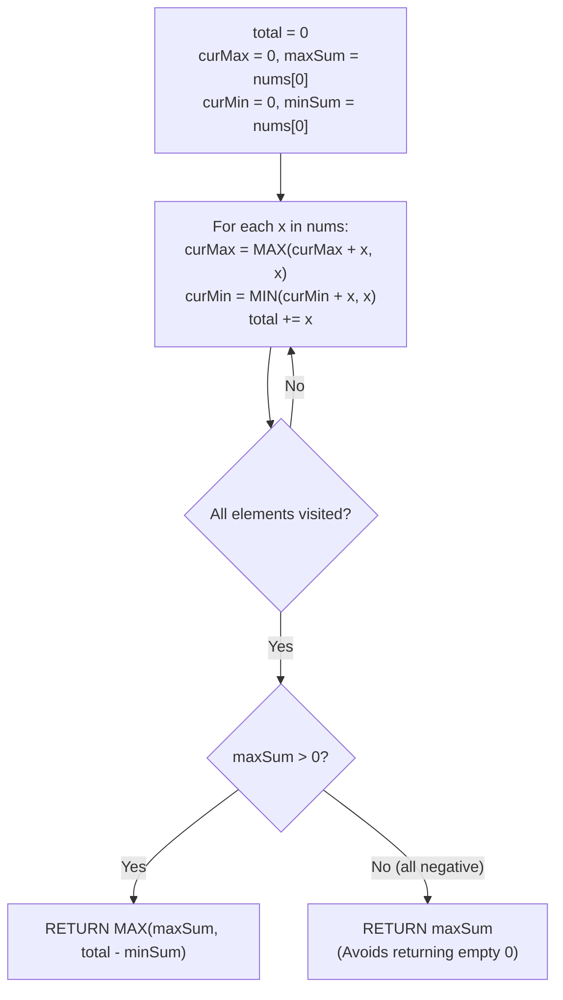

# 918. Maximum Sum Circular Subarray

- **LeetCode Link**: `https://leetcode.com/problems/maximum-sum-circular-subarray/`
- **Difficulty**: Medium
- **Pattern Category**: Kadane's Algorithm / Circular Extension
- **Prerequisite Primer**: `00-foundations/03-core-algorithmic-patterns.md`

---

## 1. Problem Overview & Edge Case Matrix

### Problem Statement
Given a circular integer array `nums` of length `n`, return the maximum possible sum of a non-empty subarray of `nums`. A circular array means the end connects to the beginning — a subarray may wrap around (e.g. `[5,-3,5]` has circular max `5 + 5 = 10` via the wrap).

```
Example 1:
Input: nums = [1,-2,3,-2]
Output: 3
Explanation: Subarray [3] (non-wrapping) wins.

Example 2:
Input: nums = [5,-3,5]
Output: 10
Explanation: Subarray [5,5] wrapping around (positions 2,0).

Example 3:
Input: nums = [-3,-2,-3]
Output: -2
Explanation: All negative — least bad element (no empty subarray allowed).
```

### Visual Problem Representation
```
[5,-3,5]:  linear best = 5; circular = total(7) - min-subarray(-3) = 10
           the wrap EXCLUDES exactly one contiguous (minimum) middle block
```

### Upfront Edge Case Matrix
| Edge Case Category | Specific Input Scenario | Expected Behavior | Pitfall / Risk |
| :--- | :--- | :--- | :--- |
| All negative | `[-3,-2,-3]` | Return `-2` (not `0`/empty) | `total - min` wrongly giving `0` |
| Single Element | `[5]` / `[-5]` | Return the element | Wrap logic on length 1 |
| All positive | `[5,5,5]` | Whole array (or wrap-equivalent) | Min-subarray eating everything |
| Non-wrapping wins | `[1,-2,3,-2]` | Return `3` | Forcing the wrap |
| Zeros present | `[0,0,0]` | Return `0` | Falsy-value short-circuits |

---

## 2. Level 1: Brute Force Approach

### Intuition & Visual Idea
Try every start with every length $1..n$ (modular indexing for wraparound), tracking the max. $O(N^2)$ — correct, quadratic.



### Pseudocode
```text
FUNCTION maxSubarraySumCircularBruteForce(nums):
    n = nums.LENGTH; best = -Infinity
    FOR start IN 0 .. n-1:
        sum = 0
        FOR len IN 1 .. n:
            sum += nums[(start + len - 1) MOD n]
            best = MAX(best, sum)
    RETURN best
```

### Step-by-Step Dry Run (Visual Trace)
| Step | Iteration / Pointer ($i, j$) | Current Value | State / Sub-array | Action Taken |
| :--- | :--- | :--- | :--- | :--- |
| 0 | start `0` | sums `5, 2, 7` | `[5], [5,-3], [5,-3,5]` | Best `7` |
| 1 | start `1` | sums `-3, 2` | `[-3], [-3,5]` | No improvement |
| 2 | start `2` | sums `5, 10` | `[5], [5,5]` wrap! | Best `10` |
| 3 | return | — | — | Return `10` |

### Modern JavaScript Implementation
```javascript
/**
 * Level 1: Brute Force (all starts × all lengths, modular)
 * Time Complexity:  O(N²) — n starts, n lengths each
 * Space Complexity: O(1) — two numbers
 */
function maxSubarraySumCircularBruteForce(nums) {
  const n = nums.length;
  // -Infinity seed (NOT 0): all-negative inputs return the least-bad element.
  let best = -Infinity;
  for (let start = 0; start < n; start++) {
    let sum = 0;
    for (let len = 1; len <= n; len++) {
      // Modular indexing: the wrap is just arithmetic, no array doubling.
      sum += nums[(start + len - 1) % n];
      if (sum > best) best = sum;
    }
  }
  return best;
}
```

### Complexity Breakdown
- **Time Complexity**: $O(N^2)$ — quadratic starts × lengths.
- **Space Complexity**: $O(1)$ — two numbers; time is the failure.

---

## 3. Level 2: Optimized Approach

### Intuition & Visual Bottleneck Elimination
Two separate Kadane runs (max-subarray + min-subarray) composed once: answer = max(linear max, total − linear min), with the all-negative guard (when max < 0, the wrap would illegally empty the array). $O(N)$ time, $O(1)$ space — clear, correct, two passes.



### Pseudocode
```text
FUNCTION kadaneMax(nums): standard max-ending-here fold, seeded nums[0]
FUNCTION kadaneMin(nums): mirror with MIN, seeded nums[0]

FUNCTION maxSubarraySumCircularTwoPass(nums):
    maxSum = kadaneMax(nums)
    IF maxSum < 0: RETURN maxSum   // all negative: wraparound illegal
    total = SUM(nums)
    minSum = kadaneMin(nums)
    RETURN MAX(maxSum, total - minSum)
```

### Step-by-Step Dry Run (Visual Trace)
| Step | Pointers / Window | Hash Map / Auxiliary State | Decision Logic | Output Accumulator |
| :--- | :--- | :--- | :--- | :--- |
| 0 | Kadane-max on `[5,-3,5]` | `maxSum = 5` | Non-negative, proceed | — |
| 1 | total `7`, Kadane-min | `minSum = -3` | Wrap candidate `7-(-3) = 10` | — |
| 2 | compare | `max(5, 10)` | Wrap wins | Return `10` |
| 3 | `[-3,-2,-3]` | `maxSum = -2 < 0` | Guard fires | Return `-2` |

### Modern JavaScript Implementation
```javascript
/**
 * Level 2: Optimized (dual Kadane + wrap composition)
 * Time Complexity:  O(N) — three linear passes (max, min, total)
 * Space Complexity: O(1) — running numbers
 */
function kadaneMax(nums) {
  // Maximum subarray sum (Maximum Subarray L3 kernel).
  let best = nums[0];
  let cur = nums[0];
  for (let i = 1; i < nums.length; i++) {
    cur = Math.max(nums[i], cur + nums[i]);
    if (cur > best) best = cur;
  }
  return best;
}

function kadaneMin(nums) {
  // Mirror image: minimum subarray sum (signs flipped throughout).
  let best = nums[0];
  let cur = nums[0];
  for (let i = 1; i < nums.length; i++) {
    cur = Math.min(nums[i], cur + nums[i]);
    if (cur < best) best = cur;
  }
  return best;
}

function maxSubarraySumCircularTwoPass(nums) {
  const maxSum = kadaneMax(nums);
  // All negative: the wrap (total - min) would select the EMPTY array.
  // Non-empty is required, so the linear answer stands unchallenged.
  if (maxSum < 0) return maxSum;
  const total = nums.reduce((a, v) => a + v, 0);
  // Wrapping max = everything EXCEPT the minimum middle block.
  return Math.max(maxSum, total - kadaneMin(nums));
}
```

### Complexity Breakdown
- **Time Complexity**: $O(N)$ — three linear passes.
- **Space Complexity**: $O(1)$ — running numbers; passes fuse into one.

---

## 4. Level 3: Most Optimal / Canonical Approach

### Intuition & Mathematical / Invariant Proof
Single-pass dual Kadane: track max-ending/max-so-far AND min-ending/min-so-far plus the total in ONE loop, then compose identically (with the same all-negative guard). Invariant: after each element, all four running values are exact for the processed prefix (max and min folds are independent — one loop serves both). Same $O(N)$ bound as Level 2 with one-third the passes. This is the canonical interview answer.

### Pseudocode
```text
FUNCTION maxSubarraySumCircular(nums):
    total = nums[0]
    maxSum = nums[0]; curMax = nums[0]
    minSum = nums[0]; curMin = nums[0]
    FOR v IN nums[1..]:
        curMax = MAX(v, curMax + v); maxSum = MAX(maxSum, curMax)
        curMin = MIN(v, curMin + v); minSum = MIN(minSum, curMin)
        total += v
    IF maxSum < 0: RETURN maxSum
    RETURN MAX(maxSum, total - minSum)
```

### Step-by-Step Dry Run (Visual Trace)
| Step | Pointer $L$ | Pointer $R$ | Invariant Checked | In-Place State |
| :--- | :--- | :--- | :--- | :--- |
| 1 | seed `v = 5` | `max = min = cur = 5`, `total = 5` | Base | — |
| 2 | `v = -3` | `curMax = 2`, `max = 5`; `curMin = -3`, `min = -3` | Folds exact | `total = 2` |
| 3 | `v = 5` | `curMax = 7`, `max = 7`; `curMin = 2`, `min` holds `-3` | Global min preserved | `total = 7` |
| 4 | compose | `maxSum = 7 ≥ 0` | `max(7, 7-(-3)) = 10` | Return `10` |

### Modern JavaScript Implementation
```javascript
/**
 * Level 3: Most Optimal / Canonical (single-pass dual Kadane)
 * Time Complexity:  O(N) — one pass, optimal lower bound
 * Space Complexity: O(1) auxiliary — five numbers
 */
function maxSubarraySumCircular(nums) {
  // Seeded from nums[0] (NOT 0): all-negative inputs stay exact throughout.
  let total = nums[0];
  let maxSum = nums[0];
  let curMax = nums[0];
  let minSum = nums[0];
  let curMin = nums[0];
  for (let i = 1; i < nums.length; i++) {
    const v = nums[i];
    // Max fold and min fold are independent: one loop serves both.
    curMax = Math.max(v, curMax + v);
    if (curMax > maxSum) maxSum = curMax;
    curMin = Math.min(v, curMin + v);
    if (curMin < minSum) minSum = curMin;
    total += v;
  }
  // All negative: wraparound would empty the array (forbidden) — linear stands.
  if (maxSum < 0) return maxSum;
  return Math.max(maxSum, total - minSum);
}
```

### Complexity Breakdown
- **Time Complexity**: $O(N)$ — optimal lower bound; one pass, constant work each.
- **Space Complexity**: $O(1)$ auxiliary — five numbers; no arrays, no passes to spare.

---

## 5. JavaScript-Specific Gotchas & V8 Optimizations
- **GC Pressure**: Avoid allocating objects inside tight loops ($O(N)$ closures). All levels allocate nothing per step — Level 1's cost is iteration count, not allocation; never materialize doubled arrays for wraparound (modular indexing suffices).
- **Type Coercion / Sorting**: `maxSum < 0` (strict) gates the wrap — `<= 0` would also fire on all-zero inputs (harmless there: `total - min = 0` either way, but the guard's MEANING is "all-negative", so state it exactly). `reduce` without an initial value throws on empty (spec guarantees non-empty; guard at the boundary otherwise).
- **Index Bounds**: Seeded-from-`nums[0]` loops start at index `1` — starting at `0` double-counts the first element into `total` and both folds. The `min`/`max` helpers in Level 2 take full arrays (not indices) — keep helper signatures uniform to avoid seed confusion.

---

## 6. Real-World MAANG Interview Follow-Ups & Extensions

### Follow-Up 1: Circular constraint variants (at most one wrap / K wraps)
- **Scenario**: Allow at most one wrap, or exactly $K$ wraps (repeated array $K$ times).
- **Solution Strategy**: One wrap = Level 3 as-is; $K$ wraps of an $N$-array = Kadane on the $K$-tiled array in $O(K·N)$... better: prefix/suffix bests compose across tiles in $O(N)$ (tile the running folds, not the array).
- **JS Code / Implementation Pattern**:
```javascript
function maxSubarrayKTiles(nums, K) {
  return tiledKadane(nums, K); // prefix/suffix composition across tiles
}
```

### Follow-Up 2: $10^9$-element circular stream with $O(1)$ RAM
- **Scenario**: Values stream once (circularity known only at end); only running state fits.
- **Solution Strategy**: Level 3 IS streaming-shaped except the all-negative guard needs no lookahead either (it reads `maxSum` at the end) — run the five-number fold online, compose at stream end. $O(1)$ RAM, single pass.
- **JS Code / Implementation Pattern**:
```javascript
async function streamingCircularMax(numberStream) {
  return onlineDualKadane(numberStream); // Level 3 over awaited values
}
```

### Follow-Up 3: Maximum circular subarray with length constraints
- **Scenario & In-Depth Solution**: Wrap allowed but length bounded (`len ≤ L`, or `len ≥ L`). Monotonic-deque prefix minima/maxima over the doubled array with a sliding window — $O(N)$ time, $O(N)$ deque. The deque replaces the closed-form wrap identity when constraints bind.
```javascript
function boundedCircularMax(nums, L) {
  return dequeConstrainedMax(nums, L); // sliding-window prefix extrema
}
```

---

## 7. What LeetCode Discuss Says (Language-Independent)

Source: top-voted post by lee215 —
`https://leetcode.com/problems/maximum-sum-circular-subarray/solutions/178422/one-pass-by-lee215-navi/`
— 91.6K views.
Language-independent summary. No new JS here.

### A. Optimal way from Discuss (Dual Kadane One-Pass: Total Sum Minus Minimum Subarray)

Solve the circular maximum subarray problem in a single pass by combining standard Kadane with its inverted minimum dual:

1. **Two Spatial Cases:**
   - **Case 1 (Non-circular / Interior):** The optimal subarray does not wrap across the circular boundary. Its sum is found by standard linear Kadane: `maxSum`.
   - **Case 2 (Circular / Boundary Wrap):** The optimal subarray wraps around the ends, consisting of an array prefix and an array suffix. Because the elements outside this wrap form a contiguous interior subarray:
     $$\max(\text{prefix} + \text{suffix}) = \text{totalSum} - \min(\text{contiguous interior subarray})$$
     Maximizing the circular wrap is equivalent to minimizing the interior subarray (`minSum`).
2. **Single Pass Accumulation:**
   - In a single iteration over `nums`, track:
     - Standard maximum subarray: `curMax = max(x, curMax + x)`, `maxSum = max(maxSum, curMax)`
     - Inverted minimum subarray: `curMin = min(x, curMin + x)`, `minSum = min(minSum, curMin)`
     - Total sum: `total += x`
3. **The All-Negative Array Boundary:**
   - If every number in `nums` is negative, `maxSum < 0` and the minimum subarray spans the entire array (`minSum == total`).
   - Evaluating `total - minSum` produces 0, representing an empty subarray (forbidden by problem constraints).
   - Guard check: If `maxSum > 0`, return `max(maxSum, total - minSum)`. Otherwise, return `maxSum`.

```text
FUNCTION maxSubarraySumCircular(nums):
    total = 0
    maxSum = nums[0]
    curMax = 0
    minSum = nums[0]
    curMin = 0

    FOR EACH x IN nums:
        curMax = MAX(curMax + x, x)
        maxSum = MAX(maxSum, curMax)

        curMin = MIN(curMin + x, x)
        minSum = MIN(minSum, curMin)

        total = total + x

    IF maxSum > 0:
        RETURN MAX(maxSum, total - minSum)
    ELSE:
        RETURN maxSum
```

- Time: O(N) — single pass scanning through array of length $N$.
- Space: O(1) — five scalar registers maintained throughout the loop.



### B. Dry run on LeetCode Example 1 (`nums = [1, -2, 3, -2]`)

- $x = 1$: `curMax = 1, maxSum = 1`, `curMin = 1, minSum = 1`, `total = 1`.
- $x = -2$: `curMax = -1, maxSum = 1`, `curMin = -2, minSum = -2`, `total = -1`.
- $x = 3$: `curMax = 3, maxSum = 3`, `curMin = 1, minSum = -2`, `total = 2`.
- $x = -2$: `curMax = 1, maxSum = 3`, `curMin = -2, minSum = -2`, `total = 0`.
- At conclusion: `total = 0`, `maxSum = 3`, `minSum = -2`.
- `maxSum > 0` condition holds $\implies \max(3, 0 - (-2)) = \max(3, 2) = 3$.

### C. Why Total - Min Subarray Works

- Partitioning a circular sequence into a wrapped subarray and an unwrapped subarray divides the complete set of indices $\{0, \dots, N-1\}$.
- Because $\text{Sum}(\text{wrap}) + \text{Sum}(\text{interior}) = \text{totalSum}$, subtracting the minimum possible interior sum directly isolates the maximum possible wrap sum.

### D. Pitfalls from comments

- **The All-Negative Array Trap:** When all elements are negative, `total == minSum`, causing `total - minSum = 0`. Returning 0 corresponds to selecting an empty subarray. The conditional `maxSum > 0 ? ... : maxSum` ensures the single least-negative element is returned.
- **Array Doubling Fallacy:** Simply concatenating `nums` to `nums` and applying standard Kadane fails because Kadane may accumulate a subarray exceeding $N$ elements, which double-counts elements and is invalid.

### E. Companies

- Discuss post itself names none.
  Companies tab on LeetCode is premium-locked.
- External source:
  `https://github.com/liquidslr/leetcode-company-wise-problems`
  (LeetCode company tags, updated June 2025).
- All-time (12): Amazon, Apple, Bloomberg, Goldman Sachs, Google, Infosys, MakeMyTrip, Meta, Microsoft, Sprinklr, TikTok, Two Sigma.
- Recent: 30 days — Amazon.
- Recent: 3 months — Amazon, Google.
