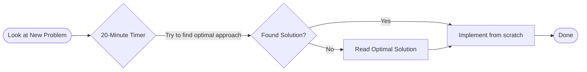
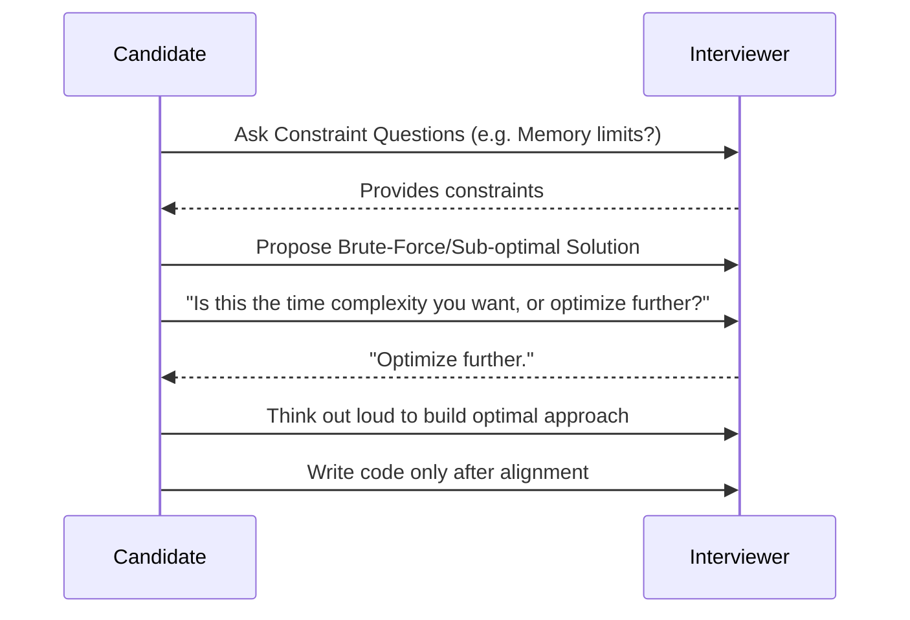

# How They Actually Did It: SDE-1 Interview Strategies

Based on scraping and analyzing actual accounts from developers who recently cracked Amazon, Google, Flipkart, and Oracle SDE-1 roles for high packages (20L-30LPA+), here is the breakdown of what successful candidates did differently.

---

## 1. The Strategy: Pattern Recognition > Brute Solving
A common theme across the successful candidates was that they **did not waste time trying to invent solutions.**

 
*   **The 20-Minute Rule:** Candidates like Aman (cracked Amazon & Flipkart) explicitly set a timer for 20 minutes when looking at a new DSA problem. If they couldn't find the optimal approach within that time, they immediately read the solution.
*   **Implementation Focus:** Instead of just reading the solution and moving on, they forced themselves to *implement* the new approach from scratch (often in C++ using STL). 
*   **The Insight:** Interviews don't test if you are an algorithm researcher. They test if you are familiar with a standard toolbox of data structures and can apply them under pressure.

## 2. The Routine: Extreme Consistency
A Google SDE-1 candidate (Venkatesh) shared his exact daily routine over a 5-month period:

| Time | Activity | Description |
| :--- | :--- | :--- |
| **8:30 AM** | Morning Warmup | Read a DSA problem before work, keeping it in mind to process mentally. |
| **4:00 PM - 8:00 PM** | "Sacred Time" | Strictly dedicated to Gym + DSA. |

*   **The Insight:** It took him 4 attempts to crack a Tier 1 company. The people who get these roles don't cram in 2 weeks; they build a 60 to 90-day unbroken habit where problem-solving becomes part of their daily life.

## 3. The Filter: "Machine Coding" / Low-Level Design (LLD)
For high-paying Unicorns (like Flipkart, Uber, Atlassian), pure DSA is not enough.
*   **The Challenge:** Candidates are given a problem statement (e.g., "Build an in-memory Parking Lot system") and 90 minutes to write working, object-oriented code.
*   **What successful candidates did:** They practiced setting up their local IDEs, quickly scaffolding projects, and writing clean, modular code with SOLID principles. Aman noted that going into a Machine Coding round without practicing the exact 90-minute format locally is a recipe for failure.

## 4. The Interview Mindset: Thinking Out Loud
In the Amazon and Google interviews, candidates highlighted that getting the right answer silently means you fail.

*   **Clarification Phase:** They spent the first 5 minutes purely asking constraint questions (e.g., "Will the array fit in memory?", "Are there negative numbers?").
*   **Feedback Loop:** They treated the interviewer as a teammate. If they proposed an $O(N^2)$ solution, they would ask the interviewer, "Is this the time complexity you are looking for, or should I optimize further?" before writing a single line of code.

## 5. Amazon's "Bar Raiser" & Behavioral Prep
For Amazon specifically, almost all candidates emphasized the Leadership Principles (LPs).
*   **The STAR Method:** They prepared a grid of 4-5 core personal stories from their past projects and mapped them to the 16 Amazon LPs (e.g., "Customer Obsession", "Deliver Results"). 
*   **The Insight:** They practiced speaking these stories out loud. Technical skills get you to the final round, but the behavioral "Bar Raiser" round is what dictates whether you get the offer and what base salary bracket you fall into.

---

### How to apply this to your 60-Day Bootcamp:
1.  **Strict 20-Minute Cutoff:** During your "Deep Work 1 & 3 (Logic)" blocks, do not stare at LeetCode problems for an hour. If you don't see the pattern in 20 mins, read the solution, close it, and code it from memory.
2.  **Machine Coding Practice:** Use your "Deep Work 4 (Building)" blocks to not just build your Agent Orchestration app loosely, but to practice building features with strict OOP principles in 90-minute timed sprints.
3.  **Vocalize Everything:** As scheduled in your "Verbal & Prep" block, you must speak out loud. The stories, the algorithms, and the system designs. Silence is your enemy in a 30 LPA interview.

<strong>Expand Podcast Analyses</strong>

## Podcast Analysis 1: How I Cracked FAANG Interviews (5 LPA → 50 LPA)
**Video Source:** [YouTube - Anubhav Sethi](https://www.youtube.com/watch?v=cfjvEy-GK8o)

### Overview
This transcript breaks down a highly systematic, 7-step approach to securing high-paying SDE roles (like a massive 10x CTC jump to ₹50 LPA). The candidate highlights that most people fail because they prepare the wrong way, focusing on quantity rather than structured strategy. 

### The 7-Step Strategy Breakdown

#### Step 1: Target Definition & Market Research
*   **The Approach:** Do not apply blindly. Identify the specific role switch (e.g., SDE-1 to SDE-2, Front-end to Back-end) and have solid reasoning for the switch.
*   **Salary Benchmarking:** Before interviewing, thoroughly research the industry benchmark for the target role using `levels.fyi` and the LeetCode compensation discussion sections. This builds negotiation leverage for the HR rounds and filters out companies that won't meet your CTC expectations.

#### Step 2: Quality Over Quantity (The Pattern Method)
*   **The Trap:** Stop asking "Is 400 LeetCode questions enough?". It's a useless metric because you can't predict the exact question.
*   **The Fix:** Categorize all DSA problems into ~10 core patterns (Binary Search, Sliding Window, DP, Graphs/Trees, Two Pointers, Greedy, etc.).
*   **The Execution:** Solve exactly 10 to 15 problems per pattern, one pattern at a time, to build strong pattern recognition under pressure. Start with the Blind 75 or LeetCode 150 as an icebreaker.

#### Step 3: Thinking Out Loud (The Dealbreaker)
*   **The Brutal Truth:** "Silence kills interviews. Perfect code will not save you later."
*   **The Fix:** Most rejections happen because the interviewer cannot hear the candidate's logical reasoning. Train yourself to constantly speak your thoughts out loud *even while practicing alone*. 

#### Step 4: System Design - The Real Way
*   **The Trap:** Memorizing architectures (like boxes and arrows) for standard problems.
*   **The Fix:** Spend the first 5 to 10 minutes gathering Functional and Non-Functional Requirements. Define what is *out of scope*.
*   **The Discussion:** Focus heavily on Trade-offs (CAP Theorem, PACELC theorem). Explicitly discuss why a NoSQL database fits better than a SQL database for the specific scale instead of just drawing an architecture block. For SDE-2 roles, prioritize latency constraints over memory.

#### Step 5: Resume Tailoring & Defense
*   **The Approach:** A generic resume will fail. Tailor the resume to the specific Job Description (JD) to pass ATS systems.
*   **The Rule:** If you cannot defend the "what" and "why" of a bullet point, remove it. Do not lie on your resume. 
*   **The Insight:** Sometimes your resume dictates the interview. For example, the candidate was asked to design a "Distributed Rate Limiter" during an Amazon system design round simply because it was listed as a project on his resume.

#### Step 6: Mocks with Feedback
*   **The Truth:** Mock interviews are more important than real ones.
*   **The Reason:** They reveal where you over-complicate things, where you confuse yourself, and where your timing is off. "Without a mock, you're like the gym guy who always skips leg day."

#### Step 7: Preparing with a Full-Time Job
*   **The Approach:** You will never have "enough" time. 
*   **The Execution:** Consistency beats long weekend grinds. Do 15 to 30 minutes daily. Short, consistent, and structured prep is the only way to manage interview prep alongside a 9-to-5 job.

---
*Status: 1/15 Videos Analyzed. Ready to process the remaining 14 videos upon confirmation.*
## Podcast Analysis 2: Do THIS To Crack Google In 2026 | Ft. Google Engineers | Vivek Gupta
**Video Source:** [YouTube - Vivek Gupta](https://www.youtube.com/watch?v=FrRjf9muIyY)

### 1. What the candidate did DIFFERENTLY to stand out
*   **Priyam (ML Role):** Worked on a side project mentored by a DeepMind scientist while at his previous company (American Express) to prove he was a serious ML candidate. Instead of cold-messaging for referrals, he would read papers published by Googlers and email them with genuine insights and comments about their work to build a relationship before asking for a referral.
*   **Lakshya:** Leveraged his strong brand value from working at Zomato and built a unique "Rubik's Cube solver" DSA project for AlgoZenith that added significant credibility to his resume.
*   **Priyabrata (Intern/New Grad):** Achieved the "Guardian" rank on LeetCode and solved over 1,200 problems. He also took on freelance work and worked under a mentor for projects during college to build actual work experience, which helped bypass the typical fresher resume screening.

### 2. How they secured referrals that actually converted
*   **Referrals are necessary but not sufficient:** They noted that "everyone has a referral" now. Just getting one doesn't guarantee a callback.
*   **Direct Recruiter Outreach:** Priyam stayed in constant touch with recruiters via email, regularly asking for updates on roles and the hiring pipeline, even when there were no immediate openings.
*   **Organic Networking:** Engaging with employees about their specific work or research (rather than just begging for a referral) led to employees actively vouching for them internally, which carries much more weight.
*   **Internal Pushes:** Having a contact already inside Google who can reach out to the recruiter internally to ask for feedback or push the application forward was cited as highly effective when applications stalled.

### 3. What projects they did to stand out
*   **DSA-Heavy Projects:** A "Rubik's Cube Solver" was specifically mentioned by both Lakshya and Priyabrata as a standout project that impressed interviewers and proved strong algorithmic skills.
*   **ML Portfolio (Priyam):** Emphasized that ML roles are heavily "portfolio-driven." He suggested having projects that match the current hype cycle (e.g., AI agents, LLM chain calls, prompt engineering) but ensuring foundational machine learning and deep learning concepts are clearly demonstrated.
*   **Full-Stack + AI:** Priyabrata recommended having at least one solid Full-Stack + AI project on the resume for product-based companies.

### 4. How they approached the interview
*   **Technical (DSA):**
    *   Google's DSA rounds typically start with a Medium question and quickly follow up with a Medium-Hard variation. There is a strict 45-minute limit.
    *   They practiced using a plain Google Doc (with auto-complete and auto-capitalization turned off) for the last few weeks of prep, to simulate Google's internal coding tool which lacks syntax highlighting.
    *   They heavily relied on past interview experiences (LeetCode discussion forums and GitHub repos like "awesome-leetcode-resources"). They recommended solving 50-60 recently asked Google questions, noting that questions frequently repeat.
    *   *In-interview execution:* Asking clarifying questions to clear up intentionally ambiguous prompts, thinking out loud continuously, and using meaningful variable names (snake_case).
*   **ML Design (Priyam):**
    *   Given real-world scenarios (e.g., detecting rare events via live camera feeds) and asked to convert them into ML problems.
    *   Focused on identifying bottlenecks (latency, data scarcity, synthetic data creation) and making trade-offs. Deep MLOps/scaling wasn't the main focus, but inherently unscalable ideas would be challenged.
*   **Behavioral (Googliness):**
    *   Lakshya used a platform called "Hello Interview" to prepare and structure stories for this round, ensuring he had clear evidence of impact and learnings for his past experiences.

### 5. Negotiation strategies and frameworks they used or recommended
*   **Interview Performance Dictates Leverage:** Google's compensation flexibility and the ease of team matching depend almost entirely on interview scores (e.g., getting "Strong Hire" vs. "Lean Hire").
*   **Competing Offers:** Google only entertains competing offers for negotiation if they are from top-tier peer companies (like Meta or Uber). They will not match or negotiate based on offers from companies like Zomato.

### 6. Any other unique frameworks, daily routines, or tips mentioned
*   **The "0-1 Game" Mental Model:** Treat job applications as binary—you either have the offer (1) or you don't (0). Even if you've completed 5 out of 6 rounds, you aren't "80% there," you are still at 0. This framework helps manage expectations and reduces the emotional pain of long delays or rejections.
*   **Long-Term Career View:** Treat your career as a 10-20 year journey. If you miss out on Google as a fresher (which is currently very difficult unless you are from a top IIT), you can build credibility elsewhere and enter as an L4 lateral hire later.
*   **Intern Conversion Tip:** To guarantee a PPO (Pre-Placement Offer), don't just complete your assigned project. Find and fix bugs in your project area on your own, contribute code to your host's other projects, and build strong relationships across the team.
*   **Patience:** The Google interview and team-matching process is notoriously slow and random, sometimes taking up to a year from application to offer.
## Podcast Analysis 2: How to Crack Google SDE Interview in 2025 | Salary, Resume Tips, Referrals & Googliness Round
**Video Source:** [YouTube - Fraz](https://www.youtube.com/watch?v=7ov9m7iioxg)

### 1. What the candidate did DIFFERENTLY to stand out
- **Inbound Recruiting via LinkedIn**: Instead of just applying, they focused heavily on attracting recruiters by maintaining a strong LinkedIn profile that positioned them as a "good problem solver." They included their competitive coding handles on their profile and consistently wrote posts documenting their learning journey to increase visibility. This strategy led to recruiters reaching out to them directly three times.
- **Impact-Driven Resume**: They focused on quantifying their work by including specific numbers in their experience and project sections (e.g., "I increased the coach to customer ratio by 25% by implementing an important feature called habit journey") to clearly show impact rather than just listing responsibilities.

### 2. How they secured referrals that actually converted
- **Targeted Approach**: First, go to the career portal and identify the exact job posting and Job ID that matches your profile and experience level.
- **Crisp Outreach**: Reach out to current employees on LinkedIn with a very short, crisp message. Do not send long paragraphs.
- **Demonstrate Preparedness**: Explicitly state your level of preparation in the message to build confidence (e.g., "I have solved 500 questions on LeetCode and feel confident I can crack the interview").
- **Provide Necessary Details**: Always include the exact Job ID, your resume, and your preparation stats.
- **Volume**: Message at least 10 to 20 employees to ensure you get a few responses.

### 3. What projects they did to stand out
The speaker did not detail their personal standalone projects in the video. However, they highlighted a specific feature they built at a past job called "Habit Journey," which they used as a primary example of how to frame impactful work on a resume.

### 4. How they approached the interview
**Technical (DSA & System Design)**:
- **Clarify & Listen**: Listen carefully and ask clarifying questions first, as interviewers sometimes intentionally leave gaps in the problem statement.
- **Speed to Brute Force**: Explain the brute force approach (including time and space complexity) within the first 5 minutes without getting bogged down in implementation details.
- **Think Aloud**: Build towards the optimal approach while actively thinking out loud so the interviewer can evaluate your thought process and offer hints if needed.
- **Test Before Coding**: Dry run the optimal approach with a test case (even if not explicitly asked to do so).
- **Code Quality**: Code the final solution (on Google Docs for Google). Maintain strict consistency with naming conventions (camelCase or snake_case), ensure meaningful variable names, and write clean, readable code with absolutely no syntax errors.
- **Time Management**: During practice, explicitly set timers: 20 minutes for medium questions and 40 minutes for hard questions.

**Behavioral (Googliness Round)**:
- **Framework**: Used the **STAR method** (Situation, Task, Action, Result) to give structured answers to situational and ethical questions (e.g., "How would you handle a manager asking you to do something unethical?").

*Note: Machine coding rounds were not mentioned in this transcript.*

### 5. Negotiation strategies and frameworks they used or recommended
- **Never Give the First Number**: Always ask the recruiter to share their offer first. Tell them you "trust the company and the process to give the best offer."
- **Data-Backed Counter**: Only negotiate after receiving the initial offer, and base it on market standards. Research recent compensation trends on platforms like LeetCode compensation threads and Levels.fyi for the specific level you are targeting (e.g., L3 or L4).
- **A Personal Mistake to Avoid**: The speaker shared a personal failure where they equated their previous startup ESOPs to actual liquid stocks during negotiation. Because their previous ESOP value was low, they were lowballed on the Google stock grant. 

### 6. Any other unique frameworks, daily routines, or tips mentioned
- **The "3 C's" of Resumes**: Keep the resume to a single page and follow three rules: Concise, Clean, and Consistent.
- **Recruiter Priority Funnel**: A recruiter revealed they look at resumes in this specific order: Experience -> College Tier -> Projects/Coding Profiles. If you are from a Tier-3 college, you must overcompensate with strong competitive programming profiles (LeetCode, Codeforces, CodeChef) and impressive projects.
- **Google Salary Bands**: The speaker highlighted that Google operates on strict salary bands for each level (e.g., 50 to 70 Lakhs). No matter how bad you are at negotiating, you won't get less than the band minimum, and no matter what your previous salary was, you won't get more than the band maximum.
## Podcast Analysis 3: FASTEST Way To Get a Software Engineering Job (No Experience)
**Source Video URL:** [YouTube - 9Vay7JdLA5s](https://www.youtube.com/watch?v=9Vay7JdLA5s)

### 1. What the candidate did DIFFERENTLY to stand out
- **Contrarian Thinking / Inversion:** Instead of asking "How can I get hired with no experience?", he suggests asking "How could I not get immediately rejected?".
- **Spinning Low-Barrier Experiences:** He took an unpaid IT internship in high school where he simply carried broken computers to a dumpster, but spun it on his resume as an "IT internship" to make it past the experience filter.
- **Targeting Small Businesses & Creators:** Instead of just mass applying, he recommends reaching out to small businesses or solo entrepreneurs (like small YouTubers) to offer free data analysis or to rebuild outdated websites (PHP/WordPress/Squarespace) to build real-world experience. 
- **Niching Down / Specificity:** Rather than just learning common languages like Python and JavaScript like everyone else, he recommends finding a niche. He specifically called out learning **Go** (mentioning Microsoft's rewrite of the TypeScript compiler) or specific niche systems like **Odoo** (an ERP/CRM system) to stand out to employers looking for specialized skills.

### 2. How they secured referrals that actually converted
- **Not explicitly detailed in this video.** He briefly mentions to "keep on asking for referrals" and try to set up "informational interviews". He teasers another video at the very end titled "how I got over a hundred Fang referrals with zero connections," but the actual strategies are not discussed in this transcript.

### 3. What projects they did to stand out
- **High School Unpaid IT Internship:** Carrying broken computers from a hospital basement to a dumpster (spun as an IT internship).
- **Recommended Projects for Viewers:** 
  - Doing data analysis for a smaller YouTube creator (analyzing trends in views, optimizing funnels, managing budget).
  - Redesigning outdated websites for small local businesses. Even if they decline, you build it anyway and offer it for free to use in your portfolio.
  - Participating in hackathons to simulate the urgency of production-level software and build a project over a weekend.

### 4. How they approached the interview
- **Technical Interview:** For non-traditional/bootcamp candidates targeting smaller companies, LeetCode (DSA) interviews are less common. Instead, expect **take-home assignments, case studies, or debugging/pair programming sessions** with an engineer. You must be 100% prepared to walk through every line of code of any project on your resume.
- **Behavioral Interview:** Since there may be no rigorous Data Structures and Algorithms (DSA) round, your behavioral skills must be "flawless."
  - **Framework:** Use the **STAR method** (Situation, Task, Action, Result) and quantify your results.
  - **Preparation:** Use ChatGPT or another LLM by pasting the job description and your resume, prompting it to generate 10 customized behavioral questions and answers. Practice these answers out loud.
- **Machine Coding:** Not explicitly mentioned, though pair programming and take-home assignments are highlighted as the primary technical evaluations.

### 5. Negotiation strategies and frameworks they used or recommended
- **Not mentioned** in the transcript.

### 6. Any other unique frameworks, daily routines, or tips mentioned
- **The "Ultramarathon" Mindset:** Getting a first job in tech with no experience is not a sprint (3-6 months); expect it to take 2 to 4 years of effort.
- **"Build First, Study Later" Approach:** Don't start by buying courses. Build projects first (like at a hackathon or for a local business), and then buy courses specifically for the tech stack you realize you need or enjoy (e.g., taking a SQL/Python course only after doing data analysis for a YouTuber).
- **The Sniper vs. Jack of all Trades:** Stop mass applying ("smashing that easy apply button") to every open role. Instead, act like a "sniper waiting for the perfect shot" by focusing on high-percentage opportunities that fit your refined niche.
- **Warren Buffett's Contrarian Framework:** Monitor what the masses are doing (learning generic JS/Python, mass applying, spamming LeetCode) and act completely independently.

---

## Podcast Analysis 4: How I'd Learn To Code In 2026 (If I Could Start Over)
**Source Video URL:** [YouTube - Vivek Gupta](https://www.youtube.com/watch?v=3Lt958tFJCQ)

*(Note: This video details strategies from the AlgoZenith Premium program rather than a specific candidate's personal experience.)*

### 1. What was done DIFFERENTLY to stand out
- **Avoiding Rote Memorization**: The speaker emphasizes moving away from "memorizing standard sheet problems" to developing clear thinking and the ability to solve problems independently.
- **Structured Roadmap**: Rather than drowning in a "tsunami of resources," the recommendation is to follow a clean, disciplined roadmap focusing on deliberate practice.
- **Competitive Edge**: Participating in milestones like competitive programming (ICPC) and open source (GSoC) is recommended to stand out in the market.

### 2. Securing Referrals that Converted
- The program offers a "placement cell" for students who meet specific accountability criteria (solving 300+ assignment problems, completing a development task, and passing a 30-minute validation interview).
- **Referral Strategy**: Once in the placement cell, students get access to an alumni network across companies. The instructor mentions he can personally vouch for qualified students by reaching out to former students working at target companies.

### 3. Projects to Stand Out
- Specific individual projects were **not mentioned**.
- The transcript mentions completing "development which talks about foundations as well as building projects" and participating in "project hackathons." They also assign a specific "development task" designed to prove competency to startups.

### 4. Approaching the Interview
The video outlines a structured approach to interview preparation taught in the program:
- **Technical (DSA)**: A 5-phase approach starting with C++ implementation and math (combinatorics, number theory), moving through greedy algorithms, binary search, graphs, bit manipulation, and dynamic programming. Advanced topics like segment trees and string tries are optional.
- **Core CS**: Rotating modules studying OS, DBMS, etc.
- **Machine Coding / System Design**: Dedicated blocks for Low-Level Design (LLD), Object-Oriented Programming (OOP), design patterns, and High-Level Design (HLD) interviews.
- **Behavioral / HR**: Participating in an "interview boot camp" for resume preparation, interviewing skills, mock interviews, and HR round readiness.

### 5. Negotiation Strategies and Frameworks
- **Not mentioned** in the transcript.

### 6. Unique Frameworks, Daily Routines, or Tips
- **The 12-Month Prep Structure**: 6 months of core training followed by 6 months of side training (designed to fit into the weekends of college students and working professionals).
- **Threshold-Based Accountability**: Setting specific numerical thresholds (e.g., 300 curated DSA problems) before considering oneself ready for interviews.
- **Community Learning**: Utilizing a peer group (via platforms like Slack) with equally motivated people to conduct mock interviews and enforce accountability.
## Podcast Analysis 5: How He Cracked Amazon SDE-2 in 2 Weeks
**Source Video:** [YouTube - Ov8izABz1GE](https://www.youtube.com/watch?v=Ov8izABz1GE)

### 1. What the candidate did DIFFERENTLY to stand out
This was not explicitly mentioned in the transcript. The candidate followed a rigorous, long-term preparation strategy rather than a unique "hack" to stand out.

### 2. How they secured referrals that actually converted
While the candidate stated that he applied through a referral, he did not explain *how* he secured it. He emphasized that getting a referral is not a hard requirement, as many candidates receive the Online Assessment (OA) link by applying directly.

### 3. What projects they did to stand out
Specific personal or professional projects were not discussed. The candidate mentioned that projects are discussed during the 10-15 minute behavioral segment of the interviews, but no specific project names or details were shared.

### 4. Approach to the Interview

#### Technical (DSA)
*   **Preparation:** Used Striver's 450 sheet from start to finish, which helped him recognize patterns.
*   **Execution:** Focused heavily on practicing end-to-end implementation. For Amazon, candidates write code in a shared document, and they are expected to write fully runnable code (which is verified for test cases post-interview).
*   **Key Topics:** Trees (including DP on trees), Hash Maps, Graphs (BFS and DFS are usually sufficient), Stacks, and Queues. Questions start at a LeetCode Medium level and can scale to Hard with follow-ups.

#### Low-Level Design (LLD)
*   **Preparation:** Started with YouTube playlists (Code With Aryan, Shreyansh Jain) and used Hello Interview. Practiced drawing entity relationships on Excalidraw.
*   **Execution:** Followed an open-ended approach focusing on classes, functions, and interactions. He emphasized knowing SOLID principles and core design patterns (Strategy, Adapter, Decorator, Builder).
*   **Coding:** Runnable code was not required for this round at Amazon; accurate pseudo-code in English and clear reasoning were sufficient.
*   **Common Questions:** Notification System, BookMyShow, Amazon Locker, Splitwise, Elevator.

#### High-Level Design (HLD)
*   **Preparation:** Read Alex Xu's System Design book initially, but primarily relied on the Hello Interview platform for interview-specific prep.
*   **Execution:** Followed a strict Standard Operating Procedure (SOP): listing functional and non-functional requirements, defining APIs, client-gateway interaction, database selection, and evaluating microservices vs. monoliths.
*   **Focus:** The main theme was scalability (handling millions/billions of DAUs). Candidates must discuss trade-offs and fallback mechanisms (e.g., "What if Redis goes down?").

#### Behavioral & Amazon Leadership Principles (LPs)
*   **Structure:** Every 1-hour interview round dedicated 10-15 minutes specifically to LPs. The Bar Raiser round was a 50/50 split between technical questions and LPs.
*   **Strategy:** Prepared stories from past experiences using the STAR method (Situation, Task, Action, Result). He strongly cautioned against fabricating stories, as interviewers probe deeply to verify authenticity.

### 5. Negotiation strategies and frameworks
Negotiation strategies or frameworks were not mentioned in the transcript.

### 6. Unique frameworks, daily routines, or tips
*   **Long-Term Consistency:** Stated it is practically impossible for a working professional to crack the interview in just a few months. He had been preparing consistently for about a year (minor daily efforts) with 3-4 months of highly focused preparation.
*   **Daily Routine:** Dedicated a few hours every day after work and devoted entire weekends to preparation, acknowledging sacrifices to his social life and health.
*   **Mock Interviews:** Highly recommended conducting mock interviews with friends to get accustomed to the specific online interview environment (writing code in a Word doc, drawing on Excalidraw).
*   **Mindset (Numbers Game):** He faced rejections from Google and D.E. Shaw before cracking Amazon. His advice was to view it as a numbers game—apply continuously, don't lose heart over rejections, and start preparing immediately rather than waiting for the "perfect time."
## Podcast Analysis 6: ex-Citadel Quant: The Exact Blueprint To Make $750,000/Year! (in 2026)
**Source Video:** [YouTube - HYlZbDebakk](https://www.youtube.com/watch?v=HYlZbDebakk)

### 1. What the candidate did DIFFERENTLY to stand out
- **Started Small & Cold Emailed**: Realizing he couldn't jump straight into FAANG/Quant, he cold-emailed over 100 PhD students to land a position at Berkeley's RISE Lab to build his resume.
- **Deep Mastery over Cramming**: Instead of just cramming for interviews, he mastered his university's probability courses (e.g., getting an A+ and answering everyone's questions on Piazza for his upper-division probability class). This strong foundation allowed him to pass Goldman Sachs and Citadel interviews with minimal extra prep.
- **Teaching/Mentoring**: He was a Teaching Assistant (TA) for two years and even lectured a theoretical computer science class (CS 70) at Berkeley.
- **Light Course Load for Interviews**: During recruitment seasons, he intentionally took a very light course load (taking only essential classes or just TAing) to maximize his time and flexibility for interviews.

### 2. How they secured referrals that actually converted
*Referrals were not explicitly discussed in the video.* However, he did leverage his network indirectly:
- He applied for his first startup internship (Usher) because his upper-division probability TA had previously interned there.
- He secured his Citadel Quant Research interview directly through a recruiter/headhunter reaching out to him, likely because of his specific research background and resume.

### 3. What projects they did to stand out
- **RISE Lab Research**: Worked on convolutional neural networks, focusing on making inference more efficient using parallel computing and neural printing.
- **Goldman Sachs Quant Strategist Projects**:
  - A data science project using Pandas and linear regression to identify potential SPAC sponsors.
  - Built a full-stack web dashboard.
- **Algoverse (Post-Corporate)**: Founded an AI research program connecting high schoolers with top-tier AI researchers, which resulted in papers accepted to major conferences (e.g., NeurIPS) and featured in OpenAI's PaperBench.

### 4. How they approached the interview (technical, behavioral, machine coding)
- **Technical (Software Engineering)**: Tested on low-level coding and operating systems knowledge. For example, he was asked to design a hash table in C++ from scratch.
- **Technical (Trading)**: Focused heavily on market making, probability, and discrete math. One challenging question involved proofs around prime numbers. The final round also included live trading games (e.g., building a market around a deck of cards) against other top candidates.
- **Technical (Quant Research)**: A highly variable mix. It included ML design questions (e.g., making generalized predictions from trash can receipts), math proofs (e.g., using the pigeon hole principle for alternating subsequences), and LeetCode. Citadel’s final round was structured as a "Super Day" with 6 back-to-back 45-minute interviews.
- **Behavioral**: For Citadel's final review stage (which gets evaluated by CEO Ken Griffin), he was required to prepare and present a list of his top 5 life accomplishments. He focused heavily on his research, Goldman Sachs internship, and early startup experience.
- **Machine Coding**: *Not explicitly referred to as "machine coding"* in the transcript, but the closest equivalent was his SWE interview requiring the low-level design and implementation of a C++ hash table.

### 5. Negotiation strategies and frameworks they used or recommended
- He possessed a competing offer from DRW before receiving his Citadel offer and attempted to use it to negotiate higher pay with DRW. 
- However, Citadel employed an aggressive strategy: they asked him to drop out of all competing interview processes before finalizing his offer, preventing him from building leverage to counter-negotiate. He agreed because Citadel's Quant Research role was exactly what he wanted.

### 6. Any other unique frameworks, daily routines, or tips mentioned
- **The "Winter Arc"**: After struggling his freshman fall (earning mostly B's), he spent his winter break intensely studying productivity frameworks, boosting his GPA to a 4.0 the following semester.
- **Deep Work & Time Blocking**: Relied heavily on Cal Newport's concepts. He used strict calendar time-blocking and entirely eliminated multitasking (e.g., no checking Messenger while watching lectures).
- **Extensive Knowledge & Task Management Systems**: Identifying as ADHD-prone, he invested hundreds of hours into building robust systems. He uses Asana for task management and Obsidian for knowledge management based on Andy Matuschak's "Evergreen Notes" framework.
- **The "Staircase" Strategy**: He strongly advocates building experience progressively rather than applying to top firms directly without experience (e.g., Research Lab $\rightarrow$ Startup $\rightarrow$ Goldman Sachs $\rightarrow$ Citadel).
## Podcast Analysis 7: RECRUITERS Reveal What ACTUALLY Gets You HIRED In 2026 [Ex-Google, Rubrik]
**Source Video:** [YouTube - 12PBAPEnjsI](https://www.youtube.com/watch?v=12PBAPEnjsI)

### 1. What to Do DIFFERENTLY to Stand Out
*   **Quantify Impact First**: Instead of starting resume bullet points with action verbs or technical jargon, start the sentence with the quantifying factor (e.g., "40% increase in customer engagement by doing X..."). This serves as a hook for the recruiter.
*   **Simplify the Language**: Write the resume to be easily understood by a non-technical reader. Avoid excessive jargon and clearly explain the problem, the solution, and how success was measured.
*   **Embrace AI**: For junior to mid-level engineers, recruiters are looking for candidates who use AI to complement their work. Standout candidates are those who can "fight with their LLMs" to ensure the code meets standards, rather than blindly accepting AI outputs.

### 2. Securing Referrals That Actually Converted
*   **Referrals Don't Guarantee Interviews**: They simply guarantee that a recruiter will review the resume within a strict SLA (e.g., 24–48 hours) because their performance KPIs depend on it.
*   **Seek Senior Referrals**: To get a referral that carries real weight, ask a senior employee (like an Engineering Manager or Senior Director) to refer you. If a senior person advocates for the profile, recruiters give it more attention.
*   **Effective Cold Emailing**: When reaching out to recruiters, get straight to the point instead of sending empty "Hi, how are you?" messages. State who you are, the role you want, years of experience, current company, attach your resume, and provide a direct link to the opening on the company's career page. 

### 3. Projects to Stand Out
*   **AI Initiatives**: Demonstrating experience building with AI tools or doing AI-related initiatives is highly valued in the current market.
*   **Live Links and READMEs**: Recruiters check GitHub, portfolio, and app links. They specifically read README files to gauge a candidate's comprehension and to check if the writing style matches their communication (to ensure it wasn't just generated by AI). 
*   **Scale**: For app developers, recruiters look at the UI, reviews, and the scale of the application to see if the candidate understands the nuances of building for large user bases (e.g., 100,000 vs. 1 million users).
*   *(Note: Certifications and online courses generally do NOT help candidates stand out; actual projects and experience matter much more.)*

### 4. Approach to the Interview (Technical, Behavioral, Machine Coding)
*   **Technical/Machine Coding**: DSA and online assessments are a mandatory filtering step. The recruiters strongly advise against cheating, as proctoring tools easily catch tab switches and time spent away from the screen. Finishing a 60-minute assessment in 5 minutes is an automatic red flag.
*   **Behavioral**: Interviewers ask scenario-based questions focusing on failures. They want to know: "Everybody makes mistakes. What did you learn from that mistake?"
*   **Senior/Staff Level**: The pre-screen and interviews are highly focused on business impact and strategic thinking. Candidates must be able to explain project scope, personal contributions, how success was measured, and the specific top-line or bottom-line metrics they moved.

### 5. Negotiation Strategies and Frameworks
*   **Understand Compensation Bands**: Mid-size to large companies have fixed compensation bands based on the role and level. Offers are made within these bands.
*   **Leverage Lost Bonuses**: If a candidate is losing an annual bonus or a joining bonus by leaving their current company during a recovery period, they can use documentation of this loss to negotiate a sign-on or joining bonus.
*   **Competing Offers**: To negotiate to the highest end of the compensation band, candidates typically need a competing offer that is closer to that higher range.
*   **Executive Sponsorship for Exceptions**: To get compensation *beyond* the standard band, the recruiter must build an ironclad business case based on exceptional interview feedback, which must then be approved by an executive sponsor (VP or above).

### 6. Unique Frameworks, Daily Routines, or Tips
*   **Don't Self-Reject**: Applying directly on a company's career page is NOT pointless. Recruiters actively process these applications and often prefer them because the candidate has already shown intent.
*   **ATS Score is a Myth**: ATS systems do *not* auto-reject resumes based on missing keywords or AI filtering. Human recruiters review all applications. The concept of an "ATS score" is a myth often pushed by paid resume-writing services.
*   **CGPA and College Tier Don't Matter**: For experienced roles, CGPA and college tiers are largely ignored. They are only used as strict filtering mechanisms during high-volume campus hiring drives (e.g., filtering thousands of applications down to a manageable number).
## Podcast Analysis 8: How I went from 0 to Google being from Mechanical Engineering
**Source Video:** [YouTube - YhXeZqx2NYA](https://www.youtube.com/watch?v=YhXeZqx2NYA)

### 1. What the candidate did DIFFERENTLY to stand out
*   Despite being in Mechanical Engineering, she built a strong mechanical portfolio while simultaneously exploring tech by collaborating with a professor on a Machine Learning project.
*   Maintained personal notes for Data Structures and Algorithms (DSA) to explicitly track mistakes during practice for easier revision.
*   Documented all her interview experiences to keep as a reference.
*   Kept her resume strictly to one page, concise, and focused on showcasing outcomes and performance metrics using bullet points (e.g., highlighting performance like "Reduced data processing time by using optimized algorithms").
*   Actively maintained her LinkedIn profile by posting projects and achievements, which caught the eye of recruiters and industry professionals.

### 2. How they secured referrals that actually converted
*   She secured a referral for Alter Engineering (which led to a 10 LPA offer) by actively maintaining her LinkedIn profile. By consistently posting about her projects and achievements and connecting with industry professionals, a senior noticed her profile and provided the referral.

### 3. What projects they did to stand out
*   **Machine Learning Project:** Created a deep learning model from scratch in collaboration with a professor. The model predicted flux values on the edges of domain elements and achieved 99% accuracy.
*   **Android Weather App:** Built an Android weather application that fetched real-time data, which provided her with practical API experience.

### 4. How they approached the interview (technical, behavioral, machine coding)
*   **Technical (Coding):** 
    *   Systematically solved 7 to 8 LeetCode problems daily, focusing on topics like Graphs, Dynamic Programming (DP), and Arrays.
    *   Read editorials whenever she got stuck on a problem.
    *   Practiced a curated list of top 150 LeetCode questions.
    *   Conducted mock interviews with friends and seniors. She practiced solving random real-time coding questions while communicating her thought process. Her interviewers would only give hints, not full solutions, which she noted is crucial for building the skill to handle interview stress.
*   **Behavioral ("Googlyness" round):**
    *   Approached this round by focusing on demonstrating team collaboration, alignment with the company's culture, and conflict resolution strategies.
*   *Note: Machine coding was not explicitly mentioned.*

### 5. Negotiation strategies and frameworks they used or recommended
*   *Not mentioned in the video.*

### 6. Any other unique frameworks, daily routines, or tips mentioned
*   **Daily Routine:** Dedicated mornings to studying computer science theory and fundamentals (Operating Systems, DBMS, Networking) and evenings to problem-solving and coding.
*   **Weekly Revision:** Used Sundays exclusively to revise old notes and focus on topics where she felt weak.
*   **Language Choice Tip:** Advised picking one language and sticking with it. She chose C++ primarily because her friends were using it, making peer doubt resolution much easier.

### Conclusion: The Ultimate SDE-1 FAANG/Unicorn Blueprint

Across both Reddit experiences and these 8 highly-detailed YouTube podcasts, a crystal clear pattern emerges for cracking 25L-50LPA roles:

| Rule | Description |
| :--- | :--- |
| **1. Pattern Matching > Memorizing** | Do not treat LeetCode as a numbers game. Solve 10-15 problems per pattern (Sliding Window, DFS, DP) and use the 20-minute rule. If you can't see the logic in 20 minutes, look at the solution and code it from scratch. |
| **2. Silence Kills Interviews** | Technical perfection means nothing if you don't communicate. You must spend the first 5 minutes clarifying constraints, and you must think out loud constantly. |
| **3. Machine Coding is Non-Negotiable** | Companies like Flipkart and Uber won't test you on hard DSA alone; they will test your OOP and LLD skills under a strict 90-minute timer. |
| **4. Referrals Require Leverage** | Cold emailing "please refer me" doesn't work. The ones who succeeded built a relationship first (commenting on papers, sharing a project) or targeted small businesses/YouTubers to build actual leverage. |
| **5. The "0-1 Game" Mindset** | Treat prep like an ultramarathon, not a sprint. Maintain strict consistency (even 30 mins a day while working full time). Treat every application as a binary 0 until you have an offer in hand. |

