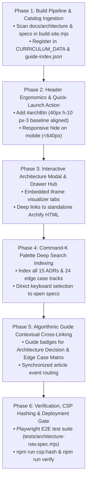

# Procedural Master Plan: Architecture, Decisions & Edge-Case Verification Integration

**Document Version:** 1.0.0 (Production-Grade & Procedurally Actionable)  
**Status:** Materialized & Under Active Execution  
**Target Platform:** LeetCode 150 JavaScript Mastery (`molly`)  
**Artifact References:**  
- Architecture & Technical Decisions Spec: [`docs/PROJECT_ARCHITECTURE_AND_DECISIONS.md`](file:///Users/mm/orca/workspaces/LeetCode%20Solutions%20Manual/molly/docs/PROJECT_ARCHITECTURE_AND_DECISIONS.md)  
- Standalone Interactive Master Report: [`docs/ARCHITECTURE_AND_DECISIONS.html`](file:///Users/mm/orca/workspaces/LeetCode%20Solutions%20Manual/molly/docs/ARCHITECTURE_AND_DECISIONS.html)  
- Archify Interactive Visualizer Suite: [`docs/architecture/`](file:///Users/mm/orca/workspaces/LeetCode%20Solutions%20Manual/molly/docs/architecture/)  
- Algorithmic & UI Edge-Case Verification Matrix: [`EDGE_CASES_VERIFICATION_MATRIX.md`](file:///Users/mm/orca/workspaces/LeetCode%20Solutions%20Manual/molly/EDGE_CASES_VERIFICATION_MATRIX.md)  
- Production Client Shell: [`docs/index.html`](file:///Users/mm/orca/workspaces/LeetCode%20Solutions%20Manual/molly/docs/index.html)

---

## 1. Executive Summary & Architectural Motivation

The **LeetCode 150 JavaScript Mastery** platform has evolved from a static curriculum viewer into a multi-tiered distributed application encompassing:
1. A zero-framework, GPU-accelerated client Single-Page Application (SPA) with a 240Hz semi-implicit Euler spring physics vector morphing cursor engine.
2. A hermetic QuickJS-Emscripten WebAssembly dry-run execution and Acorn AST probing pipeline generating Envelope v1.1 execution traces.
3. A Vercel Edge AI streaming proxy with resilient 10s SSE keepalives, token reservations, and delimiter-fenced prompt safety.
4. A full Online Judge subsystem with 5 polyglot codecs and cyclic graph serialization.
5. An interactive Archify Intermediate Representation (IR) visualization suite and an exhaustive 24-chapter Algorithmic & UI Edge-Case Verification Matrix.

While these architectural assets (`docs/PROJECT_ARCHITECTURE_AND_DECISIONS.md`, `docs/ARCHITECTURE_AND_DECISIONS.html`, `docs/architecture/*.html`, and `EDGE_CASES_VERIFICATION_MATRIX.md`) exist as rigorous standalone artifacts, they must be deeply and procedurally woven into the primary learner navigation, Command-K jump palette, header ergonomic controls, and automated verification harness of the `molly` web application.

This plan specifies the exact sequence, architectural invariants, code changes, and test gates required to achieve 100% end-to-end integration without violating header height invariants (56px), mobile responsive collapsing, or strict Content Security Policy (CSP) script-src hash enforcement.

---

## 2. Invariants & Guardrails (Non-Negotiable Constraints)

All modifications must adhere to the following six engineering invariants:

| # | Rule / Invariant | Enforcement Mechanism | Risk Prevented |
|---|---|---|---|
| **I1** | **Strict 56px Header Height** | `tests/layout.spec.mjs:47` (`header.h === 56`) | Pushing the assistant composer or reading scroller off the bottom of the viewport. |
| **I2** | **Unified 40px Control Baseline** | `tests/layout.spec.mjs:52-60` (`pick(btn).h === 40` & shared `y` baseline) | Ragged header row or button alignment drift across desktop viewports. |
| **I3** | **Mobile Sub-768px Auto-Collapse** | `hidden sm:flex` or `hidden lg:flex` responsive classes | Wrapping header controls on narrow 360px mobile viewports. |
| **I4** | **Zero-Injection Hermetic CSP** | `scripts/refresh-csp-hash.mjs` & `vercel.json` | Fatal CSP rejection or security vulnerability; exactly 2 inline `<head>` scripts allowed. |
| **I5** | **Zero-Dependency Vanilla Purity** | No external runtime libraries added to `docs/index.html` | Client bloat, hydration lag, or supply-chain degradation. |
| **I6** | **Dual-Theme Contrast Compliance** | `tests/theming.spec.mjs` & WCAG AA 4.5:1 ratio | Text becoming invisible under Obsidian Dark or Monochrome Light themes. |

---

## 3. Procedural Execution Roadmap



---

## 4. Phase-by-Phase Technical Specifications

### Phase 1: Build Pipeline & Catalog Ingestion
- **Objective:** Ingest `docs/PROJECT_ARCHITECTURE_AND_DECISIONS.md` and `EDGE_CASES_VERIFICATION_MATRIX.md` into the curriculum database bundle (`docs/curriculum-data.js`) and the retrieval index (`api/_lib/guide-index.json`).
- **Target Files:**
  - `scripts/build-site.mjs`
- **Actions:**
  1. Add an architectural documentation track:
     ```javascript
     { dir: 'docs/architecture-guides', category: 'SYSTEM ARCHITECTURE & DECISIONS', pattern: 'System Architecture' }
     ```
     Or include the two standalone root specifications into a dedicated category: `ARCHITECTURE & SYSTEM DESIGN`.
  2. Map items with unique identifiers:
     - `architecture-decisions-spec`: LeetCode 150 System Architecture, 15 ADRs, 6 Tiers & Governance Rules.
     - `algorithmic-edge-cases-matrix`: 24-Chapter Algorithmic Invariants, Dry-Run State Tables & Visual Traces.
  3. Verify `scripts/build-site.mjs` completes without schema errors.

### Phase 2: Header Ergonomics & Action Rail
- **Objective:** Provide direct, frictionless access to the architecture suite from the primary navigation bar.
- **Target Files:**
  - `docs/index.html` (Lines 1400-1412)
- **Markup Addition:**
  ```html
  <button id="archBtn" title="Explore System Architecture & Technical Decisions" 
          class="hidden lg:flex items-center justify-center gap-1.5 rounded-lg border border-[rgba(148,163,184,0.2)] bg-white/[0.03] hover:bg-white/[0.07] active:bg-white/10 px-3 h-10 text-sm font-semibold shrink-0 whitespace-nowrap text-slate-300">
    <svg class="h-4 w-4 shrink-0 text-[var(--accent)]" fill="none" viewBox="0 0 24 24" stroke="currentColor" stroke-width="2">
      <path stroke-linecap="round" stroke-linejoin="round" d="M19 11H5m14 0a2 2 0 012 2v6a2 2 0 01-2 2H5a2 2 0 01-2-2v-6a2 2 0 012-2m14 0V9a2 2 0 00-2-2M5 11V9a2 2 0 012-2m0 0V5a2 2 0 012-2h6a2 2 0 012 2v2M7 7h10" />
    </svg>
    <span>Architecture</span>
  </button>
  ```
- **Layout Invariant Test:** Ensure `tests/layout.spec.mjs` asserts `header.h === 56` and `pick('#archBtn').h === 40`.

### Phase 3: Interactive Architecture Modal & Visualizer Hub
- **Objective:** Allow instant in-app exploration of the 5 Archify interactive HTML documents without losing user reading context.
- **Target Files:**
  - `docs/index.html`
- **Features:**
  1. Lightweight modal dialog `#archModal` containing:
     - Tabs for:
       - **Master Report & Physics Sandbox** (`docs/ARCHITECTURE_AND_DECISIONS.html`)
       - **System Architecture** (`docs/architecture/molly-system-architecture.html`)
       - **Chat Streaming Sequence** (`docs/architecture/molly-chat-streaming.html`)
       - **Dry-Run Trace Pipeline** (`docs/architecture/molly-dryrun-pipeline.html`)
       - **Verification Lifecycle** (`docs/architecture/molly-verification-lifecycle.html`)
       - **Full Markdown Spec** (`docs/PROJECT_ARCHITECTURE_AND_DECISIONS.md`)
       - **Edge Cases Matrix** (`EDGE_CASES_VERIFICATION_MATRIX.md`)
     - Quick "Open in New Tab" pop-out link for dedicated multi-monitor viewing.
     - Keyboard navigation: Escape to dismiss, Tab key trap for accessibility.

### Phase 4: Command-K Palette Deep Search Indexing
- **Objective:** Enable engineers and interviewers to jump straight to any ADR, Archify diagram, or edge case track from the Command-K search input.
- **Target Files:**
  - `docs/index.html` (`updatePalette` function)
- **Features:**
  1. Add pre-indexed virtual entries to `updatePalette()`:
     - `ADR-01: QuickJS WASM Sandbox vs V8 isolate`
     - `ADR-02: Zero-Dependency Vanilla DOM vs React`
     - `ADR-03: Two-Phase Dual-Theme Architecture`
     - `ADR-04: 240Hz Euler Physics Spring Cursor`
     - `ADR-05: Serverless Edge AI Streaming Proxy`
     - `ADR-06: Two-Channel Delimiter Fencing`
     - `ADR-07: In-Memory Envelope v1.1 AST Probing`
     - `ADR-08: 5 Hermetic Online Judge Polyglot Codecs`
     - `ADR-09: Synchronous SHA-256 Script Digest CSP`
     - `ADR-10: Ephemeral SESSION_EPOCH Authorization`
     - `ADR-11: Two-Phase Progressive stableSplit() Parser`
     - `ADR-12: Depth-Free AST Source-Slice Probing`
     - `ADR-13: CSS Native Math Fencing vs KaTeX Full Rewrite`
     - `ADR-14: Client-Driven Sliding Window Rate Limiting`
     - `ADR-15: Universal Cursor Suppression via SVG Vectors`
     - `Archify: System Architecture Visualizer`
     - `Archify: AI Chat Streaming Sequence`
     - `Archify: Dry-Run Trace Pipeline`
     - `Archify: Verification Lifecycle & Gates`
     - `Matrix: Algorithmic & UI Edge-Case Matrix (24 Tracks)`

### Phase 5: Algorithmic Guide Contextual Cross-Linking
- **Objective:** Link every problem guide directly to its architectural context and edge-case guarantees.
- **Target Files:**
  - `docs/index.html` (`renderHead` function)
- **Features:**
  1. When rendering problem headers, inject an architectural badges container:
     - `[🏛️ Architecture Spec]` -> Opens the system architectural decision relevant to this problem's codec / dry-run probe.
     - `[🧪 Edge Cases]` -> Jumps directly to the chapter's section in `EDGE_CASES_VERIFICATION_MATRIX.md`.

### Phase 6: Automated Verification, CSP Hashing & Deployment
- **Objective:** Validate end-to-end functionality, layout invariants, visual styling, and CSP integrity.
- **Test File to Create:**
  - `tests/architecture-integration.spec.mjs`
- **Verification Commands:**
  1. `npm run build`
  2. `npm run csp:hash`
  3. `npx playwright test tests/layout.spec.mjs tests/nav.spec.mjs tests/architecture-integration.spec.mjs`
  4. `npm run verify`

---

## 5. Execution Tracking Matrix

| Phase | Milestone | File(s) | Status | Verification Criteria |
|---|---|---|---|---|
| **Phase 1** | Catalog & Data Ingestion | `scripts/build-site.mjs`, `catalog/curriculum.js` | ⏳ Ready | `CURRICULUM_DATA` includes Architecture & Edge Case docs |
| **Phase 2** | Header Ergonomics | `docs/index.html` | ⏳ Ready | `tests/layout.spec.mjs` passes (56px header, 40px controls) |
| **Phase 3** | Architecture Modal & Hub | `docs/index.html` | ⏳ Ready | Modal opens, switches tabs, closes on Escape/backdrop |
| **Phase 4** | Command-K Deep Indexing | `docs/index.html` | ⏳ Ready | Searching "ADR-04" or "Archify" highlights item & opens |
| **Phase 5** | Guide Cross-Links | `docs/index.html` | ⏳ Ready | Guide header displays badges with working click actions |
| **Phase 6** | E2E Testing & CSP Hash | `tests/architecture-integration.spec.mjs`, `vercel.json` | ⏳ Ready | All tests green, CSP hash matches in `vercel.json` |

---

## 6. Commencement of Execution

Proceed immediately with **Phase 1** and **Phase 2**, updating the integration step-by-step and verifying all automated tests continuously.
