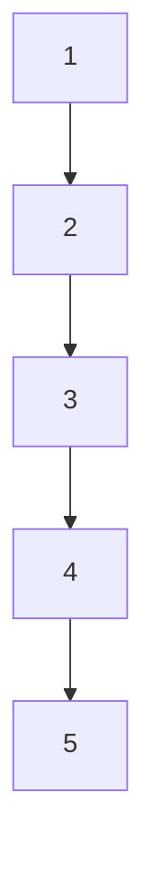
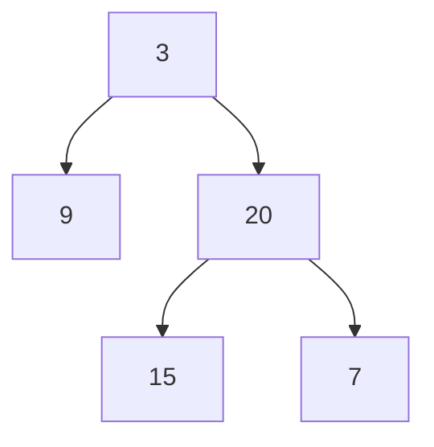
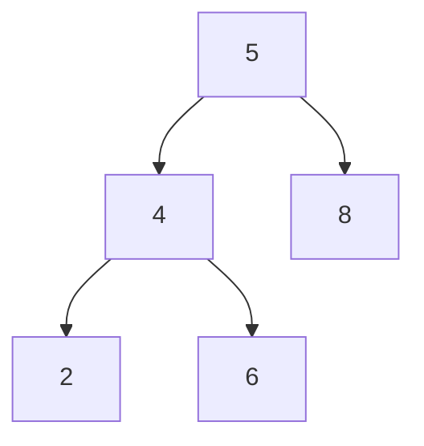
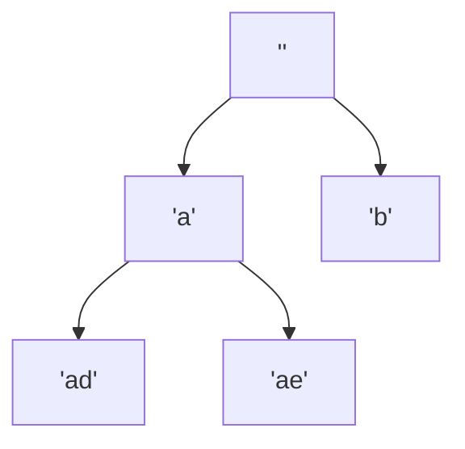
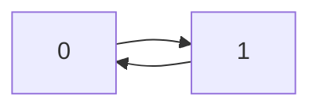
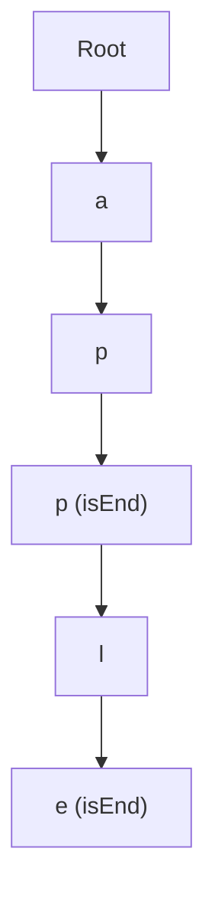
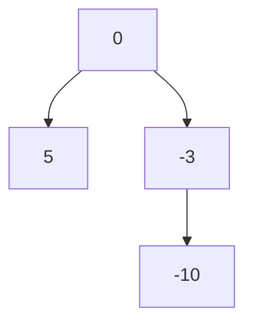
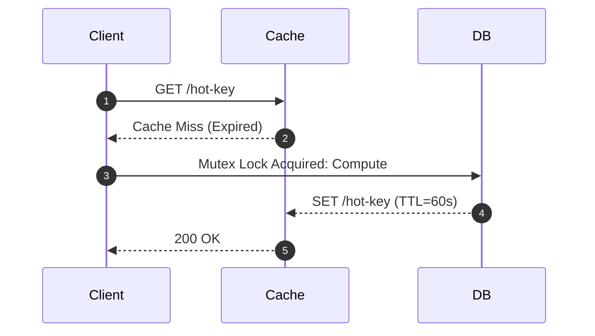

# Comprehensive Algorithmic & UI Edge-Case Matrix

This matrix covers code implementation invariants, dry run execution paths, table geometries, and visual structures (arrays, trees, stacks, matrices) across all **24 categories** in the curriculum.

## 1. Array & String (`01-array-string`)

**Representative Problem:** `01-merge-sorted-array`

### Edge Cases & Boundary Invariants

#### Case 1: m = 0, n > 0 (nums1 has only buffer zeros)
- **Input:** `nums1 = [0, 0, 0], m = 0, nums2 = [1, 2, 3], n = 3`
- **Expected:** `[1, 2, 3]`
- **Pitfall / Risk:** Writing to index p < 0 or off-by-one underflow in 3-pointer backward scan.

#### Case 2: Duplicate keys and single element bounds
- **Input:** `nums1 = [1, 1, 1, 0, 0], m = 3, nums2 = [1, 1], n = 2`
- **Expected:** `[1, 1, 1, 1, 1]`
- **Pitfall / Risk:** Pointer decrement stalls or strict inequalities cause infinite loops.

### Dry Run State Table

| Step | p1 (m-1) | p2 (n-1) | p (write) | Action | nums1 State |
| --- | --- | --- | --- | --- | --- |
| 0 | m=0 (p1=-1) | 2 | 2 | p1 < 0 -> copy nums2[2]=3 | [0, 0, 3] |
| 1 | -1 | 1 | 1 | p1 < 0 -> copy nums2[1]=2 | [0, 2, 3] |
| 2 | -1 | 0 | 0 | p1 < 0 -> copy nums2[0]=1 | [1, 2, 3] |

### Visual Representation (`~~~viz-array`)

```viz-array
{
  "title": "Dry Run: Backward 3-Pointer Placement",
  "cells": [
    1,
    2,
    3
  ],
  "pointers": [
    {
      "i": 0,
      "label": "p=0"
    }
  ]
}
```

---

## 2. Two Pointers (`02-two-pointers`)

**Representative Problem:** `01-valid-palindrome`

### Edge Cases & Boundary Invariants

#### Case 1: String with zero alphanumeric characters
- **Input:** `s = "., :; !?"`
- **Expected:** `true`
- **Pitfall / Risk:** Pointers cross past each other out of string index bounds while skipping symbols.

#### Case 2: Single character or palindrome with uneven casing
- **Input:** `s = "aA"`
- **Expected:** `true`
- **Pitfall / Risk:** Case folding mismatch if ASCII toLowerCase / regex sanitization is skipped.

### Dry Run State Table

| Step | Left Pointer | Right Pointer | Char Left | Char Right | Verdict |
| --- | --- | --- | --- | --- | --- |
| 0 | 0 ('.') | 7 ('?') | Non-alphanumeric | Non-alphanumeric | Advance both |
| 1 | 4 (':') | 5 (';') | Non-alphanumeric | Non-alphanumeric | Pointers cross -> true |

### Visual Representation (`~~~viz-array`)

```viz-array
{
  "title": "Two Pointers Convergence",
  "cells": [
    "a",
    "b",
    "c",
    "b",
    "a"
  ],
  "pointers": [
    {
      "i": 0,
      "label": "L"
    },
    {
      "i": 4,
      "label": "R"
    }
  ]
}
```

---

## 3. Sliding Window (`03-sliding-window`)

**Representative Problem:** `01-minimum-size-subarray-sum`

### Edge Cases & Boundary Invariants

#### Case 1: Sum of entire array < target
- **Input:** `target = 100, nums = [1, 2, 3, 4, 5]`
- **Expected:** `0`
- **Pitfall / Risk:** Returning Infinity or initial accumulator instead of guaranteed 0 sentinel.

#### Case 2: Single element meets target immediately
- **Input:** `target = 7, nums = [7]`
- **Expected:** `1`
- **Pitfall / Risk:** Window shrinkage fails to record length 1 when left === right.

### Dry Run State Table

| Right | Added | Window Sum | Condition (sum >= target) | Left | Min Length |
| --- | --- | --- | --- | --- | --- |
| 0 | nums[0]=7 | 7 | 7 >= 7 (true) | Shrink left=1 | minLen = min(inf, 1) = 1 |

### Visual Representation (`~~~viz-array`)

```viz-array
{
  "title": "Sliding Window Bounds",
  "cells": [
    {
      "v": 2,
      "state": "active"
    },
    {
      "v": 3,
      "state": "active"
    },
    {
      "v": 1,
      "state": "active"
    },
    2,
    4,
    3
  ],
  "pointers": [
    {
      "i": 0,
      "label": "L"
    },
    {
      "i": 2,
      "label": "R"
    }
  ]
}
```

---

## 4. Matrix (`04-matrix`)

**Representative Problem:** `01-valid-sudoku`

### Edge Cases & Boundary Invariants

#### Case 1: 1xN or Nx1 single dimension matrix in traversal (Spiral Matrix / Rotate)
- **Input:** `matrix = [[1, 2, 3, 4]]`
- **Expected:** `Correct bounds checking without duplicate row/column double-counting`
- **Pitfall / Risk:** Double printing row / column when top === bottom or left === right.

#### Case 2: Sub-box block coordinate indexing for Sudoku
- **Input:** `board[8][8] in lower-right corner`
- **Expected:** `Box index Math.floor(r/3)*3 + Math.floor(c/3) === 8`
- **Pitfall / Risk:** Off-by-one or bitmask collision across 9 separate 3x3 grids.

### Dry Run State Table

| Row | Col | Val | Row Set Check | Col Set Check | Box (r/3, c/3) Set Check |
| --- | --- | --- | --- | --- | --- |
| 0 | 0 | '5' | row[0].has('5') -> add | col[0].has('5') -> add | box[0].has('5') -> add |
| 0 | 4 | '5' | row[0].has('5') -> CONFLICT | - | - |

---

## 5. Hashmap (`05-hashmap`)

**Representative Problem:** `01-two-sum`

### Edge Cases & Boundary Invariants

#### Case 1: Target formed by identical element twice
- **Input:** `nums = [3, 3], target = 6`
- **Expected:** `[0, 1]`
- **Pitfall / Risk:** Overwriting hash index before lookup, causing element to match with itself.

#### Case 2: Negative numbers and zero
- **Input:** `nums = [-3, 4, 3, 90], target = 0`
- **Expected:** `[0, 2]`
- **Pitfall / Risk:** Falsy zero check (`if (map.get(complement))` evaluates to false when index is 0).

### Dry Run State Table

| Index i | Value | Complement (target - val) | Map Has Complement? | Map State After Step |
| --- | --- | --- | --- | --- |
| 0 | 3 | 6 - 3 = 3 | false (empty map) | { 3: 0 } |
| 1 | 3 | 6 - 3 = 3 | true (found at index 0) | Return [0, 1] |

### Visual Representation (`~~~viz-array`)

```viz-array
{
  "title": "Hash Map State",
  "cells": [
    3,
    3
  ],
  "map": [
    [
      "3",
      "0"
    ]
  ],
  "pointers": [
    {
      "i": 1,
      "label": "curr"
    }
  ]
}
```

---

## 6. Intervals (`06-intervals`)

**Representative Problem:** `01-summary-ranges`

### Edge Cases & Boundary Invariants

#### Case 1: Touching/adjacent intervals vs overlapping intervals
- **Input:** `[[1, 4], [4, 5]]`
- **Expected:** `Merged to [1, 5] (inclusive end points)`
- **Pitfall / Risk:** Treating intervals as disjoint if strict inequality < is used instead of <=.

#### Case 2: Single interval completely subsumes another
- **Input:** `[[1, 10], [2, 3]]`
- **Expected:** `[[1, 10]]`
- **Pitfall / Risk:** Updating end to smaller interval value `cur[1] = next[1]` instead of `Math.max`.

### Dry Run State Table

| Current Merged | Next Interval | Overlap Condition (next[0] <= cur[1]) | Action |
| --- | --- | --- | --- |
| [1, 10] | [2, 3] | 2 <= 10 (true) | cur[1] = max(10, 3) = 10 -> [1, 10] |
| [1, 10] | [12, 15] | 12 <= 10 (false) | Push [1, 10], set cur = [12, 15] |

---

## 7. Stack (`07-stack`)

**Representative Problem:** `01-valid-parentheses`

### Edge Cases & Boundary Invariants

#### Case 1: Leading closing bracket or empty stack on pop
- **Input:** `s = "]" or "}{"`
- **Expected:** `false`
- **Pitfall / Risk:** Stack underflow or comparing `undefined` against char.

#### Case 2: Only opening brackets left unclosed
- **Input:** `s = "((("`
- **Expected:** `false`
- **Pitfall / Risk:** Returning true without asserting `stack.length === 0` at termination.

### Dry Run State Table

| Step | Char | Stack Before | Action | Stack After | Valid? |
| --- | --- | --- | --- | --- | --- |
| 0 | '(' | [] | Push '(' | ['('] | true |
| 1 | ']' | ['('] | Pop '(' != matching pair of ']' | ['('] | false (Mismatch) |

### Visual Representation (`~~~viz-array`)

```viz-array
{
  "title": "LIFO Stack State",
  "cells": [
    "(",
    "{",
    "["
  ],
  "pointers": [
    {
      "i": 2,
      "label": "TOP"
    }
  ]
}
```

---

## 8. Linked List (`08-linked-list`)

**Representative Problem:** `01-linked-list-cycle`

### Edge Cases & Boundary Invariants

#### Case 1: Empty list (head === null) or 1 node without cycle
- **Input:** `head = [1], pos = -1`
- **Expected:** `false`
- **Pitfall / Risk:** Null pointer dereference accessing `fast.next.next` when `fast.next` is null.

#### Case 2: Even vs Odd length list cycle detection (Floyd's Tortoise and Hare)
- **Input:** `head = [1, 2], cycle pos = 0`
- **Expected:** `true`
- **Pitfall / Risk:** Loop condition `while (fast && fast.next)` missing.

### Dry Run State Table

| Step | Slow Pointer (1 step) | Fast Pointer (2 steps) | Collision Check (slow === fast) |
| --- | --- | --- | --- |
| 0 | Node(1) | Node(1) | Initial position |
| 1 | Node(2) | Node(1) [cycled] | false |
| 2 | Node(1) | Node(1) | true -> CYCLE DETECTED |

### Visual Representation (`~~~viz-array`)

```viz-array
{
  "title": "Floyd Cycle Detection Pointers",
  "cells": [
    1,
    2,
    3,
    4
  ],
  "pointers": [
    {
      "i": 1,
      "label": "slow"
    },
    {
      "i": 3,
      "label": "fast"
    }
  ]
}
```

---

## 9. Binary Tree General (`09-binary-tree-general`)

**Representative Problem:** `01-maximum-depth`

### Edge Cases & Boundary Invariants

#### Case 1: Skewed degenerate tree (linked list structure)
- **Input:** `1 -> 2 -> 3 -> 4 -> 5 (all right children)`
- **Expected:** `Depth = 5`
- **Pitfall / Risk:** Call stack overflow on deep un-balanced trees in recursion without tail-recursion/iteration.

#### Case 2: Null root
- **Input:** `root = null`
- **Expected:** `0`
- **Pitfall / Risk:** Dereferencing `root.val` or `root.left` on null.

### Dry Run State Table

| Call Stack | Node Visited | Left Subtree Depth | Right Subtree Depth | Returned Value |
| --- | --- | --- | --- | --- |
| maxDepth(5) | 5 | 0 (null) | 0 (null) | 1 + max(0, 0) = 1 |
| maxDepth(4) | 4 | 0 (null) | 1 | 1 + max(0, 1) = 2 |

### Visual Representation (`mermaid`)



---

## 10. Binary Tree BFS (`10-binary-tree-bfs`)

**Representative Problem:** `01-level-order-traversal`

### Edge Cases & Boundary Invariants

#### Case 1: Single node tree
- **Input:** `root = [1]`
- **Expected:** `[[1]]`
- **Pitfall / Risk:** Inner level loop slicing incorrect number of items.

#### Case 2: Queue length mutation inside level loop
- **Input:** `root = [3, 9, 20, null, null, 15, 7]`
- **Expected:** `[[3], [9, 20], [15, 7]]`
- **Pitfall / Risk:** Evaluating `i < queue.length` dynamically instead of capturing fixed `levelSize = queue.length`.

### Dry Run State Table

| Level | Captured Level Size | Queue Contents | Current Level Result | Queue After Expansion |
| --- | --- | --- | --- | --- |
| 0 | 1 | [3] | [3] | [9, 20] |
| 1 | 2 | [9, 20] | [9, 20] | [15, 7] |
| 2 | 2 | [15, 7] | [15, 7] | [] |

### Visual Representation (`mermaid`)



---

## 11. Binary Search Tree (`11-binary-search-tree`)

**Representative Problem:** `01-minimum-absolute-difference-in-bst`

### Edge Cases & Boundary Invariants

#### Case 1: Subtree values valid locally but violate ancestor global BST invariant
- **Input:** `5 -> left child 4, 4 -> right child 6 (6 > 5 violates root)`
- **Expected:** `false for isValidBST`
- **Pitfall / Risk:** Only comparing node against immediate left/right child rather than propagating `(min, max)` interval.

#### Case 2: Integer boundary nodes (Number.MIN_SAFE_INTEGER, -Infinity)
- **Input:** `root = [-2147483648]`
- **Expected:** `Valid`
- **Pitfall / Risk:** Initial boundary set to 32-bit int min instead of null / -Infinity.

### Dry Run State Table

| Node | Valid Range (min, max) | Node Value Within Range? | Child Bound Inheritance |
| --- | --- | --- | --- |
| Root 5 | (-inf, +inf) | true | Left child must be (-inf, 5) |
| Child 4 | (-inf, 5) | true | Right child must be (4, 5) |
| Node 6 | (4, 5) | 6 in (4, 5) -> FALSE | Violation detected! |

### Visual Representation (`mermaid`)



---

## 12. Binary Search (`12-binary-search`)

**Representative Problem:** `01-search-insert-position`

### Edge Cases & Boundary Invariants

#### Case 1: Element smaller than all elements (insert at 0)
- **Input:** `nums = [2, 4, 6], target = 1`
- **Expected:** `0`
- **Pitfall / Risk:** Returning negative index or out of bounds.

#### Case 2: Element larger than all elements (insert at nums.length)
- **Input:** `nums = [2, 4, 6], target = 7`
- **Expected:** `3`
- **Pitfall / Risk:** Returning nums.length - 1 instead of appending index.

#### Case 3: Midpoint overflow prevention
- **Input:** `left = 2^30, right = 2^30`
- **Expected:** `Correct midpoint computation`
- **Pitfall / Risk:** `(left + right) / 2` 32-bit integer overflow; must use `left + Math.floor((right - left) / 2)`.

### Dry Run State Table

| Iter | Left | Right | Mid | nums[mid] | Comparison | Action |
| --- | --- | --- | --- | --- | --- | --- |
| 1 | 0 | 2 | 1 | 4 | 7 > 4 | left = mid + 1 = 2 |
| 2 | 2 | 2 | 2 | 6 | 7 > 6 | left = mid + 1 = 3 |
| End | 3 | 2 | - | - | left > right | Return left = 3 |

### Visual Representation (`~~~viz-array`)

```viz-array
{
  "title": "Binary Search Pointers",
  "cells": [
    2,
    4,
    6
  ],
  "pointers": [
    {
      "i": 1,
      "label": "mid"
    },
    {
      "i": 2,
      "label": "R"
    }
  ]
}
```

---

## 13. Heap / Priority Queue (`13-heap`)

**Representative Problem:** `01-kth-largest-element`

### Edge Cases & Boundary Invariants

#### Case 1: k === nums.length (finding absolute minimum)
- **Input:** `nums = [3, 2, 1, 5, 6, 4], k = 6`
- **Expected:** `1`
- **Pitfall / Risk:** Min-heap eviction logic evicts target element if heap capacity condition is `<=` instead of `>`.

#### Case 2: All elements identical
- **Input:** `nums = [2, 2, 2, 2], k = 2`
- **Expected:** `2`
- **Pitfall / Risk:** Quickselect partitioning infinite recursion when pivot equal elements not partitioned into 3 ways.

### Dry Run State Table

| Num Inserted | Min-Heap State | Heap Size | Action (if size > k) |
| --- | --- | --- | --- |
| 3 | [3] | 1 | Keep |
| 2 | [2, 3] | 2 | Keep |
| 5 | [2, 3, 5] | 3 (k=2) | Pop min (2) -> [3, 5] |
| 6 | [3, 5, 6] | 3 (k=2) | Pop min (3) -> [5, 6] |

---

## 14. Backtracking (`14-backtracking`)

**Representative Problem:** `01-letter-combinations-phone-number`

### Edge Cases & Boundary Invariants

#### Case 1: Empty input string digits = ''
- **Input:** `digits = ''`
- **Expected:** `[] (empty array, NOT [''])`
- **Pitfall / Risk:** Base case pushing empty accumulator into results list yielding `['']`.

#### Case 2: State mutation / sharing across branches
- **Input:** `Path exploration with arrays`
- **Expected:** `Clean backtrack`
- **Pitfall / Risk:** Pushing reference without copying `res.push([...current])` causing all saved results to mirror final state.

### Dry Run State Table

| Depth | Digit | Letters | Chosen | Path So Far | Backtrack Action |
| --- | --- | --- | --- | --- | --- |
| 0 | '2' | ['a', 'b', 'c'] | 'a' | ['a'] | Recurse depth 1 |
| 1 | '3' | ['d', 'e', 'f'] | 'd' | ['a', 'd'] | Leaf reached -> push 'ad', pop 'd' |

### Visual Representation (`mermaid`)



---

## 15. Math (`15-math`)

**Representative Problem:** `01-palindrome-number`

### Edge Cases & Boundary Invariants

#### Case 1: Negative numbers
- **Input:** `x = -121`
- **Expected:** `false`
- **Pitfall / Risk:** Minus sign cannot match tail digit.

#### Case 2: Numbers ending in 0 (except 0 itself)
- **Input:** `x = 10`
- **Expected:** `false`
- **Pitfall / Risk:** Reversing half digits matches `1 === 0` if `x % 10 === 0 && x !== 0` check omitted.

#### Case 3: 32-bit signed integer overflow on reverse
- **Input:** `x = 2147483647`
- **Expected:** `Safe reversal or bounded termination`
- **Pitfall / Risk:** Double precision float in JS avoids 32-bit int overflow, but bitwise operations `| 0` truncate.

### Dry Run State Table

| Step | Remaining x | Reversed Half | Loop Condition (x > reversed) | Verdict |
| --- | --- | --- | --- | --- |
| 0 | 1221 | 0 | 1221 > 0 (true) | Extract digit 1 -> rev = 1, x = 122 |
| 1 | 122 | 1 | 122 > 1 (true) | Extract digit 2 -> rev = 12, x = 12 |
| 2 | 12 | 12 | 12 > 12 (false) | Terminate: x === rev (12 === 12) -> TRUE |

---

## 16. 1D Dynamic Programming (`16-one-dp`)

**Representative Problem:** `01-climbing-stairs`

### Edge Cases & Boundary Invariants

#### Case 1: n = 1 and n = 2 base boundaries
- **Input:** `n = 1`
- **Expected:** `1`
- **Pitfall / Risk:** Allocating array `dp[n]` and accessing `dp[2]` leading to out-of-bounds.

#### Case 2: Coin Change with impossible amount
- **Input:** `coins = [2], amount = 3`
- **Expected:** `-1`
- **Pitfall / Risk:** Returning initial sentinel (Infinity / amount + 1) instead of -1.

### Dry Run State Table

| i | dp[i-2] | dp[i-1] | Formula: dp[i] = dp[i-1] + dp[i-2] | Space-Optimized (prev, curr) |
| --- | --- | --- | --- | --- |
| 1 | - | - | 1 (base) | curr = 1 |
| 2 | - | 1 | 2 (base) | prev = 1, curr = 2 |
| 3 | 1 | 2 | 1 + 2 = 3 | prev = 2, curr = 3 |

### Visual Representation (`~~~viz-array`)

```viz-array
{
  "title": "1D DP Memoization Table",
  "cells": [
    1,
    2,
    3,
    5,
    8
  ],
  "pointers": [
    {
      "i": 4,
      "label": "dp[5]"
    }
  ]
}
```

---

## 17. Multidimensional DP (`17-multi-dp`)

**Representative Problem:** `01-triangle`

### Edge Cases & Boundary Invariants

#### Case 1: 1x1 grid or single row triangle
- **Input:** `triangle = [[-10]]`
- **Expected:** `-10`
- **Pitfall / Risk:** In-place bottom-up loop fails to execute if row loop starts at `triangle.length - 2` without base return.

#### Case 2: Negative path weights
- **Input:** `triangle = [[2], [3, 4], [6, 5, 7], [4, 1, 8, 3]]`
- **Expected:** `11 (2 + 3 + 5 + 1)`
- **Pitfall / Risk:** Greedy choice trap (picking local min 3 instead of 4).

### Dry Run State Table

| Row | Col | Value | Children (row+1, c) & (row+1, c+1) | Min Path Value |
| --- | --- | --- | --- | --- |
| 2 | 0 | 6 | min(4, 1) = 1 | 6 + 1 = 7 |
| 2 | 1 | 5 | min(1, 8) = 1 | 5 + 1 = 6 |
| 1 | 0 | 3 | min(7, 6) = 6 | 3 + 6 = 9 |

---

## 18. Graph General (`18-graph-general`)

**Representative Problem:** `01-number-of-islands`

### Edge Cases & Boundary Invariants

#### Case 1: Grid of all water ('0') or all land ('1')
- **Input:** `grid = [['0', '0'], ['0', '0']]`
- **Expected:** `0`
- **Pitfall / Risk:** Returning uninitialized counters.

#### Case 2: Cycle in directed graph (Course Schedule)
- **Input:** `numCourses = 2, prerequisites = [[1, 0], [0, 1]]`
- **Expected:** `false`
- **Pitfall / Risk:** Infinite recursion in DFS without 3-state coloring (0=unvisited, 1=visiting, 2=visited).

### Dry Run State Table

| Node | Color State Before | Neighbor | Neighbor State | Action / Cycle Verdict |
| --- | --- | --- | --- | --- |
| 0 | 1 (Visiting) | 1 | 0 (Unvisited) | Recurse into node 1 |
| 1 | 1 (Visiting) | 0 | 1 (Visiting) | Back-edge to node currently in path -> CYCLE DETECTED! |

### Visual Representation (`mermaid`)



---

## 19. Graph BFS (`19-graph-bfs`)

**Representative Problem:** `01-snakes-and-ladders`

### Edge Cases & Boundary Invariants

#### Case 1: Target unreachable in BFS shortest path
- **Input:** `Blocked destination or no valid transitions`
- **Expected:** `-1`
- **Pitfall / Risk:** Queue exhausts without target check returning -1.

#### Case 2: Duplicate state insertion causing exponential BFS queue bloat
- **Input:** `Dense graph where multiple nodes lead to same child`
- **Expected:** `O(V + E) time`
- **Pitfall / Risk:** Marking visited upon dequeue rather than upon enqueue.

### Dry Run State Table

| Step | Dequeued Node | Next Roll (1..6) | Destination (Snake/Ladder) | Mark Visited On Enqueue |
| --- | --- | --- | --- | --- |
| 0 | Square 1 | +1 -> Square 2 | Ladder to Square 15 | visited.add(15); queue.push(15) |
| 1 | Square 1 | +2 -> Square 3 | No jump | visited.add(3); queue.push(3) |

---

## 20. Trie (`20-trie`)

**Representative Problem:** `01-implement-trie`

### Edge Cases & Boundary Invariants

#### Case 1: Searching prefix of an inserted word that is not marked as word
- **Input:** `insert('apple'); search('app')`
- **Expected:** `false`
- **Pitfall / Risk:** Returning true because path nodes exist, without checking `node.isEnd === true`.

#### Case 2: Empty string word or duplicate insertion
- **Input:** `insert('a'); insert('a')`
- **Expected:** `Trie handles duplicates idempotently`
- **Pitfall / Risk:** Node duplication or dangling pointers.

### Dry Run State Table

| Char | Current Node Children | Child Exists? | Action | isEnd Flag |
| --- | --- | --- | --- | --- |
| 'a' | root.children | No | Create node 'a' | false |
| 'p' | node('a').children | No | Create node 'p' | false |
| 'p' | node('p').children | No | Create node 'p' | true (End of 'app') |

### Visual Representation (`mermaid`)



---

## 21. Divide & Conquer (`21-divide-conquer`)

**Representative Problem:** `01-convert-sorted-array-to-bst`

### Edge Cases & Boundary Invariants

#### Case 1: Even number of elements (choice of left-middle vs right-middle)
- **Input:** `nums = [-10, -3, 0, 5]`
- **Expected:** `Height-balanced BST (either choice is valid, height difference <= 1)`
- **Pitfall / Risk:** Imbalance if split midpoint formula shifts recursively.

#### Case 2: Subarray boundary convergence
- **Input:** `left > right`
- **Expected:** `null`
- **Pitfall / Risk:** Off-by-one infinite recursion if `mid` is passed instead of `mid - 1` and `mid + 1`.

### Dry Run State Table

| Subarray [left, right] | Mid Index | Mid Value | Left Child Call | Right Child Call |
| --- | --- | --- | --- | --- |
| [0, 3] | 1 | -3 | [-10, -10] -> Node(-10) | [0, 5] -> Mid 0 |
| [0, 0] | 0 | -10 | left > right -> null | left > right -> null |

### Visual Representation (`mermaid`)



---

## 22. Bit Manipulation (`22-bit-manipulation`)

**Representative Problem:** `01-add-binary`

### Edge Cases & Boundary Invariants

#### Case 1: Carry left over after consuming both binary strings
- **Input:** `a = '11', b = '1'`
- **Expected:** `'100'`
- **Pitfall / Risk:** Forgetting to prepend final carry `if (carry) result = '1' + result`.

#### Case 2: Unequal string lengths
- **Input:** `a = '1010', b = '101111'`
- **Expected:** `'111001'`
- **Pitfall / Risk:** NaN propagation when index goes negative without `i >= 0 ? Number(a[i]) : 0`.

### Dry Run State Table

| i (a) | j (b) | Bit a | Bit b | Carry In | Sum = a+b+carry | Output Bit (sum % 2) | Carry Out (sum / 2) |
| --- | --- | --- | --- | --- | --- | --- | --- |
| 1 | 0 | 1 | 1 | 0 | 2 | 0 | 1 |
| 0 | -1 | 1 | 0 | 1 | 2 | 0 | 1 |
| -1 | -1 | 0 | 0 | 1 | 1 | 1 | 0 |

---

## 23. Kadane's Algorithm (`23-kadanes-algorithm`)

**Representative Problem:** `01-maximum-subarray`

### Edge Cases & Boundary Invariants

#### Case 1: All numbers negative
- **Input:** `nums = [-5, -2, -8, -1, -4]`
- **Expected:** `-1 (the least negative single number)`
- **Pitfall / Risk:** Initializing max to 0 or resetting current to 0 instead of picking `max(num, current + num)`.

#### Case 2: Single element array
- **Input:** `nums = [-1]`
- **Expected:** `-1`
- **Pitfall / Risk:** Loop bound starting at 0 or returning 0.

### Dry Run State Table

| Index | Element num | currSum = max(num, currSum + num) | maxSum = max(maxSum, currSum) |
| --- | --- | --- | --- |
| 0 | -5 | -5 | -5 |
| 1 | -2 | max(-2, -5 + -2) = -2 | max(-5, -2) = -2 |
| 2 | -8 | max(-8, -2 + -8) = -8 | -2 |
| 3 | -1 | max(-1, -8 + -1) = -1 | max(-2, -1) = -1 |

### Visual Representation (`~~~viz-array`)

```viz-array
{
  "title": "Kadane Current vs Max Accumulator",
  "cells": [
    -5,
    -2,
    -8,
    -1,
    -4
  ],
  "pointers": [
    {
      "i": 3,
      "label": "maxSum: -1"
    }
  ]
}
```

---

## 24. MAANG Guides & System Design (`24-maang-guides`)

**Representative Problem:** `01-maang-sde-roadmap`

### Edge Cases & Boundary Invariants

#### Case 1: High-concurrency distributed consistency edge case
- **Input:** `Distributed write conflict with dual leader replication`
- **Expected:** `Vector clocks / Conflict-free Replicated Data Types (CRDTs) resolution`
- **Pitfall / Risk:** Last-write-wins (LWW) silent data loss under clock drift.

#### Case 2: Cache thundering herd / cache stampede
- **Input:** `Hot key TTL expiry under 100k QPS`
- **Expected:** `Mutual exclusion mutex lock / probabilistic early expiration`
- **Pitfall / Risk:** Database connection pool exhaustion and cascading service outage.

### Dry Run State Table

| Event Time | Client Request | Cache Status | DB Concurrency Lock | Outcome |
| --- | --- | --- | --- | --- |
| t0 | 10,000 QPS on key 'trending' | Cache expired | Lock acquired by worker 1 | Worker 1 queries DB |
| t1 | Remaining 9,999 requests | Cache waiting | Lock busy -> wait or serve stale | DB protected from stampede |

### Visual Representation (`mermaid`)



---

