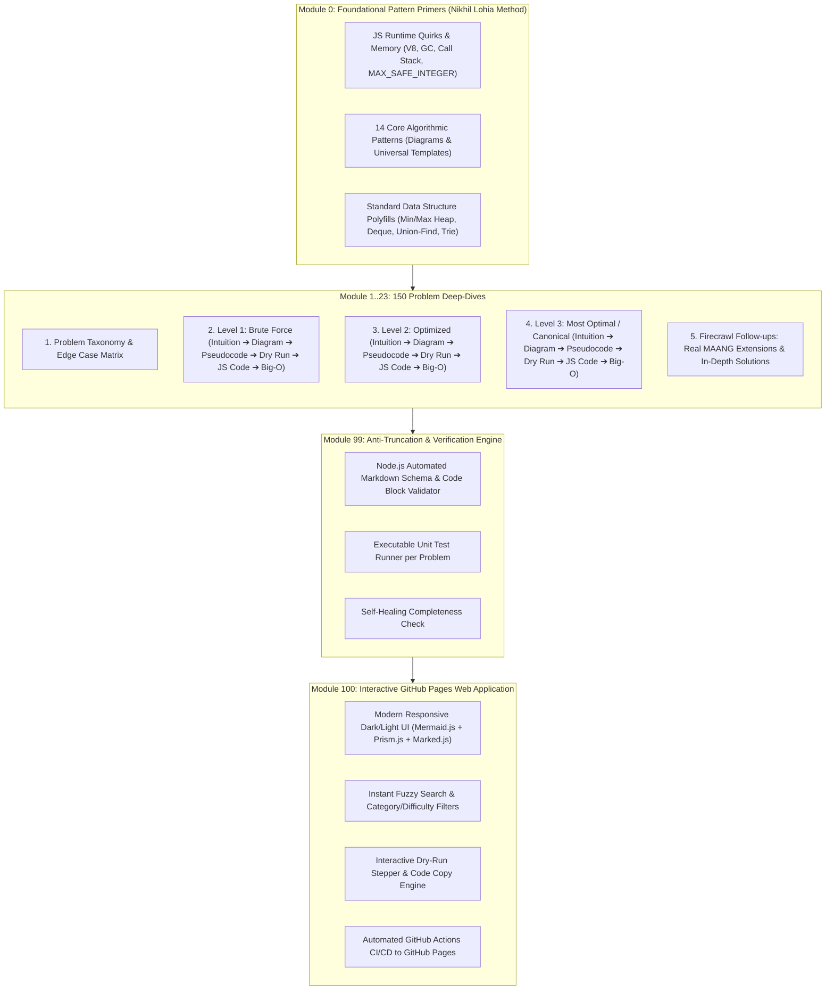
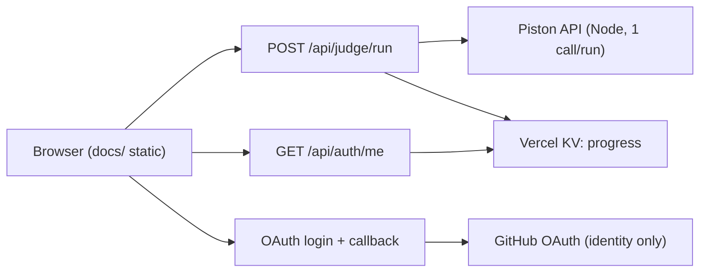

# LeetCode Top Interview 150 — Master JavaScript Curriculum & HyperPlan

---

## 1. Executive Strategy & Architectural Blueprint

This master plan structures the study, implementation, visual diagramming, follow-up research, and automated validation for the **LeetCode Top Interview 150** using **Modern JavaScript (ES2024+)**.



---

## 2. What Was Missing in Standard DSA Prep (The MAANG Gap)

To crack MAANG / Top-Tier Tech firms using JavaScript, typical prep misses several critical dimensions:

| Dimension | Typical Prep Trap | MAANG / High-Paying Standard |
| :--- | :--- | :--- |
| **JS Runtime Pitfalls** | Ignoring V8 internals | Explicitly handling $O(N)$ recursion call stack overflow ($N > 10^4$), `Array.prototype.sort()` lexicographical gotcha, and `Number.MAX_SAFE_INTEGER` ($2^{53}-1$). |
| **Missing Stdlib DS** | Relying on `@datastructures-js` or assuming built-in Heap exists | Writing clean, 12-line zero-dependency Binary Heap / Deque in whiteboard CoderPad interviews in under 90 seconds. |
| **Edge Case Discipline** | Patching edge cases after writing code | Building an **Upfront Edge Case Matrix** (Empty, Single element, Duplicates, Negative numbers, Out-of-bounds, Integer overflow, Sparse data). |
| **Dry Run Mechanics** | Mental tracing | Formal **State Transition Tracing Tables** mapping variable states at $t_0, t_1, \dots, t_k$. |
| **Interview Follow-ups** | Stopping at the accepted LeetCode submission | Handling streaming inputs, concurrency/worker threads, $10^9$ element scaling (external memory/chunking), distributed queries, and read-heavy vs write-heavy tradeoffs. |
| **Communication Framework** | Jumping straight into coding | **REACTO** (Repeat/Clarify, Examples, Approach trade-offs, Code, Test/Dry Run, Optimize). |

---

## 3. Standardized Problem Specification Template

Every single problem file across all 150 questions strictly follows this exact markdown schema:

````markdown
# [Problem ID]. [Problem Title]

- **LeetCode Link**: `https://leetcode.com/problems/<slug>/`
- **Difficulty**: Easy | Medium | Hard
- **Pattern Category**: Two Pointers | Sliding Window | Monotonic Stack | etc.
- **Prerequisite Primer**: `00-foundations/<primer-file>.md`

---

## 1. Problem Overview & Edge Case Matrix

### Visual Problem Representation
```
[ASCII Art / Mermaid Diagram illustrating problem inputs, constraints, and target output]
```

### Upfront Edge Case Matrix
| Edge Case Category | Specific Input Scenario | Expected Behavior | Pitfall / Risk |
| :--- | :--- | :--- | :--- |
| Empty / Nil | `nums = []` | Return `0` / `null` | Index out of bounds |
| Single Element | `nums = [1]` | Return `1` | Loop invariant termination |
| All Identical / Duplicates | `nums = [2, 2, 2, 2]` | Correct count | Infinite loop in two pointers |
| Negative / Extreme Values | `nums = [-10^9, 10^9]` | Handle range | Integer precision loss |

---

## 2. Level 1: Brute Force Approach

### Intuition & Visual Idea
[2-3 sentences explaining the intuitive baseline approach]

```mermaid
flowchart TD
    [Mermaid Flowchart showing brute-force logic step-by-step]
```

### Pseudocode
```text
FUNCTION solveBruteForce(input):
    ...
```

### Step-by-Step Dry Run (Visual Trace)
| Step | Iteration / Pointer ($i, j$) | Current Value | State / Sub-array | Action Taken |
| :--- | :--- | :--- | :--- | :--- |
| 0 | $i=0, j=0$ | `val = X` | `[...]` | Initialize |
| 1 | $i=0, j=1$ | `val = Y` | `[...]` | Compare & update |

### Modern JavaScript Implementation
```javascript
/**
 * Level 1: Brute Force
 * Time Complexity:  O(...)
 * Space Complexity: O(...)
 */
function solveBruteForce(input) {
  // Implementation with line-by-line explanatory comments
}
```

### Complexity Breakdown
- **Time Complexity**: $O(\dots)$ — Why (nested loops / recursion depth).
- **Space Complexity**: $O(\dots)$ — Auxiliary vs Stack space.

---

## 3. Level 2: Optimized Approach

### Intuition & Visual Bottleneck Elimination
[What redundant work is eliminated from Level 1?]

```mermaid
flowchart TD
    [Flowchart of optimized data structure or single-pass traversal]
```

### Pseudocode
```text
FUNCTION solveOptimized(input):
    ...
```

### Step-by-Step Dry Run (Visual Trace)
| Step | Pointers / Window | Hash Map / Auxiliary State | Decision Logic | Output Accumulator |
| :--- | :--- | :--- | :--- | :--- |
| 1 | ... | ... | ... | ... |

### Modern JavaScript Implementation
```javascript
/**
 * Level 2: Optimized
 * Time Complexity:  O(...)
 * Space Complexity: O(...)
 */
function solveOptimized(input) {
  // Clean, modern JS implementation
}
```

### Complexity Breakdown
- **Time Complexity**: $O(\dots)$
- **Space Complexity**: $O(\dots)$

---

## 4. Level 3: Most Optimal / Canonical Approach

### Intuition & Mathematical / Invariant Proof
[The peak optimal approach — Two Pointers, In-place modification, Bit manipulation, Monotonic Deque, etc.]

```
[ASCII State Diagram showing in-place pointers or state transition]
```

### Pseudocode
```text
FUNCTION solveMostOptimal(input):
    ...
```

### Step-by-Step Dry Run (Visual Trace)
| Step | Pointer $L$ | Pointer $R$ | Invariant Checked | In-Place State |
| :--- | :--- | :--- | :--- | :--- |
| 1 | ... | ... | ... | ... |

### Modern JavaScript Implementation
```javascript
/**
 * Level 3: Most Optimal
 * Time Complexity:  O(...)
 * Space Complexity: O(...)
 */
function solveMostOptimal(input) {
  // Production-grade, edge-case hardened JS implementation
}
```

### Complexity Breakdown
- **Time Complexity**: $O(\dots)$ — Optimal lower bound.
- **Space Complexity**: $O(\dots)$ — In-place $O(1)$ auxiliary space.

---

## 5. JavaScript-Specific Gotchas & V8 Optimizations
- **GC Pressure**: Avoid allocating objects inside tight loops ($O(N)$ closures).
- **Type Coercion / Sorting**: Ensure `nums.sort((a, b) => a - b)`.
- **Index Bounds**: Safe array traversal without sparse array de-optimizations.

---

## 6. Real-World MAANG Interview Follow-Ups & Extensions (Firecrawl Researched)

### Follow-Up 1: [e.g., Streaming Data / Unlimited Input Size]
- **Scenario**: What if the input stream does not fit in memory ($N = 10^{12}$)?
- **Solution Strategy**: External sorting, rolling hash, Reservoir sampling, chunked buffer.
- **JS Code / Implementation Pattern**:
```javascript
function solveStreaming(readableStream) { ... }
```

### Follow-Up 2: [e.g., High-Concurrency / Multi-threaded Worker Architecture]
- **Scenario**: How do you parallelize this across multiple Node.js Worker Threads?
- **Solution Strategy**: `SharedArrayBuffer` + `Atomics` or Map-Reduce partitioning.
- **JS Code / Implementation Pattern**:
```javascript
// Worker thread partition handler
```

### Follow-Up 3: [e.g., Read-Heavy vs Write-Heavy Cache Modification]
- **Scenario & In-Depth Solution**:
```javascript
// ...
```
````

---

## 4. Foundational Pattern Primers Roadmap (Nikhil Lohia Style)

Before tackling the 150 problems, the following **12 Foundation Primers** establish the mental models:

1. **JS DSA Runtime Fundamentals (`00-js-runtime-quirks.md`)**
   - V8 Engine memory layout, call stack limits ($10^4$ frames) & trampoline pattern for tail recursion.
   - Numerical precision limits (`Number.MAX_SAFE_INTEGER`, `BigInt`, bitwise 32-bit truncation).
   - Array representations in V8 (Packed SMI vs Packed Elements vs Holey Arrays).
   - Map/Set internal hashtable semantics & hashing composite keys (`${r},${c}`).
2. **Two Pointers & In-Place Array Mutation (`01-two-pointers.md`)**
   - Opposing pointers (Convergence) vs Fast-Slow (Cycle detection) vs Partitioning (Dutch National Flag).
3. **Sliding Window Framework (`02-sliding-window.md`)**
   - Fixed-size vs Dynamic-size window with shrinkage condition templates.
4. **Monotonic Stack & Queue (`03-monotonic-stack-queue.md`)**
   - Next Greater Element, Stock Span, Histogram max area, Sliding Window Maximum ($O(N)$ amortized).
5. **Interval Scheduling & Sweep-Line (`04-intervals.md`)**
   - Interval overlapping conditions, greedy merging, min meeting rooms sweep line.
6. **Linked List Invariant Transformations (`05-linked-lists.md`)**
   - Sentinel/Dummy head nodes, fast-slow middle/cycle, iterative 3-pointer reversal.
7. **Binary Trees & Breadth/Depth First Search (`06-binary-trees.md`)**
   - Pre/In/Post-order recursive vs iterative (explicit stack), BFS level-order with Queue.
   - Morris Traversal for $O(1)$ space in-order.
8. **Binary Search & Solution-Space Bisection (`07-binary-search.md`)**
   - Exact match vs Lower Bound (`left <= right`) vs Search on Answer space ($f(x)$ monotonic check).
9. **Backtracking & State-Space Tree Pruning (`08-backtracking.md`)**
   - Permutations, Combinations, Subsets, Constraint satisfaction (N-Queens, Sudoku) with choice/explore/unchoice.
10. **Graphs: DFS, BFS, Dijkstra, Topological Sort & Union-Find (`09-graphs.md`)**
    - Adjacency list representation in JS, Kahn's algorithm (indegree array), Disjoint Set Union with path compression & union by rank.
11. **Dynamic Programming: The 5-Step Framework (`10-dynamic-programming.md`)**
    - State Definition $\to$ Recurrence Relation $\to$ Base Cases $\to$ Memoization (Top-Down) $\to$ Iterative Tabulation with Space Compression (Bottom-Up).
12. **Bit Manipulation & Zero-Dependency Polyfills (`11-bit-manipulation-polyfills.md`)**
    - Bitwise XOR tricks, two's complement, bitmask DP, and standard copy-paste **MinHeap / MaxHeap** class.

---

## 5. Automated Verification & Anti-Truncation Pipeline

To guarantee 100% completion with zero truncated code blocks or missing sections, we implement an automated validation suite:

```
scripts/
├── validate-guide.mjs    # Validates Markdown AST, required sections, unclosed code blocks
├── test-runner.mjs       # Executes JS solutions against LeetCode test cases
└── firecrawl-fetcher.mjs # Queries Firecrawl CLI for interview follow-up intelligence
```

### Validation Invariants Enforced by `validate-guide.mjs`:
1. **Structural Completeness**: Every problem file must have all 6 top-level H2 sections (`Problem Overview`, `Level 1`, `Level 2`, `Level 3`, `JS Gotchas`, `MAANG Follow-Ups`).
2. **Code Fence Integrity**: Validates balanced backticks (no half-printed markdown).
3. **Executable Code Integrity**: Extracts Level 1, Level 2, and Level 3 JavaScript blocks and runs them through `node --check` (syntax validator) and test assertions.
4. **Dry Run Table Integrity**: Ensures markdown tables contain valid headers and non-empty trace steps.
5. **Diagram Presence**: Verifies presence of at least 1 Mermaid flowchart or ASCII state diagram per solution tier.

---

## 6. Interactive Judge Platform — Pilot Plan (STATUS: PLANNED — build NOT started)

> This section records the full working plan for user login + on-site code
> execution + synced progress. No backend code has been written. Build order
> (when approved): judge routes → auth → progress gating, each verified
> before the next starts.

### 6.1 Locked decisions (owner votes + feasibility verdicts)

| # | Decision | Rationale |
|---|---|---|
| D1 | Execution on **our own judge** (Piston API, Node runtime) | LeetCode exposes no public execution API and no third-party login; the only unofficial path (internal GraphQL + user session cookies) is fragile, ToS-risky, and holds user credentials. Rejected. |
| D2 | Login via **GitHub OAuth only** | Only standards-supported login available. No LeetCode login exists; no cookie import, ever. |
| D3 | Backend on **Vercel serverless**; GH Pages stays a static mirror | Secrets (`client_secret`, session keys) cannot live in browser JS. New `/api/*` routes deploy from repo root; `docs/` remains the static artifact. |
| D4 | Pilot scope: **5 problems** (table below), JS only | Proves every integration shape (scalar, string, array, DP, tree I/O) before the 145-problem expansion. |

### 6.2 Hyperplan amendments (adversarial review output — incorporated)

1. **Server-side verdicts kept** (over client-side Web-Worker judge): mobile Safari throttles/kills background workers and `Worker.terminate` races make client TLE janky; server verdicts are authoritative. Worker judge stays a documented phase-2 cost play.
2. **Timeout/TLE contract**: exactly one Piston call per Run request; Piston-side run cap (~3s); function-level cap with margin under Vercel's limit; timeouts map to a `TLE` verdict, never a hang.
3. **Driver envelope**: harness returns `{passed, failed, tests[], error}`; user code wrapped in try/catch with error serialization; stdout capped (~100KB, truncated flag); stack overflow surfaces as an error verdict; `process.exit` cannot escape the driver.
4. **Abuse controls**: judge route requires a valid session; per-user cap (~20 runs/min pilot); `problemId` allowlisted to the 5 pilot slugs (unknown → 400).
5. **Auth spec**: `state` CSRF param mandatory (GitHub OAuth Apps lack PKCE); GitHub access token discarded after identity read — store only the github user id plus our own signed session JWT (`httpOnly`, `Secure`, `SameSite=Lax`, 30-day fixed expiry for pilot).
6. **Explicit pilot non-goals**: no localStorage progress import (fresh server-side start), no multi-language support, no LeetCode verdicts. Decisions, not omissions.
7. **Deploy procedure**: preview deployment first; GH Pages static mirror untouched as fallback; move from CLI-direct `docs/` deploys to root-based deploys (`vercel.json` with `outputDirectory: docs`).
8. **Piston fallback trigger** (defined now, built only if triggered): repeated 429s/timeouts → self-host Piston (same interface).
9. **Pilot set affirmed**: Invert Binary Tree stays — tree serialization is the riskiest integration, and testing the riskiest thing is the point of a pilot.

### 6.3 Pilot problem set

| # | Problem | Why included | I/O shape | Harness note |
|---|---|---|---|---|
| 6 | Two Sum | Happy path (hash/array) | `(number[], number) → number[]` | Order-sensitive compare |
| 20 | Valid Parentheses | String + stack | `(string) → boolean` | — |
| 35 | Search Insert Position | Binary search, scalar out | `(number[], number) → number` | — |
| 70 | Climbing Stairs | DP, scalar in/out | `(number) → number` | — |
| 226 | Invert Binary Tree | **Tree I/O proof** | `(level-order array) → level-order array` | Driver converts via shared `arrayToTree`/`treeToArray` |

### 6.4 Architecture



### 6.5 API contract

- `POST /api/judge/run` — body `{problemId: string, code: string}`; requires session; `problemId` must be one of the 5 pilot slugs; returns `{passed: number, failed: number, tests: [{name, ok, expected, got}], error: string|null}`. Rate-limited per user. Timeout → `{error: "TLE"}` verdict shape.
- `GET /api/auth/login` — creates `state`, redirects to GitHub authorize URL.
- `GET /api/auth/callback?code=…&state=…` — validates `state`, exchanges code server-side, fetches github user id, discards GitHub token, sets session cookie, redirects to app.
- `GET /api/auth/me` — returns `{githubId, done: [...]}` or `401`.
- `POST /api/auth/logout` — clears the session cookie.

### 6.6 Judge driver design (per problem)

- User submits a plain named JS function (e.g. `twoSum(nums, target)`).
- Server concatenates: user code + authored driver from `judge/tests/<slug>.json` (sample + edge cases, expected outputs).
- Single Piston execution of the bundle; driver prints the JSON envelope to stdout; server parses, records pass/fail per test, persists progress on full-pass.
- Tree problems: driver deserializes input arrays to trees and serializes outputs back (level-order, `null`-trimmed) before comparing.

### 6.7 Progress store (Vercel KV)

- Key `user:{githubId}` → `{done: string[], updatedAt: string}`.
- Written on full-pass of a problem's test set; read by `/api/auth/me` and the sidebar progress UI.
- No migration from `localStorage` in pilot (fresh start; see amendment 6).

### 6.8 New files (planned, not created)

```
api/
├── judge/
│   └── run.mjs            # auth gate → allowlist → driver build → Piston → verdict
├── auth/
│   ├── login.mjs          # state + GitHub authorize redirect
│   ├── callback.mjs       # code exchange → identity → session cookie
│   ├── me.mjs             # session → { githubId, done }
│   └── logout.mjs         # clear cookie
└── _lib/
    ├── session.mjs        # JWT sign/verify (env secret), cookie helpers
    ├── piston.mjs         # single-call executor with timeout + cap
    ├── kv.mjs             # progress read/write
    └── problems.mjs       # pilot registry: slugs, fn names, I/O codecs
judge/
└── tests/
    ├── two-sum.json
    ├── valid-parentheses.json
    ├── search-insert-position.json
    ├── climbing-stairs.json
    └── invert-binary-tree.json
vercel.json                 # { "outputDirectory": "docs" } (functions auto-detected in /api)
```

### 6.9 Verification gates (must ALL pass before pilot ships)

1. Route unit tests with mocked Piston/auth (all branches: pass, fail, TLE, 401, 400, bad problemId).
2. Live Piston round-trip per pilot problem (correct + incorrect + infinite-loop submissions).
3. Real OAuth login against the owner's GitHub App (login → callback → me → logout).
4. E2E checklist in a logged-in browser session across all 5 problems.
5. Existing `npm run verify` still green (curriculum untouched).

### 6.10 Owner inputs required (build blockers)

1. **Build approval** (this plan + the 9 amendments above).
2. A GitHub OAuth App created by the owner (homepage = Vercel URL, callback = `https://<app>/api/auth/callback`): paste the **client ID** in chat; put the **client secret** directly into Vercel env vars yourself (never into chat or git).
3. Confirm the 5 pilot problems (or swap any).

### 6.11 Explicitly deferred to phase 2

Remaining 145 problems · Piston self-host (trigger: §6.2.8) · client-side worker judge option · localStorage progress import · multi-language support · `firecrawl-fetcher.mjs` research CLI (guides already ship researched follow-ups; tooling only if editing resumes at scale).
