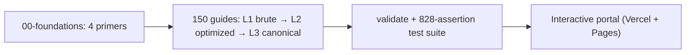

# LeetCode Top Interview 150 — Visual JavaScript Manual

Crack MAANG JavaScript interviews with **150 problems, each solved 3 ways** — brute force → optimized → canonical — with diagrams, dry runs, V8 gotchas, and real interview follow-ups. Every solution is executable and CI-tested.

**Live manual:** https://leetcode-top-interview-150-javascri.vercel.app · GitHub Pages mirror on `main` branch deployments.

   

> Stats provenance: guide count from the curriculum table below (sums to 150); assertion count from `npm test`. Re-run both before editing this file.

## What's inside

- **150 problem guides** (`01-array-string/` … `23-kadanes-algorithm/`) — each one a self-contained study session: intuition, flowcharts, pseudocode, step-by-step dry-run tables, commented JS, Big-O, and interviewer-ready explanations.
- **4 foundation primers** (`00-foundations/`) — JS runtime quirks, zero-dependency data-structure polyfills, core algorithmic patterns, explaining complexity to interviewers. Read these first.
- **Executable test suite** (`scripts/test-runner.mjs`) — 828 assertions across all guides; solutions are code that runs, not text that rots.
- **Judge subsystem tests** (`scripts/test-judge.mjs`) — 32 assertions over the QuickJS sandbox, verdict driver, session helpers, and `/api/judge/run` guards.
- **Schema validator** (`scripts/validate-guide.mjs`) — rejects truncated or malformed guides in CI.
- **Interactive web portal** (`docs/`) — dark-mode manual with fuzzy search (`⌘K`), difficulty filters, progress tracking, Mermaid diagrams, Prism highlighting, and KaTeX math. Built by `scripts/build-site.mjs`, deployed to Vercel + GitHub Pages.



Full blueprint: [`MASTER_PLAN.md`](MASTER_PLAN.md).

## Anatomy of a guide

Every guide follows the same 6-section schema (enforced by `validate-guide.mjs` — keep it intact):

1. **Problem Overview & Edge Case Matrix** — statement plus an upfront table of edge cases and their failure modes.
2. **Level 1: Brute Force** — intuition, Mermaid flowchart, pseudocode, dry-run trace table, commented JS, complexity.
3. **Level 2: Optimized** — what redundant work dies, same full treatment.
4. **Level 3: Most Optimal / Canonical** — the interview-winning approach with invariant proof.
5. **JavaScript-Specific Gotchas & V8 Optimizations** — GC pressure, `charCodeAt` vs `parseInt`, bitwise truncation, typed arrays.
6. **MAANG Follow-Ups & Extensions** — streaming inputs, concurrency, scaling, with solution strategies and code.

## Curriculum

| Module | Focus | Guides |
|---|---|---|
| `00-foundations` | Runtime quirks, polyfills, patterns, complexity | 4 primers |
| `01-array-string` | Strings, sorting, greedy, matrices-as-arrays | 24 |
| `02-two-pointers` | Palindromes, containers, 3Sum | 5 |
| `03-sliding-window` | Dynamic windows, concatenation, minimum window | 4 |
| `04-matrix` | Sudoku, spiral, rotate, zeroes, Game of Life | 5 |
| `05-hashmap` | Anagrams, grouping, Two Sum, sequences | 9 |
| `06-intervals` | Merge, insert, arrows | 4 |
| `07-stack` | Parentheses, paths, min-stack, RPN, calculator | 5 |
| `08-linked-list` | Cycle, merge, reverse, rotate, LRU | 11 |
| `09-binary-tree-general` | Depth, symmetry, construction, LCA, path sum | 14 |
| `10-binary-tree-bfs` | Level order, views, zigzag | 4 |
| `11-binary-search-tree` | Validation, kth smallest, min difference | 3 |
| `12-binary-search` | Rotated arrays, peaks, median of medians | 7 |
| `13-heap` | Kth largest, IPO, k pairs, median stream | 4 |
| `14-backtracking` | Combinations, permutations, N-Queens, word search | 7 |
| `15-math` | Palindromes, pow, sqrt, max points | 6 |
| `16-one-dp` | Climbing stairs, robber, word break, LIS | 5 |
| `17-multi-dp` | Paths, palindromes, edit distance, stocks, squares | 9 |
| `18-graph-general` | Islands, clone, division, course schedule | 6 |
| `19-graph-bfs` | Snakes & ladders, mutations, word ladder | 3 |
| `20-trie` | Prefix tree, add/search, word search II | 3 |
| `21-divide-conquer` | BST from array, sort list, quad tree, k-lists | 4 |
| `22-bit-manipulation` | Add/reverse bits, single numbers, AND ranges | 6 |
| `23-kadanes-algorithm` | Max subarray, circular max | 2 |

## Quickstart

Requires Node 20+ (CI uses Node 20). Install backend dependencies first (the curriculum itself stays dependency-free):

```bash
npm install              # quickjs-emscripten sandbox for the judge API
npm run validate   # schema + code-fence integrity for all 150 guides
npm test           # execute every JS solution block (828 assertions)
npm run test:judge # judge sandbox, driver, session + route guards (32 assertions)
npm run build      # regenerate docs/curriculum-data.js from markdown
npm run verify     # all of the above, in order
```

To study: open the live portal, or `npx serve docs` and browse locally.

## How the portal renders

Markdown never ships raw. `scripts/build-site.mjs` bundles all guides into `docs/curriculum-data.js`; `docs/index.html` renders client-side:

`marked` (markdown) → `Prism` (JS highlighting, ligatures off) → `mermaid` (dark-theme flowcharts) → `KaTeX` (all `$…$` math; `pre`/`code` excluded so template literals like `` `r${r}:${val}` `` are never parsed as math) → responsive tables via `.table-scroll` wrappers.

## Repo layout

```
00-foundations/ … 23-kadanes-algorithm/  # 150 guides + 4 primers (the product)
docs/                                    # index.html + generated curriculum-data.js (the portal)
scripts/                                 # validate-guide.mjs, test-runner.mjs, test-judge.mjs, build-site.mjs
api/                                     # Vercel serverless: judge/run + _lib (sandbox, session, problems)
judge/tests/                             # authored per-problem test specs (5-problem pilot)
.github/workflows/deploy.yml            # validate → test → test:judge → build → GitHub Pages
MASTER_PLAN.md                           # full curriculum blueprint + judge-platform plan
vercel.json                              # outputDirectory: docs for git-based deploys
```

## Status & roadmap

- ✅ 150/150 guides complete, validated, tested (`npm test`: 828 assertions, 0 failures), deployed.
- ✅ Judge execution routes built + tested (`npm run test:judge`: 32 assertions, 0 failures) — QuickJS sandbox, verdict driver, session helpers, `/api/judge/run` with auth/rate guards.
- 🔲 Auth routes + progress store next (needs owner-created GitHub OAuth App) — see `MASTER_PLAN.md` §6.

## Contributing

1. Copy the 6-section schema from any guide in `04-matrix/` (smallest module, easiest to imitate).
2. Keep all fenced blocks balanced and all JS blocks runnable — `npm run verify` must stay green.
3. Math goes in `$…$` (KaTeX renders it); never put `$` math inside code blocks.

## License

MIT — study hard, interview well.
