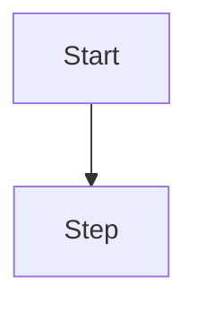

# {Title} (ELI15 in first 100 words: what it is + why a 15-year-old should care)

## 1. TL;DR + analogy
## 2. Why companies care
## 3. Core concepts in simple words
## 4. Detailed JS examples
```js
// runnable Node 18+ example, good vs bad AI output where relevant
```
## 5. Flowchart

## 6. Whiteboard diagram

## 7. Official notes (Firecrawl full-capture, file paths + URLs cited)
## 8. Cross-verify table (official vs second source, conflicts)
## 9. Top-50 interview questions (table: # | Question | Why asked | Answer link)
## 10. Quiz + project checklist + Next
