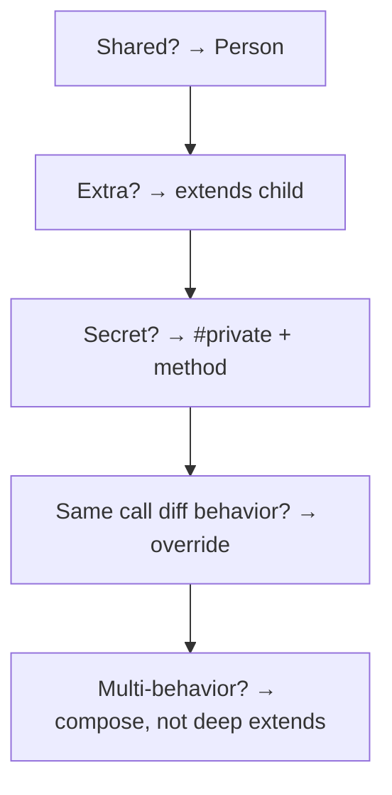
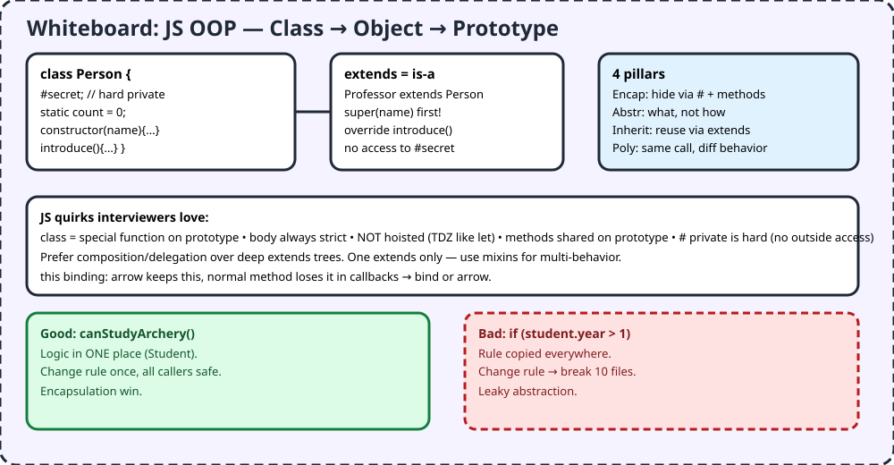

# F1 — JS + OOP

> Blueprint (class) → house (object). Professors and Students are both People — put shared stuff in Person, extras in children, hide secrets with `#`.

## 1. TL;DR + analogy
- School: `Person` has name + introduce. `Professor extends Person` adds teaches + grade. `Student extends Person` hides `#year`, exposes `canStudyArchery()`.
- JS twist: classes are "special functions" on prototypes, body always strict, NOT hoisted, methods shared.

## 2. Why companies care
- Video Phase 1: pick JS + OOP thoroughly before DSA. Every later phase (DSA patterns, backend, agents) assumes you can model cleanly.
- Interviews probe `this`, `#` private, extends/super order, composition vs inheritance.

## 3. Core concepts in simple words
1. **Declaration vs expression:** `class A {}` vs `const A = class {}`. Both strict, both TDZ (no use-before-define).
2. **Constructor:** one only, `super()` first in child before `this`. Creates + binds + returns object.
3. **Methods on prototype:** shared, can be normal/async/generator. `this` binds at call time — arrows keep, callbacks lose (bind needed).
4. **Static:** on class itself (`Date.now()`), for utils/caches, not per instance. Static blocks for init.
5. **Fields:** `name = ''` declares; `#year` hard private — invisible outside, children can't touch parent `#`. No `public/private` keywords.
6. **4 pillars:** Encapsulation (hide via # + methods), Abstraction (what not how), Inheritance (extends reuse), Polymorphism (override same call).
7. **Prefer composition:** deep extends trees rot; JS single-extends — mixins/delegation for multi-behavior.

## 4. Detailed JS examples

### 4.1 Person → Professor → Student (runnable)
```js
class Person {
  constructor(name) { this.name = name; }
  introduceSelf() { console.log(`Hi! I'm ${this.name}`); }
}
class Professor extends Person {
  constructor(name, teaches) { super(name); this.teaches = teaches; }
  grade() { console.log(Math.floor(Math.random() * 5) + 1); }
}
class Student extends Person {
  #year;
  constructor(name, year) { super(name); this.#year = year; }
  canStudyArchery() { return this.#year > 1; }
}
const g = new Student("Asha", 2);
console.log(g.canStudyArchery()); // true
// console.log(g.#year); // SyntaxError — hard private
```

### 4.2 this trap + static
```js
class Counter {
  static total = 0;
  #x = 0;
  constructor() { Counter.total++; }
  inc = () => { this.#x++; }; // arrow keeps this in callbacks
  get x() { return this.#x; }
}
const c = new Counter();
setTimeout(c.inc, 10); // works because arrow; normal method would need .bind
```

### 4.3 Composition over inheritance
```js
// Instead of 5-level extends, mix behaviors
const canGrade = { grade(p) { return Math.ceil(Math.random() * 5); } };
const prof = Object.assign(new Person("Rao"), canGrade);
```

## 5. Flowchart


## 6. Whiteboard diagram


## 7. Official notes (Firecrawl full-capture)
- MDN Classes: `https://developer.mozilla.org/en-US/docs/Web/JavaScript/Reference/Classes`
  - Raw: `.firecrawl/raw/f1-mdn-classes-official.md` — 1115 lines / 93881 bytes, verified
  - Used: special functions, TDZ, strict body, constructor/super, prototype methods, static, fields, # hard private, inheritance, eval order
- MDN Using classes + OOP guides (free websearch): Person/Professor/Student, canStudyArchery encapsulation win, delegation flexibility
- Cross-check: JS prototype model can do OOP without classes, but class syntax maps cleanly; Date mutability warning

## 8. Cross-verify table
| Claim | MDN official | Second source (MDN guides) | Verdict |
|---|---|---|---|
| Class strict, not hoisted | Yes, TDZ like let/const | Yes | Agree |
| One constructor, super first | Yes, SyntaxError if 2 | Yes, Square extends Polygon | Agree |
| Methods shared on prototype | Yes, plain/async/generator | Yes | Agree |
| # hard private, no keywords | Yes, scoped to body | Yes, console-only relaxation | Agree |
| Prefer delegation/composition | Yes, flexible vs hierarchies | Yes, archery method win | Agree |

## 9. Top-50 interview questions — JS + OOP
Main banks:
- OOP 52: https://github.com/Devinterview-io/oop-interview-questions — verified `.firecrawl/raw/f1-oop-top52.md` (1543 lines / 61612 bytes)
- OOP 52 answers: https://devinterview.io/questions/web-and-mobile-development/oop-interview-questions
- JS 60+: https://www.interviewbit.com/javascript-interview-questions
- JS 50: https://codefinity.com/blog/Top-50-Must-Know-JavaScript-Interview-Questions
- JS OOP drills: https://www.greatfrontend.com/questions/javascript-interview-questions/quiz

| # | Question | Why asked | Answer link |
|---|---|---|---|
| 1 | What is OOP? | Paradigm, objects+methods | [Answer](https://github.com/Devinterview-io/oop-interview-questions) |
| 2 | Procedural vs OOP? | Data+fn management | [Answer](https://github.com/Devinterview-io/oop-interview-questions) |
| 3 | Encapsulation? | Hide + bind | [Answer](https://github.com/Devinterview-io/oop-interview-questions) |
| 4 | Polymorphism? override vs overload? | Same call diff behavior | [Answer](https://github.com/Devinterview-io/oop-interview-questions) |
| 5 | Inheritance types? | Single/multi/level | [Answer](https://github.com/Devinterview-io/oop-interview-questions) |
| 6 | Abstraction techniques? | Abstract/interface | [Answer](https://github.com/Devinterview-io/oop-interview-questions) |
| 7 | Class vs object? | Blueprint vs house | [Answer](https://github.com/Devinterview-io/oop-interview-questions) |
| 8 | Constructor use? | Init | [Answer](https://devinterview.io/questions/web-and-mobile-development/oop-interview-questions) |
| 9 | Destructor/finalizer? | Cleanup | [Answer](https://devinterview.io/questions/web-and-mobile-development/oop-interview-questions) |
| 10 | Inheritance vs mixin vs composition? | Reuse tradeoffs | [Answer](https://devinterview.io/questions/web-and-mobile-development/oop-interview-questions) |
| 11 | Interface vs abstract class? | Contract vs partial | [Answer](https://devinterview.io/questions/web-and-mobile-development/oop-interview-questions) |
| 12 | Aggregation? | Has-a | [Answer](https://devinterview.io/questions/web-and-mobile-development/oop-interview-questions) |
| 13 | Overriding rules? | Signature | [Answer](https://devinterview.io/questions/web-and-mobile-development/oop-interview-questions) |
| 14 | Static when? | Class-level | [Answer](https://devinterview.io/questions/web-and-mobile-development/oop-interview-questions) |
| 15 | Multiple inheritance cons? | Diamond | [Answer](https://devinterview.io/questions/web-and-mobile-development/oop-interview-questions) |
| 16 | Diamond problem? | Shared base | [Answer](https://devinterview.io/questions/web-and-mobile-development/oop-interview-questions) |
| 17 | Cohesion vs coupling? | Focus vs deps | [Answer](https://devinterview.io/questions/web-and-mobile-development/oop-interview-questions) |
| 18 | Access specifiers? / JS #? | Visibility | [Answer](https://devinterview.io/questions/web-and-mobile-development/oop-interview-questions) |
| 19 | Builder pattern? | Stepwise build | [Answer](https://devinterview.io/questions/web-and-mobile-development/oop-interview-questions) |
| 20 | Strategy pattern? | Swap algo | [Answer](https://devinterview.io/questions/web-and-mobile-development/oop-interview-questions) |
| 21 | Adapter pattern? | Wrap interface | [Answer](https://devinterview.io/questions/web-and-mobile-development/oop-interview-questions) |
| 22 | Anti-patterns? | God object etc | [Answer](https://devinterview.io/questions/web-and-mobile-development/oop-interview-questions) |
| 23 | Circular deps? | Break cycles | [Answer](https://devinterview.io/questions/web-and-mobile-development/oop-interview-questions) |
| 24 | Unit test OOP? | Mock/inject | [Answer](https://devinterview.io/questions/web-and-mobile-development/oop-interview-questions) |
| 25 | Abstraction vs encapsulation? | What vs hide | [Answer](https://www.interviewbit.com/oops-interview-questions) |
| 26 | Need for OOP? | Modular/reuse | [Answer](https://www.interviewbit.com/oops-interview-questions) |
| 27 | Real-world design with OOP? | Model domain | [Answer](https://www.interviewbit.com/oops-interview-questions) |
| 28 | SOLID? | Design judgment | [Answer](https://www.interviewbit.com/oops-interview-questions) |
| 29 | var vs let vs const? | Scope/hoist | [Answer](https://www.interviewbit.com/javascript-interview-questions) |
| 30 | Hoisting? | Decls to top | [Answer](https://www.interviewbit.com/javascript-interview-questions) |
| 31 | typeof + data types? | Dynamic | [Answer](https://www.interviewbit.com/javascript-interview-questions) |
| 32 | Strict mode? | Safer | [Answer](https://www.interviewbit.com/javascript-interview-questions) |
| 33 | IIFE? | Isolate | [Answer](https://www.interviewbit.com/javascript-interview-questions) |
| 34 | == vs ===? | Coercion | [Answer](https://www.interviewbit.com/javascript-interview-questions) |
| 35 | Arrow functions? | Lexical this | [Answer](https://www.interviewbit.com/javascript-interview-questions) |
| 36 | Closures? | Capture | [Answer](https://codefinity.com/blog/Top-50-Must-Know-JavaScript-Interview-Questions) |
| 37 | Promises/async? | Flow | [Answer](https://codefinity.com/blog/Top-50-Must-Know-JavaScript-Interview-Questions) |
| 38 | Prototype inheritance? | Delegate chain | [Answer](https://www.greatfrontend.com/questions/javascript-interview-questions/quiz) |
| 39 | new vs call? | Instance | [Answer](https://www.greatfrontend.com/questions/javascript-interview-questions/quiz) |
| 40 | ES6 class vs ES5 fn? | Sugar | [Answer](https://www.greatfrontend.com/questions/javascript-interview-questions/quiz) |
| 41 | bind/call/apply? | Set this | [Answer](https://www.greatfrontend.com/questions/javascript-interview-questions/quiz) |
| 42 | Extending builtins bad? | Collisions | [Answer](https://www.greatfrontend.com/questions/javascript-interview-questions/quiz) |
| 43 | Cookie vs storage? | Persist | [Answer](https://www.greatfrontend.com/questions/javascript-interview-questions/quiz) |
| 44 | script async/defer? | Load order | [Answer](https://www.greatfrontend.com/questions/javascript-interview-questions/quiz) |
| 45 | Event bubbling? | Propagate | [Answer](https://www.greatfrontend.com/questions/javascript-interview-questions/quiz) |
| 46 | Sync vs async fn? | Block? | [Answer](https://www.greatfrontend.com/questions/javascript-interview-questions/quiz) |
| 47 | Polyfills? | Backfill | [Answer](https://www.greatfrontend.com/questions/javascript-interview-questions/quiz) |
| 48 | Object.create pattern? | Delegate | [Answer](https://github.com/Narahari-Sundaragopalan/JavaScript-Interview-Questions/blob/master/concepts/OOP.md) |
| 49 | Factory makePerson? | No new | [Answer](https://github.com/Narahari-Sundaragopalan/JavaScript-Interview-Questions/blob/master/concepts/OOP.md) |
| 50 | personStore greet? | Literal+fn | [Answer](https://github.com/Narahari-Sundaragopalan/JavaScript-Interview-Questions/blob/master/concepts/OOP.md) |

## 10. Quiz + checklist
Quiz: 1) Class vs object? 2) super rule? 3) # vs _? 4) Static? 5) Compose vs extends?
Checklist: [ ] built Person tree [ ] used # + static [ ] fixed 1 this bug
Next: [F2 — DSA Patterns](#docs_fresher-roadmap_f2-dsa-150-patterns-js)
