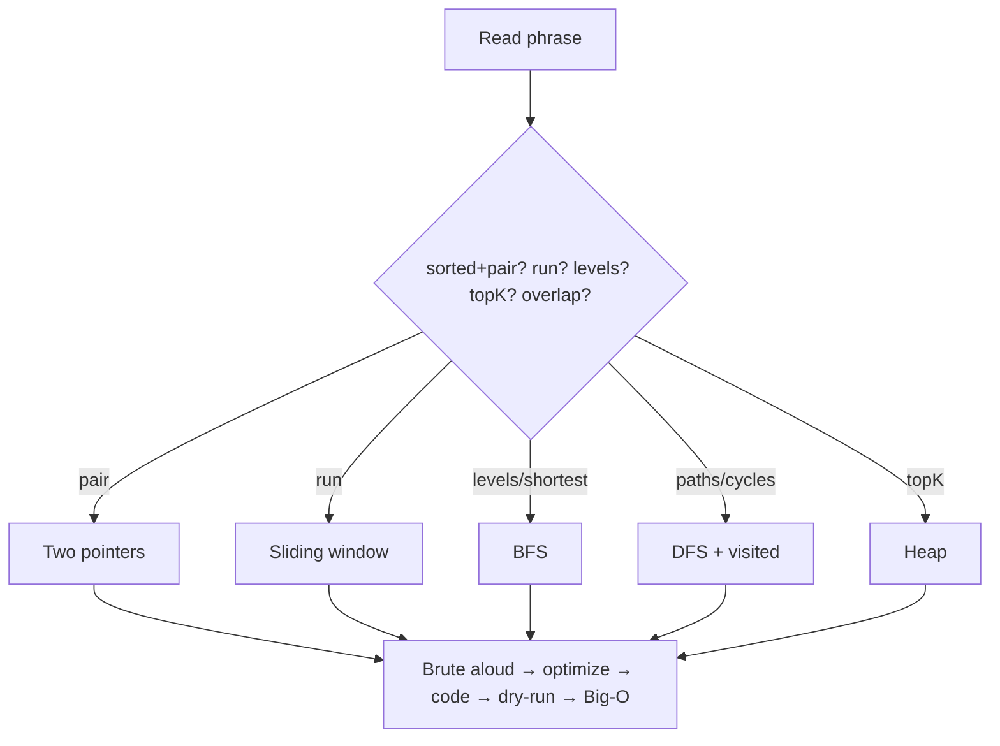
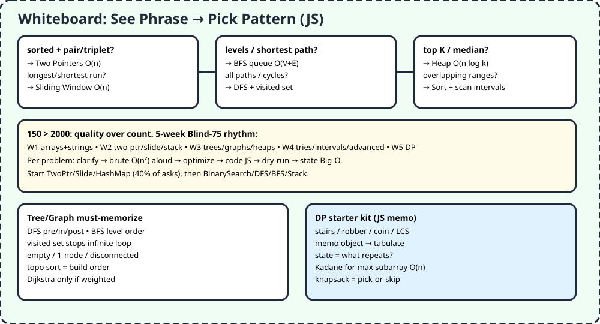

# F2 — DSA 150 Patterns in JS

> Companies test pattern recognition, not memory. "Sorted + pair?" → two pointers. "Longest run?" → sliding window. "Levels?" → BFS. Learn the tell, not 2000 solutions.

## 1. TL;DR + analogy
- Doctor analogy: symptoms → diagnosis. Phrases are symptoms, patterns are cures. 150 diverse cases beats 150 array clones.
- Video rule: 150-200 filtered across arrays, trees, graphs, DP. Write some from scratch once to feel it, then audit AI like A3.

## 2. Why companies care
- FAANG asks arrays/strings/linked-lists/trees/graphs/DP because they reveal Big-O + tradeoff thinking (A3) + communication (A4).
- Frontend roles weight practical transforms: dedupe, group, slide, traverse, cache — not exotic math.

## 3. Core patterns in simple words (JS-first)
1. **Two Pointers O(n):** sorted pair/triplet, palindrome, dedupe in place. Converge or fast/slow.
2. **Sliding Window O(n):** longest/shortest contiguous, fixed-k sums, char replacement. Expand right, shrink left while invalid.
3. **HashMap/Prefix:** frequency, anagram, subarray sums. Trade space for time.
4. **Stack/Monotonic:** parentheses, next-greater, window max. Last-in-first-out saves rescans.
5. **Intervals:** merge/insert/calendar — sort by start, scan once O(n log n).
6. **Fast/Slow + Reversal:** cycle detect, middle, reverse sublist O(1) space.
7. **Tree DFS/BFS O(n):** pre/in/post, level order, validate BST with bounds, LCA. BFS queue for levels/shortest unweighted.
8. **Graphs O(V+E):** adjacency via hash-of-hash, visited set mandatory, topo for build order, Dijkstra only weighted.
9. **Heap/Top-K O(n log k):** K frequent/closest, merge K lists, median via two heaps.
10. **Binary Search O(log n):** sorted/rotated boundary, answer-space search.
11. **Backtrack/DP:** try-all with prune; memo → tabulate. Start stairs/robber/coin/LCS/knapsack, Kadane O(n).

## 4. Detailed JS examples

### 4.1 Two pointers + sliding window
```js
// Two Sum II (sorted) — O(n)
function twoSumSorted(nums, t) {
  let l = 0, r = nums.length - 1;
  while (l < r) {
    const s = nums[l] + nums[r];
    if (s === t) return [l, r];
    s < t ? l++ : r--;
  }
}
// Longest substring no repeat — O(n)
function longestUnique(s) {
  const last = new Map(); let l = 0, best = 0;
  for (let r = 0; r < s.length; r++) {
    if (last.has(s[r]) && last.get(s[r]) >= l) l = last.get(s[r]) + 1;
    last.set(s[r], r); best = Math.max(best, r - l + 1);
  }
  return best;
}
```

### 4.2 Tree BFS + graph DFS
```js
// Level order (BFS) — queue
function levelOrder(root) {
  if (!root) return [];
  const q = [root], out = [];
  while (q.length) {
    const lvl = [];
    for (let n = q.length; n > 0; n--) {
      const x = q.shift(); lvl.push(x.val);
      if (x.left) q.push(x.left); if (x.right) q.push(x.right);
    }
    out.push(lvl);
  }
  return out;
}
// Islands (DFS + visited) — O(V)
function numIslands(grid) {
  let c = 0; const R = grid.length, C = grid[0]?.length ?? 0;
  const dfs = (i, j) => {
    if (i < 0 || j < 0 || i >= R || j >= C || grid[i][j] !== "1") return;
    grid[i][j] = "0";
    dfs(i+1,j); dfs(i-1,j); dfs(i,j+1); dfs(i,j-1);
  };
  for (let i = 0; i < R; i++) for (let j = 0; j < C; j++)
    if (grid[i][j] === "1") { c++; dfs(i, j); }
  return c;
}
```

### 4.3 DP memo starter
```js
// Climbing stairs — memo O(n)
function climb(n, m = {}) {
  if (n <= 2) return n;
  return m[n] ??= climb(n-1, m) + climb(n-2, m);
}
// House robber — tabulate O(n)
function rob(nums) {
  let a = 0, b = 0;
  for (const x of nums) [a, b] = [b, Math.max(b, a + x)];
  return b;
}
```

## 5. Flowchart


## 6. Whiteboard diagram


## 7. Official notes (Firecrawl full-capture)
- TechInterviewHandbook best-practice: `https://www.techinterviewhandbook.org/best-practice-questions`
  - Raw: `.firecrawl/raw/f2-blind75-official.md` — 273 lines / 23701 bytes, verified
  - Used: Blind-75 → distilled 50 over 5 weeks (arrays → pointers → trees/graphs → heaps/tries → DP)
- GreatFrontend Blind-75 JS: `https://www.greatfrontend.com/interviews/blind75`
  - Raw: `.firecrawl/raw/f2-blind75-js.md` — 1253 lines / 27947 bytes, verified
  - Used: 75 Qs with JS/TS solutions + tests, 44h total, array/tree/graph/linked-list anchors
- Free cross-verify: LeetCode-75 20+ topics table, Grokking phrase→pattern cheat sheet, DSA Handbook 15-part curriculum, devweekends STAMPS/SLIDE mnemonics

## 8. Cross-verify table
| Claim | Handbook / GF | Second source | Verdict |
|---|---|---|---|
| 150 diverse > 2000 random | Yes, 75→50 distilled | Yes, problem dumps forget | Agree |
| Start TwoPtr/Slide/HashMap (40%) | Yes, weeks 1-2 | Yes, devweekends 40% | Agree |
| Tree/graph visited mandatory | Yes, graph cheatsheet | Yes, infinite-loop guard | Agree |
| DP hardest, start stairs/robber | Yes, week 5 | Yes, DSA Handbook part 9 | Agree |
| JS solutions + tests exist | Yes, GF browser + tests | Yes, LC-75 code links | Agree |

## 9. Top-50 interview questions — DSA patterns
Main banks:
- 75 JS: https://www.greatfrontend.com/interviews/blind75
- 50-schedule: https://www.techinterviewhandbook.org/best-practice-questions
- 75 plan: https://github.com/RikamPalkar/leetcode-75
- Patterns: https://github.com/dipjul/Grokking-the-Coding-Interview-Patterns-for-Coding-Questions
- 100 must-know: https://leetcode.com/discuss/study-guide/5908573/Important-DSA-Patterns-100-to-Crack-Coding-Interviews

| # | Question | Pattern | Answer link |
|---|---|---|---|
| 1 | Two Sum | HashMap O(n) | [Answer](https://www.greatfrontend.com/interviews/blind75) |
| 2 | Best Time Stock | Slide/min-track | [Answer](https://www.greatfrontend.com/interviews/blind75) |
| 3 | Contains Duplicate | Set | [Answer](https://www.greatfrontend.com/interviews/blind75) |
| 4 | Product Except Self | Prefix/suffix | [Answer](https://www.greatfrontend.com/interviews/blind75) |
| 5 | Maximum Subarray | Kadane DP | [Answer](https://www.greatfrontend.com/interviews/blind75) |
| 6 | Max Product Subarray | Track min+max | [Answer](https://www.greatfrontend.com/interviews/blind75) |
| 7 | Min Rotated Sorted | Binary search | [Answer](https://www.greatfrontend.com/interviews/blind75) |
| 8 | Search Rotated Sorted | Boundary BS | [Answer](https://www.greatfrontend.com/interviews/blind75) |
| 9 | 3Sum | Fixed+converge | [Answer](https://www.greatfrontend.com/interviews/blind75) |
| 10 | Container Water | Converge max-area | [Answer](https://www.greatfrontend.com/interviews/blind75) |
| 11 | Longest No-Repeat Substring | Variable window | [Answer](https://www.greatfrontend.com/interviews/blind75) |
| 12 | Longest Repeating Replace | Freq window | [Answer](https://github.com/jaimin-bariya/blind-75-leetcode) |
| 13 | Min Window Substring | Shrink-while-valid | [Answer](https://github.com/jaimin-bariya/blind-75-leetcode) |
| 14 | Valid Anagram/Group | Count map | [Answer](https://github.com/jaimin-bariya/blind-75-leetcode) |
| 15 | Valid Parentheses | Stack | [Answer](https://github.com/jaimin-bariya/blind-75-leetcode) |
| 16 | Valid Palindrome | Converge | [Answer](https://github.com/jaimin-bariya/blind-75-leetcode) |
| 17 | Longest Palindromic | Expand-center/DP | [Answer](https://github.com/jaimin-bariya/blind-75-leetcode) |
| 18 | Reverse Linked List | 3-pointer | [Answer](https://www.greatfrontend.com/interviews/blind75) |
| 19 | Detect Cycle | Fast/slow | [Answer](https://www.greatfrontend.com/interviews/blind75) |
| 20 | Merge Two Sorted | Two-ptr | [Answer](https://www.greatfrontend.com/interviews/blind75) |
| 21 | Merge K Lists | Min-heap | [Answer](https://www.greatfrontend.com/interviews/blind75) |
| 22 | Remove Nth From End | Fast/slow gap | [Answer](https://github.com/jaimin-bariya/blind-75-leetcode) |
| 23 | Reorder List | Mid+reverse+merge | [Answer](https://github.com/jaimin-bariya/blind-75-leetcode) |
| 24 | Max Depth Tree | DFS | [Answer](https://www.greatfrontend.com/interviews/blind75) |
| 25 | Same/Flip Tree | DFS compare | [Answer](https://www.greatfrontend.com/interviews/blind75) |
| 26 | Level Order | BFS | [Answer](https://www.greatfrontend.com/interviews/blind75) |
| 27 | Validate BST | Bounds DFS | [Answer](https://www.greatfrontend.com/interviews/blind75) |
| 28 | Kth Smallest BST | Inorder | [Answer](https://github.com/jaimin-bariya/blind-75-leetcode) |
| 29 | LCA BST | Split walk | [Answer](https://github.com/jaimin-bariya/blind-75-leetcode) |
| 30 | Max Path Sum | Post-order gain | [Answer](https://www.greatfrontend.com/interviews/blind75) |
| 31 | Serialize/Deserialize | Preorder + nulls | [Answer](https://www.greatfrontend.com/interviews/blind75) |
| 32 | Subtree Check | Match DFS | [Answer](https://github.com/jaimin-bariya/blind-75-leetcode) |
| 33 | Build Tree Pre+In | Partition | [Answer](https://www.greatfrontend.com/interviews/blind75) |
| 34 | Trie Insert/Search | Prefix tree | [Answer](https://www.greatfrontend.com/interviews/blind75) |
| 35 | Clone Graph | Hash + DFS/BFS | [Answer](https://www.greatfrontend.com/interviews/blind75) |
| 36 | Course Schedule | Topo sort | [Answer](https://github.com/jaimin-bariya/blind-75-leetcode) |
| 37 | Pacific Atlantic | Multi-source DFS | [Answer](https://github.com/jaimin-bariya/blind-75-leetcode) |
| 38 | Number Islands | Grid DFS | [Answer](https://github.com/jaimin-bariya/blind-75-leetcode) |
| 39 | Longest Consecutive | Set sequence | [Answer](https://github.com/jaimin-bariya/blind-75-leetcode) |
| 40 | Climbing Stairs | Memo | [Answer](https://github.com/jaimin-bariya/blind-75-leetcode) |
| 41 | Coin Change | DP min-coins | [Answer](https://github.com/jaimin-bariya/blind-75-leetcode) |
| 42 | LIS | DP + binary | [Answer](https://github.com/jaimin-bariya/blind-75-leetcode) |
| 43 | LCS | 2D DP | [Answer](https://github.com/jaimin-bariya/blind-75-leetcode) |
| 44 | Word Break | DP + trie | [Answer](https://github.com/jaimin-bariya/blind-75-leetcode) |
| 45 | Combination Sum | Backtrack | [Answer](https://github.com/jaimin-bariya/blind-75-leetcode) |
| 46 | House Robber I/II | Pick-or-skip | [Answer](https://github.com/jaimin-bariya/blind-75-leetcode) |
| 47 | Decode Ways | Count DP | [Answer](https://github.com/jaimin-bariya/blind-75-leetcode) |
| 48 | Unique Paths/Jump | Grid/greedy | [Answer](https://github.com/jaimin-bariya/blind-75-leetcode) |
| 49 | Merge/Insert Intervals | Sort+scan | [Answer](https://github.com/jaimin-bariya/blind-75-leetcode) |
| 50 | Top K Frequent | Heap/bucket | [Answer](https://www.techinterviewhandbook.org/best-practice-questions) |

Pattern drills: https://resources.devweekends.com/dsa-patterns/overview (phrase→pattern), https://www.grokkingthecodinginterview.com/blog/dsa-patterns-cheat-sheet (41 on one page), https://frontendinterviews.dev/frontend-algorithm-interview-questions (frontend high-signal)

## 10. Quiz + checklist
Quiz: 1) Sorted+pair? 2) Longest run? 3) Levels? 4) TopK? 5) Overlap ranges?
Checklist: [ ] solved 2-3 easy +1 med/day W1-2 [ ] dry-ran BFS+DFS [ ] memoized 1 DP
Next: [F3 — Postgres + REST + Auth](#docs_fresher-roadmap_f3-postgres-rest-auth)
