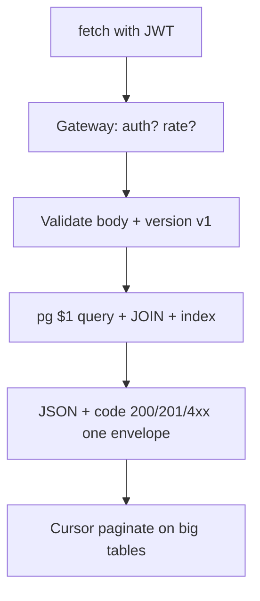
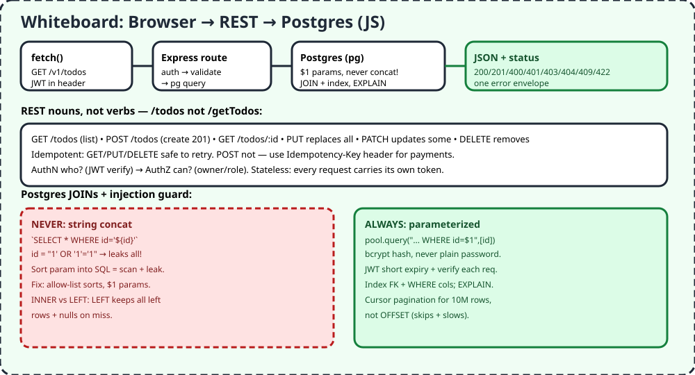

# F3 — Postgres + REST API + Auth

> Library analogy: Postgres = shelves (tables), REST = librarian desk (nouns + methods), Auth = library card (who + can-what). Every request shows its card because REST is stateless.

## 1. TL;DR + analogy
- Shelves have indexes (like book index) so librarian finds rows without scanning all 10M.
- Bad AI: `WHERE id='${id}'` → `' OR '1'='1` leaks everything. Good: `$1` params + allow-list sorts.

## 2. Why companies care
- Video Phase 3: Postgres + REST + basic auth before deployment. Backend interviews live here: methods, codes, versioning, injection, pagination.

## 3. Core concepts in simple words
1. **Resources not verbs:** `/todos`, not `/getTodos`. GET list/one, POST create (201), PUT replace-all, PATCH some, DELETE remove.
2. **Idempotent/safe:** GET/PUT/DELETE retry-safe; POST not — payments need `Idempotency-Key`.
3. **Codes:** 200 ok, 201 created, 400 bad shape, 401 who?, 403 no!, 404 missing, 409 conflict (wrong state), 422 valid JSON bad data. One error envelope.
4. **Stateless:** each request carries JWT; server doesn't remember. ETag + 304 saves bandwidth.
5. **Version:** `/v1` URI simplest; header/query possible. New version only on breaking change.
6. **Pagination:** offset easy but slow/skips on 10M; cursor (keyset) stable. Sort allow-list, never raw SQL.
7. **Postgres:** JOIN types (INNER only matches, LEFT keeps left + nulls), indexes speed reads cost writes, FK + WHERE indexed, EXPLAIN before 10M.
8. **Auth:** AuthN (JWT verify) → AuthZ (owner/role). bcrypt passwords, short JWT expiry, least-privilege DB roles.

## 4. Detailed JS examples

### 4.1 Express CRUD with auth + validation (runnable sketch)
```js
import express from "express";
import jwt from "jsonwebtoken";
const app = express();
app.use(express.json());

const TOKENS = "secret";
function requireAuth(req, res, next) {
  const h = req.headers.authorization ?? "";
  try { req.user = jwt.verify(h.replace("Bearer ", ""), TOKENS); next(); }
  catch { res.status(401).json({ code: "UNAUTH", message: "Login first" }); }
}

let todos = {}, nextId = 1;
app.get("/v1/todos", (req, res) => res.json({ data: Object.values(todos) }));
app.post("/v1/todos", requireAuth, (req, res) => {
  if (!req.body.title) return res.status(422).json({ code: "BAD_TITLE", message: "title required" });
  const id = nextId++;
  todos[id] = { id, title: req.body.title, owner: req.user.sub };
  res.status(201).json({ data: todos[id] });
});
```

### 4.2 Postgres safe vs unsafe (pg)
```js
import { Pool } from "pg";
const pool = new Pool({ connectionString: process.env.DATABASE_URL });

// UNSAFE — NEVER DO THIS
// await pool.query(`SELECT * FROM todos WHERE id='${req.params.id}'`);

// SAFE
const { rows } = await pool.query("SELECT * FROM todos WHERE id=$1", [req.params.id]);

// JOIN + index hint
await pool.query(`
  SELECT t.title, u.name FROM todos t
  JOIN users u ON u.id = t.owner_id
  WHERE u.id=$1 ORDER BY t.id LIMIT 20`, [userId]);
// CREATE INDEX todos_owner ON todos(owner_id);
```

### 4.3 Cursor pagination + password
```js
import bcrypt from "bcrypt";
// cursor: ?after=123&limit=20 → WHERE id > $1, stable on 10M rows
// password: hash once, compare always
const hash = await bcrypt.hash("pw123", 12);
console.log(await bcrypt.compare("pw123", hash)); // true
```

## 5. Flowchart


## 6. Whiteboard diagram


## 7. Official notes (Firecrawl full-capture)
- Postgres joins: `https://www.postgresql.org/docs/current/tutorial-join.html`
  - Raw: `.firecrawl/raw/f3-pg-join-official.md` — 236 lines / 11842 bytes, verified
  - Used: JOIN/ON pre-dates syntax, weather/cities example, index chapter (speed vs overhead)
- REST 50+: `https://www.datacamp.com/blog/rest-api-interview-questions`
  - Raw: `.firecrawl/raw/f3-rest-top50.md` — 1399 lines / 64273 bytes, verified
  - Used: Q1-Q50 basics→advanced, PUT vs POST/PATCH, stateless, idempotency, 401/403, 400/422, 409, pagination, versioning, ETag, auth methods
- Free cross-verify: Postgres SELECT/Indexes docs, Simplilearn 40 REST, Browserless authN/Z + OWASP API Top 10 (BOLA), Designgurus gateway vs LB

## 8. Cross-verify table
| Claim | Official | Second source | Verdict |
|---|---|---|---|
| PUT replace, PATCH partial | Yes, code blocks | Yes, POST not same as PUT | Agree |
| Stateless + JWT per request | Yes | Yes, AuthN who/AuthZ can | Agree |
| 401 vs 403, 400 vs 422 | Yes | Yes | Agree |
| Cursor > offset on huge | Yes, sort/limit notes | Yes, offset skips/slows | Agree |
| $1 prevents injection | PG docs param style | Yes, sort allow-list | Agree |

## 9. Top-50 interview questions — Postgres + REST + Auth
Main banks:
- REST 50+: https://www.datacamp.com/blog/rest-api-interview-questions
- REST 40: https://www.simplilearn.com/rest-api-interview-questions-answers-article
- REST 40+: https://www.interviewbit.com/rest-api-interview-questions
- SQL 99: https://www.datacamp.com/blog/rest-api-interview-questions (linked Top 99 SQL inside guide)

| # | Question | Why asked | Answer link |
|---|---|---|---|
| 1 | REST constraints? | Stateless/cache/uniform | [Answer](https://www.datacamp.com/blog/rest-api-interview-questions) |
| 2 | REST vs SOAP? | Light vs contract | [Answer](https://www.datacamp.com/blog/rest-api-interview-questions) |
| 3 | HTTP methods when? | CRUD mapping | [Answer](https://www.datacamp.com/blog/rest-api-interview-questions) |
| 4 | PUT vs POST? | Replace vs create | [Answer](https://www.datacamp.com/blog/rest-api-interview-questions) |
| 5 | PUT vs PATCH? | All vs some | [Answer](https://www.datacamp.com/blog/rest-api-interview-questions) |
| 6 | Stateless means? | No session | [Answer](https://www.datacamp.com/blog/rest-api-interview-questions) |
| 7 | Truly RESTful? HATEOAS? | Level 2 vs 3 | [Answer](https://www.datacamp.com/blog/rest-api-interview-questions) |
| 8 | Status codes? | Contract | [Answer](https://www.datacamp.com/blog/rest-api-interview-questions) |
| 9 | Resource vs endpoint? | Noun vs URL | [Answer](https://www.datacamp.com/blog/rest-api-interview-questions) |
| 10 | URI best practices? | Plurals, no verbs | [Answer](https://www.datacamp.com/blog/rest-api-interview-questions) |
| 11 | Idempotency? which? | Retry safety | [Answer](https://www.datacamp.com/blog/rest-api-interview-questions) |
| 12 | Safe vs idempotent? | Read vs repeat | [Answer](https://www.datacamp.com/blog/rest-api-interview-questions) |
| 13 | Query vs path params? | Filter vs identity | [Answer](https://www.datacamp.com/blog/rest-api-interview-questions) |
| 14 | Content negotiation? | Accept header | [Answer](https://www.datacamp.com/blog/rest-api-interview-questions) |
| 15 | OPTIONS/CORS? | Preflight | [Answer](https://www.datacamp.com/blog/rest-api-interview-questions) |
| 16 | 401 vs 403? | Who vs allowed | [Answer](https://www.datacamp.com/blog/rest-api-interview-questions) |
| 17 | 400 vs 422? | Parse vs semantic | [Answer](https://www.datacamp.com/blog/rest-api-interview-questions) |
| 18 | 409 when? | State conflict | [Answer](https://www.datacamp.com/blog/rest-api-interview-questions) |
| 19 | Pagination offset vs cursor? | Scale | [Answer](https://www.datacamp.com/blog/rest-api-interview-questions) |
| 20 | Versioning? | URI/header/query | [Answer](https://www.datacamp.com/blog/rest-api-interview-questions) |
| 21 | ETag caching? | 304 save | [Answer](https://www.datacamp.com/blog/rest-api-interview-questions) |
| 22 | Auth methods? | Key/Bearer/OAuth/JWT | [Answer](https://www.datacamp.com/blog/rest-api-interview-questions) |
| 23 | OAuth 2.0 vs 2.1? | PKCE default | [Answer](https://www.datacamp.com/blog/rest-api-interview-questions) |
| 24 | AuthN vs AuthZ? | Who vs can | [Answer](https://www.browserless.io/blog/rest-api-interview-questions-answers) |
| 25 | Version in URL? | Compat | [Answer](https://www.browserless.io/blog/rest-api-interview-questions-answers) |
| 26 | Rate limit where? | Gateway/Redis | [Answer](https://www.designgurus.io/blog/mastering-the-api-interview-common-questions-and-expert-answers) |
| 27 | Gateway vs LB? | Entry vs spread | [Answer](https://www.designgurus.io/blog/mastering-the-api-interview-common-questions-and-expert-answers) |
| 28 | Design hotel booking API? | Resources | [Answer](https://www.datacamp.com/blog/rest-api-interview-questions) |
| 29 | Flaky 3rd-party? | Retry/idempotency | [Answer](https://www.designgurus.io/blog/mastering-the-api-interview-common-questions-and-expert-answers) |
| 30 | SELECT basics? | Rows/cols | [Answer](https://www.postgresql.org/docs/current/tutorial-join.html) |
| 31 | INNER vs LEFT JOIN? | Match vs keep-left | [Answer](https://www.postgresql.org/docs/current/tutorial-join.html) |
| 32 | WHERE vs HAVING? | Row vs group | [Answer](https://www.postgresql.org/docs/16/sql-select.html) |
| 33 | Indexes? cost? | Speed vs write | [Answer](https://www.postgresql.org/docs/18/indexes.html) |
| 34 | N+1 query? | Batch/JOIN | [Answer](https://www.interviewbit.com/rest-api-interview-questions) |
| 35 | SQL injection fix? | $1 + allow-list | [Answer](https://www.browserless.io/blog/rest-api-interview-questions-answers) |
| 36 | JWT structure? | Header.payload.sig | [Answer](https://docs.postgrest.org/en/stable/references/auth.html) |
| 37 | Bcrypt why? | Slow hash | [Answer](https://www.interviewbit.com/rest-api-interview-questions) |
| 38 | Refresh tokens? | Short access | [Answer](https://www.interviewbit.com/rest-api-interview-questions) |
| 39 | RBAC? | Roles | [Answer](https://docs.postgrest.org/en/stable/references/auth.html) |
| 40 | BOLA? | Object authZ | [Answer](https://www.browserless.io/blog/rest-api-interview-questions-answers) |
| 41 | Sorting param safe? | Allow-list | [Answer](https://www.designgurus.io/blog/8-rest-api-interview-questions-every-developer-should-know) |
| 42 | Filtering naming? | ?category= | [Answer](https://www.designgurus.io/blog/8-rest-api-interview-questions-every-developer-should-know) |
| 43 | Error envelope? | code+message | [Answer](https://www.designgurus.io/blog/8-rest-api-interview-questions-every-developer-should-know) |
| 44 | CRUD + codes? | 201/204 | [Answer](https://www.designgurus.io/blog/8-rest-api-interview-questions-every-developer-should-know) |
| 45 | Protect route? | Middleware | [Answer](https://www.designgurus.io/blog/8-rest-api-interview-questions-every-developer-should-know) |
| 46 | Two versions? | Blueprints | [Answer](https://www.designgurus.io/blog/8-rest-api-interview-questions-every-developer-should-know) |
| 47 | Idempotent writes? | Key header | [Answer](https://www.designgurus.io/blog/8-rest-api-interview-questions-every-developer-should-know) |
| 48 | Test with Postman/cURL? | Contract | [Answer](https://www.browserless.io/blog/rest-api-interview-questions-answers) |
| 49 | Cache-Control? | Freshness | [Answer](https://www.simplilearn.com/rest-api-interview-questions-answers-article) |
| 50 | Richardson level 2 ok? | Pragmatic | [Answer](https://www.datacamp.com/blog/rest-api-interview-questions) |

## 10. Quiz + checklist
Quiz: 1) PUT vs PATCH? 2) 401 vs 403? 3) Offset vs cursor on 10M? 4) INNER vs LEFT? 5) AuthN vs AuthZ?
Checklist: [ ] built CRUD + auth [ ] 1 JOIN + index + EXPLAIN [ ] cursor page on big table
Next: [F4 — Docker + AWS + Actions](./f4-docker-aws-actions.md)
