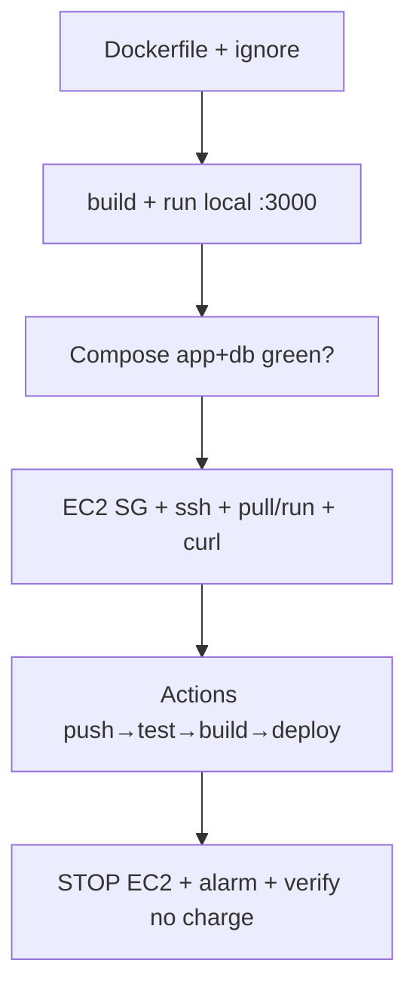
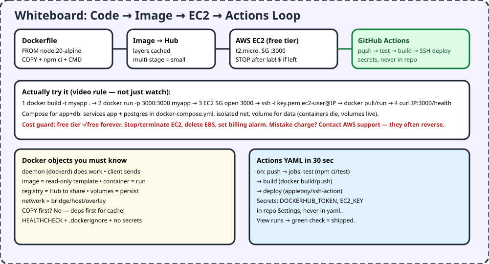

# F4 — Docker + AWS Free Tier + GitHub Actions

> Shipping beats watching. Build image → run locally → EC2 → Actions auto-deploys on push. And turn OFF EC2 after labs or free becomes paid.

## 1. TL;DR + analogy
- Lunchbox: Dockerfile = recipe, image = packed box, container = box opened at school, registry = shelf, volume = locker that survives trash day.
- Video trick: AWS support often reverses accidental charges if you ask — but set billing alarms first.

## 2. Why companies care
- "It works on my machine" dies with Docker. Actions proves tests + builds on every push. EC2 proves you can run in cloud, not just localhost.

## 3. Core concepts in simple words
1. **Architecture:** client sends, daemon (`dockerd`) builds/runs, Desktop wraps it, registries share images.
2. **Objects:** image read-only, container runnable, volumes persist (containers don't!), networks bridge/host/overlay.
3. **Dockerfile order matters:** deps first (`COPY package*.json + npm ci`) for layer cache; code last. Multi-stage = small prod image. `.dockerignore` + no secrets + HEALTHCHECK.
4. **Compose:** app + postgres together, isolated net, `depends_on`, volumes for DB.
5. **EC2 free tier:** t2/t3.micro, security group opens port, `ssh -i key.pem`, pull/run, `curl /health`. STOP/terminate + delete EBS after. Billing alarm mandatory.
6. **Actions:** `on: push` → jobs test → build/push → deploy via SSH. Templates to start, secrets in Settings, view checks green.

## 4. Detailed examples

### 4.1 Node Dockerfile + compose (JS app)
```dockerfile
FROM node:20-alpine AS base
WORKDIR /app
COPY package*.json ./
RUN npm ci --omit=dev
COPY . .
EXPOSE 3000
HEALTHCHECK --interval=30s CMD wget -qO- http://localhost:3000/health || exit 1
CMD ["node", "server.js"]
```
```yaml
# docker-compose.yml
services:
  app:
    build: .
    ports: ["3000:3000"]
    depends_on: [db]
    environment: [DATABASE_URL=postgres://u:p@db:5432/app]
  db:
    image: postgres:16
    volumes: [pgdata:/var/lib/postgresql/data]
volumes: { pgdata: {} }
```

### 4.2 EC2 runbook (actually do it)
```bash
docker build -t myapp .
docker run -d -p 3000:3000 --env-file .env myapp
# EC2: SG inbound 3000 from your IP, then:
ssh -i key.pem ec2-user@EC2_IP
docker pull <you>/myapp:latest && docker run -d -p 3000:3000 <you>/myapp
curl http://EC2_IP:3000/health
# DONE? aws ec2 stop-instances --instance-ids i-xxx  # or terminate + delete volume
```

### 4.3 Actions CI/CD starter
```yaml
name: ci
on: { push: { branches: [main] } }
jobs:
  test:
    runs-on: ubuntu-latest
    steps:
      - uses: actions/checkout@v4
      - uses: actions/setup-node@v4
        with: { node-version: 20 }
      - run: npm ci && npm test
  build:
    needs: test
    runs-on: ubuntu-latest
    steps:
      - uses: actions/checkout@v4
      - run: docker build -t ${{ secrets.DOCKERHUB_USER }}/myapp:${{ github.sha }} .
```

## 5. Flowchart


## 6. Whiteboard diagram


## 7. Official notes (Firecrawl full-capture)
- Docker overview: `https://docs.docker.com/get-started/docker-overview/`
  - Raw: `.firecrawl/raw/f4-docker-official.md` — 379 lines / 19290 bytes, verified
  - Used: platform (develop/distribute/run), client-daemon REST, daemon/client/Desktop/registries, images vs containers, `docker run` example
- Actions quickstart: `https://docs.github.com/en/actions/get-started/quickstart`
  - Raw: `.firecrawl/raw/f4-actions-official.md` — 674 lines / 39323 bytes, verified
  - Used: templates, prerequisites, first workflow, view results, next steps
- Free cross-verify: Docker get-started index, AWS pillars (cost), EC2 free-tier warnings from video

## 8. Cross-verify table
| Claim | Official | Second source | Verdict |
|---|---|---|---|
| Client-daemon via REST API | Yes, arch section | Yes, docker run flow | Agree |
| Image template, container runnable | Yes | Yes, Hub pulls | Agree |
| Volumes persist, containers don't | Yes, objects | Yes, pgdata pattern | Agree |
| Actions template→workflow→results | Yes, quickstart | Yes, UltimateDevOps guide | Agree |
| Free tier must stop + alarm | Video + AWS cost pillar | Yes, billing alarms | Agree |

## 9. Top-50 interview questions — Docker + AWS + Actions
Main banks:
- Docker 55: https://github.com/Devinterview-io/docker-interview-questions
- Docker 50: https://github.com/collabnix/dockerlabs/blob/master/docker/docker-interview-questions.md
- Docker 50 leveled: https://devopsboys.com/devops-interview-questions/docker
- DevOps 500+ (Docker 60+, Actions 25+, AWS 80+): https://github.com/techmahato/UltimateDevOpsInterviewGuide

| # | Question | Why asked | Answer link |
|---|---|---|---|
| 1 | Docker vs VM? | Isolation level | [Answer](https://github.com/Devinterview-io/docker-interview-questions) |
| 2 | Image vs container? | Template vs run | [Answer](https://devopsboys.com/devops-interview-questions/docker) |
| 3 | Dockerfile keys? | Build recipe | [Answer](https://devopsboys.com/devops-interview-questions/docker) |
| 4 | Volumes why? | Persist | [Answer](https://devopsboys.com/devops-interview-questions/docker) |
| 5 | Compose when? | Multi-container | [Answer](https://devopsboys.com/devops-interview-questions/docker) |
| 6 | Hub pull/push? | Share | [Answer](https://devopsboys.com/devops-interview-questions/docker) |
| 7 | docker exec? | Debug running | [Answer](https://devopsboys.com/devops-interview-questions/docker) |
| 8 | docker ps flags? | List | [Answer](https://devopsboys.com/devops-interview-questions/docker) |
| 9 | Port -p? | Map | [Answer](https://devopsboys.com/devops-interview-questions/docker) |
| 10 | Env vars? | Config | [Answer](https://devopsboys.com/devops-interview-questions/docker) |
| 11 | Network modes? | Bridge/host | [Answer](https://devopsboys.com/devops-interview-questions/docker) |
| 12 | CMD vs ENTRYPOINT? | Defaults | [Answer](https://devopsboys.com/devops-interview-questions/docker) |
| 13 | Multi-stage why? | Small images | [Answer](https://devopsboys.com/devops-interview-questions/docker) |
| 14 | Reduce size? | Slim/Alpine | [Answer](https://devopsboys.com/devops-interview-questions/docker) |
| 15 | Layer cache optimize? | Order deps first | [Answer](https://devopsboys.com/devops-interview-questions/docker) |
| 16 | Healthcheck? | Self-report | [Answer](https://devopsboys.com/devops-interview-questions/docker) |
| 17 | Registry mirror? | Speed | [Answer](https://devopsboys.com/devops-interview-questions/docker) |
| 18 | Scan vulns? | Security | [Answer](https://devopsboys.com/devops-interview-questions/docker) |
| 19 | CPU/mem limits? | No noisy neighbor | [Answer](https://devopsboys.com/devops-interview-questions/docker) |
| 20 | Secrets? | No env leak | [Answer](https://devopsboys.com/devops-interview-questions/docker) |
| 21 | Tag strategy? | sha/semver | [Answer](https://devopsboys.com/devops-interview-questions/docker) |
| 22 | CoW? | Layers | [Answer](https://devopsboys.com/devops-interview-questions/docker) |
| 23 | BuildKit? | Fast builds | [Answer](https://devopsboys.com/devops-interview-questions/docker) |
| 24 | Docker API? | Automate | [Answer](https://devopsboys.com/devops-interview-questions/docker) |
| 25 | Daemon/client/registry? | 3 parts | [Answer](https://www.interviewbit.com/docker-interview-questions) |
| 26 | Lifecycle? | create→run→stop | [Answer](https://www.edureka.co/blog/interview-questions/docker-interview-questions) |
| 27 | Data survives exit? | Only volumes | [Answer](https://www.edureka.co/blog/interview-questions/docker-interview-questions) |
| 28 | Compose wait ready? | depends ordering | [Answer](https://www.edureka.co/blog/interview-questions/docker-interview-questions) |
| 29 | Paused remove? | No, stop first | [Answer](https://www.edureka.co/blog/interview-questions/docker-interview-questions) |
| 30 | Self-restart? | restart policy | [Answer](https://www.edureka.co/blog/interview-questions/docker-interview-questions) |
| 31 | EC2 free tier? | Micro + SG | [Answer](https://github.com/techmahato/UltimateDevOpsInterviewGuide) |
| 32 | SG open 3000? | Inbound rule | [Answer](https://github.com/techmahato/UltimateDevOpsInterviewGuide) |
| 33 | Stop vs terminate? | Pause vs delete | [Answer](https://github.com/techmahato/UltimateDevOpsInterviewGuide) |
| 34 | Billing alarm? | Budget alert | [Answer](https://github.com/techmahato/UltimateDevOpsInterviewGuide) |
| 35 | IAM least privilege? | Roles | [Answer](https://github.com/techmahato/UltimateDevOpsInterviewGuide) |
| 36 | S3 vs EBS? | Object vs disk | [Answer](https://github.com/techmahato/UltimateDevOpsInterviewGuide) |
| 37 | Actions triggers? | on push/PR | [Answer](https://github.com/techmahato/UltimateDevOpsInterviewGuide) |
| 38 | Jobs vs steps? | VM vs cmds | [Answer](https://github.com/techmahato/UltimateDevOpsInterviewGuide) |
| 39 | Secrets storage? | Settings | [Answer](https://github.com/techmahato/UltimateDevOpsInterviewGuide) |
| 40 | Reusable workflows? | DRY CI | [Answer](https://github.com/techmahato/UltimateDevOpsInterviewGuide) |
| 41 | Cache npm/docker? | Speed | [Answer](https://github.com/techmahato/UltimateDevOpsInterviewGuide) |
| 42 | Blue-green/canary? | Safe deploy | [Answer](https://github.com/techmahato/UltimateDevOpsInterviewGuide) |
| 43 | Rollback? | Prev sha | [Answer](https://github.com/techmahato/UltimateDevOpsInterviewGuide) |
| 44 | ArgoCD vs Actions? | GitOps vs CI | [Answer](https://github.com/techmahato/UltimateDevOpsInterviewGuide) |
| 45 | Swarm vs K8s? | Simple vs prod | [Answer](https://devopsboys.com/devops-interview-questions/docker) |
| 46 | Overlay net? | Multi-host | [Answer](https://devopsboys.com/devops-interview-questions/docker) |
| 47 | tmpfs when? | RAM-only | [Answer](https://devopsboys.com/devops-interview-questions/docker) |
| 48 | Bench security? | Audit script | [Answer](https://devopsboys.com/devops-interview-questions/docker) |
| 49 | Logging strategy? | json/driver | [Answer](https://devopsboys.com/devops-interview-questions/docker) |
| 50 | Support refund? | Ask support | [Answer](https://github.com/techmahato/UltimateDevOpsInterviewGuide) |

## 10. Quiz + checklist
Quiz: 1) Image vs container? 2) Cache trick? 3) Volume why? 4) Actions secrets where? 5) After lab?
Checklist: [ ] ran app+db compose [ ] deployed EC2 + curled [ ] green Actions run [ ] stopped EC2 + alarm
Next: [F5 — OpenAI + LangChain JS](#docs_fresher-roadmap_f5-openai-langchain-js)
