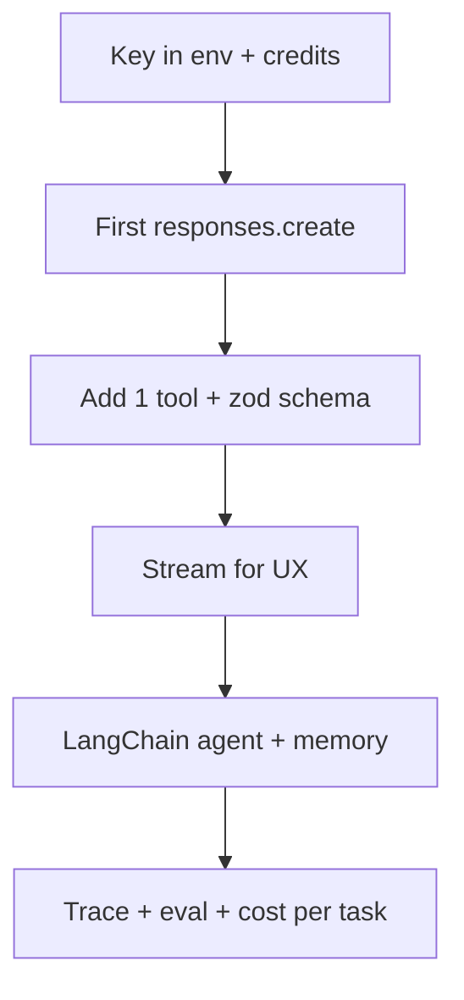
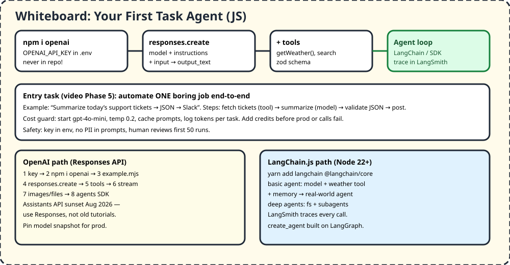

# F5 — OpenAI API + LangChain JS Agents

> Automate one boring job: fetch tickets → summarize → JSON → Slack. Start with one Responses call, add one tool, then graduate to an agent loop with tracing.

## 1. TL;DR + analogy
- Remote chef: you send recipe (prompt) + ingredients (tools), chef returns dish (`output_text`). LangChain = kitchen manager who loops until banquet done.
- Video Phase 5: OpenAI API + proper engineering + LangChain task agents. Assistants API is dead (Aug 2026) — use Responses.

## 2. Why companies care
- Every fresher project with "AI" must show key hygiene, cost control, evals, and one real automation — not a chatbot demo.

## 3. Core concepts in simple words
1. **Key in env:** `OPENAI_API_KEY` from dashboard, `.env` + never commit. SDK reads env automatically.
2. **Responses API:** `responses.create({model, instructions, input})` → `output_text`. Pin snapshot, temp 0.2 factual.
3. **Tools:** JSON-schema functions you run; model asks, you execute, feed back. Start web/file search or one local fn.
4. **Stream:** `stream:true` for chat UX; iterate deltas.
5. **Images/files:** URL/upload/PDF → extract/classify.
6. **Agents SDK:** `Agent + run + tool + handoffs` (see A2). Use for loops, not one-shots.
7. **LangChain.js (Node 22+):** `langchain + @langchain/core`, basic agent (model + weather tool + prompt) → +memory → real-world (fs + subagents). `create_agent` on LangGraph; trace in LangSmith.
8. **Cost/safety:** mini model first, cache, per-task token log, add credits, no PII, human reviews first 50.

## 4. Detailed JS examples

### 4.1 First OpenAI call (example.mjs)
```js
import OpenAI from "openai";
const client = new OpenAI(); // reads OPENAI_API_KEY
const response = await client.responses.create({
  model: "gpt-5.6",
  instructions: "Return JSON only.",
  input: "Write a one-sentence bedtime story about a unicorn.",
});
console.log(response.output_text);
```

### 4.2 Tool + streaming
```js
// tool the model can ask for (you execute)
const getWeather = {
  type: "function",
  name: "getWeather",
  parameters: { type: "object", properties: { city: { type: "string" } } },
};
const r2 = await client.responses.create({
  model: "gpt-5.6", tools: [getWeather],
  input: "Weather in Pune? Use the tool.",
});
// streaming UX
const stream = await client.responses.create({ model: "gpt-5.6", input: "Haiku about code", stream: true });
for await (const e of stream) if (e.type === "response.output_text.delta") process.stdout.write(e.delta);
```

### 4.3 LangChain.js basic agent (Node 22+)
```bash
yarn add langchain @langchain/core
```
```js
// shape: model + weather tool + prompt → agent loop; add memory for multi-turn
// see official quickstart for full TS; trace at smith.langchain.com
import "dotenv/config";
// 1) define tool 2) create_agent({model, tools}) 3) invoke({messages}) 4) add memory 5) trace
```

## 5. Flowchart


## 6. Whiteboard diagram


## 7. Official notes (Firecrawl full-capture)
- OpenAI quickstart: `https://platform.openai.com/docs/quickstart?api-mode=responses`
  - Raw: `.firecrawl/raw/f5-openai-quickstart.md` — 2319 lines / 64924 bytes, verified
  - Used: key → `npm i openai` → example.mjs → credits → images/files → tools → stream/realtime → agents; Assistants sunset
- LangChain JS quickstart: `https://docs.langchain.com/oss/javascript/langchain/quickstart`
  - Raw: `.firecrawl/raw/f5-langchain-js.md` — 1193 lines / 36777 bytes, verified
  - Used: Node 22+, yarn/bun install, model-agnostic, basic → memory → real-world/deep agents, LangSmith tracing, LangGraph base
- Free cross-verify: Agents SDK quickstart (tool/handoff JS), openai-node README (Responses vs Chat), DataCamp LangChain interview guide

## 8. Cross-verify table
| Claim | Official | Second source | Verdict |
|---|---|---|---|
| `npm i openai`, env key, example.mjs | Yes | Yes, node README | Agree |
| Responses primary, Chat legacy | Yes | Yes | Agree |
| Assistants sunset Aug 2026 | Yes, migrate guide | Yes | Agree |
| LangChain needs Node 22+, memory, trace | Yes | Yes, RAG/agent/memory sections | Agree |
| Start mini + cache + budgets | Quickstart credits | Yes, cost per task | Agree |

## 9. Top-50 interview questions — OpenAI + LangChain
Main banks:
- LangChain 2026: https://www.datacamp.com/blog/langchain-interview-questions
- LangChain 40: https://www.interviewcoder.co/blog/langchain-interview-questions
- Agents SDK: https://developers.openai.com/api/docs/guides/agents/quickstart
- LangChain JS: https://docs.langchain.com/oss/javascript/langchain/quickstart

| # | Question | Why asked | Answer link |
|---|---|---|---|
| 1 | First OpenAI call steps? | Key+SDK+create | [Answer](https://platform.openai.com/docs/quickstart?api-mode=responses) |
| 2 | Responses vs Chat? | Primary vs legacy | [Answer](https://platform.openai.com/docs/quickstart?api-mode=responses) |
| 3 | Where key lives? | Env safety | [Answer](https://platform.openai.com/docs/quickstart?api-mode=responses) |
| 4 | Add credits why? | Paywall | [Answer](https://platform.openai.com/docs/quickstart?api-mode=responses) |
| 5 | Image input how? | Multimodal | [Answer](https://platform.openai.com/docs/quickstart?api-mode=responses) |
| 6 | Tools how? | Extend | [Answer](https://platform.openai.com/docs/quickstart?api-mode=responses) |
| 7 | Stream how? | UX | [Answer](https://platform.openai.com/docs/quickstart?api-mode=responses) |
| 8 | Build agents path? | SDK | [Answer](https://developers.openai.com/api/docs/guides/agents/quickstart) |
| 9 | Assistants vs Responses? | Migrate | [Answer](https://developers.openai.com/api/docs/guides/migrate-to-responses) |
| 10 | Pin snapshot why? | Stable prod | [Answer](https://developers.openai.com/api/docs/guides/agents/quickstart) |
| 11 | What is LangChain? | Usefulness | [Answer](https://www.datacamp.com/blog/langchain-interview-questions) |
| 12 | Chains what? | Compose | [Answer](https://www.datacamp.com/blog/langchain-interview-questions) |
| 13 | LangChain RAG how? | Retrieve→answer | [Answer](https://www.datacamp.com/blog/langchain-interview-questions) |
| 14 | Wrong docs retrieved? | Rerank/rewrite | [Answer](https://www.datacamp.com/blog/langchain-interview-questions) |
| 15 | Agent what? | Loop+tools | [Answer](https://www.datacamp.com/blog/langchain-interview-questions) |
| 16 | Agent cost? | Steps | [Answer](https://www.datacamp.com/blog/langchain-interview-questions) |
| 17 | Memory what? | State | [Answer](https://www.datacamp.com/blog/langchain-interview-questions) |
| 18 | Reduce context growth? | Summarize/trim | [Answer](https://www.datacamp.com/blog/langchain-interview-questions) |
| 19 | Deploy LangChain? | Serve + trace | [Answer](https://www.datacamp.com/blog/langchain-interview-questions) |
| 20 | Multi-agent when? | Split on bloat | [Answer](https://www.datacamp.com/blog/langchain-interview-questions) |
| 21 | Cache? | Exact/semantic | [Answer](https://www.datacamp.com/blog/langchain-interview-questions) |
| 22 | Latency = steps? | Arch not tune | [Answer](https://www.datacamp.com/blog/langchain-interview-questions) |
| 23 | LangChain vs LlamaIndex? | Agent vs search | [Answer](https://www.datacamp.com/blog/langchain-interview-questions) |
| 24 | LangChain vs LangGraph? | High vs runtime | [Answer](https://www.datacamp.com/blog/langchain-interview-questions) |
| 25 | LCEL? | Chain expr | [Answer](https://www.interviewcoder.co/blog/langchain-interview-questions) |
| 26 | Memory types? | Buffer/window/summary | [Answer](https://www.interviewcoder.co/blog/langchain-interview-questions) |
| 27 | RAG vs fine-tune? | Facts vs style | [Answer](https://www.interviewcoder.co/blog/langchain-interview-questions) |
| 28 | LangSmith? | Trace/eval | [Answer](https://www.interviewcoder.co/blog/langchain-interview-questions) |
| 29 | Deep agents? | FS+subagents | [Answer](https://docs.langchain.com/oss/javascript/learn) |
| 30 | MCP tools? | Standard | [Answer](https://docs.langchain.com/oss/javascript/learn) |
| 31 | SQL agent HITL? | Approve writes | [Answer](https://docs.langchain.com/oss/javascript/learn) |
| 32 | Voice agent? | Speak/listen | [Answer](https://docs.langchain.com/oss/javascript/learn) |
| 33 | PDF search engine? | Chunk+embed | [Answer](https://docs.langchain.com/oss/javascript/learn) |
| 34 | Basic agent files? | Node 22+, dotenv | [Answer](https://docs.langchain.com/oss/javascript/langchain/quickstart) |
| 35 | Any model? | Provider switch | [Answer](https://docs.langchain.com/oss/javascript/langchain/quickstart) |
| 36 | Tools runtime ctx? | Inject | [Answer](https://docs.langchain.com/oss/javascript/langchain/quickstart) |
| 37 | Short-term memory? | Threads | [Answer](https://docs.langchain.com/oss/javascript/langchain/quickstart) |
| 38 | Subagents when? | Delegate | [Answer](https://docs.langchain.com/oss/javascript/learn) |
| 39 | Eval agent? | Golden+judge | [Answer](https://www.datacamp.com/blog/langchain-interview-questions) |
| 40 | Prod failure? | Trace+rollback+eval | [Answer](https://www.datacamp.com/blog/langchain-interview-questions) |
| 41 | Tool call fail? | Typed retry | [Answer](https://agentswarms.fyi/blog/agentic-ai-interview-questions-2026) |
| 42 | Prompt leak? | No secrets | [Answer](https://owasp.org/www-project-top-10-for-large-language-model-applications) |
| 43 | Injection? | Untrusted docs | [Answer](https://owasp.org/www-project-top-10-for-large-language-model-applications) |
| 44 | Rate limit? | Budgets | [Answer](https://www.designgurus.io/blog/mastering-the-api-interview-common-questions-and-expert-answers) |
| 45 | Version prompts? | Git+evals | [Answer](https://sureprompts.com/blog/prompt-engineering-interview-questions) |
| 46 | Temp for JSON? | 0.2 | [Answer](https://sureprompts.com/blog/prompt-engineering-interview-questions) |
| 47 | Grounding? | Cite docs | [Answer](https://sureprompts.com/blog/prompt-engineering-interview-questions) |
| 48 | Chain vs agent? | Fixed vs auto | [Answer](https://www.datacamp.com/blog/langchain-interview-questions) |
| 49 | Cost per task? | Router+cache | [Answer](https://agentswarms.fyi/blog/agentic-ai-interview-questions-2026) |
| 50 | Demo project? | 1 automation E2E | [Answer](https://docs.langchain.com/oss/javascript/learn) |

## 10. Quiz + checklist
Quiz: 1) Key where? 2) Responses vs Assistants? 3) Tool who runs? 4) Node version? 5) Trace where?
Checklist: [ ] 1 Responses call [ ] 1 tool agent [ ] LangChain basic + memory + trace
Next: Mid M1 — [Advanced System Design](../mid-level-roadmap/m1-advanced-system-design.md)
