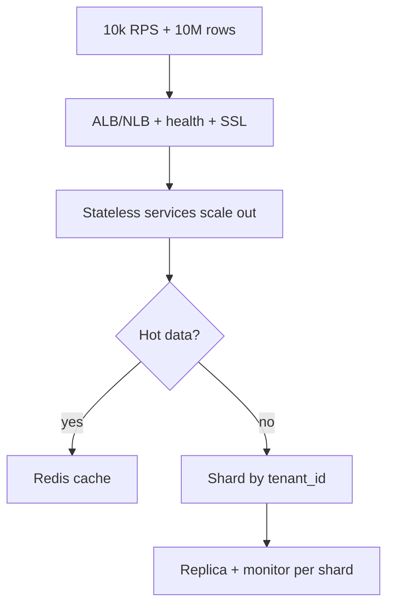
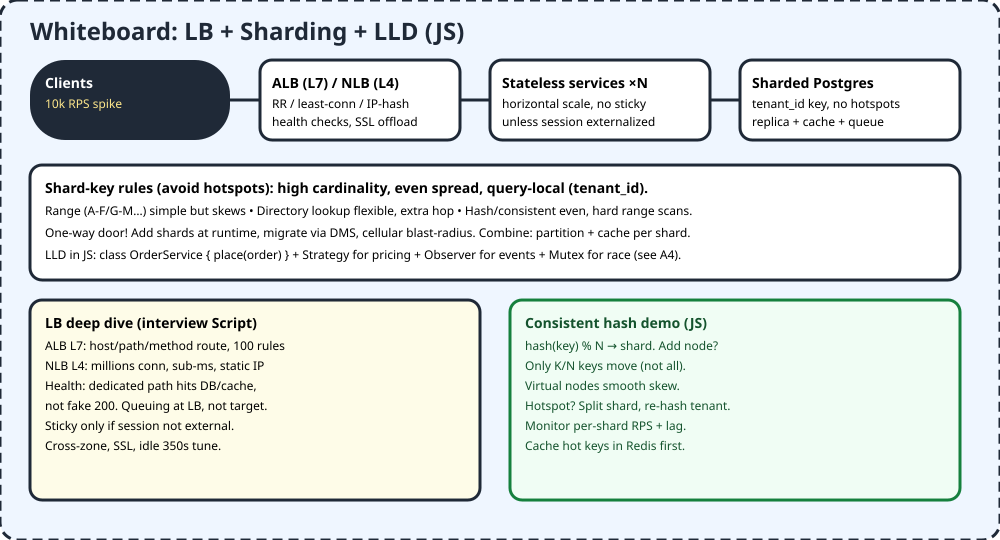

# M1 — Advanced System Design

> One DB melts at 10M rows (A3). Fix: spread traffic (LB) + split data (shards) + clean classes (LLD). Sharding is a one-way door — choose key carefully.

## 1. TL;DR + analogy
- Supermarket: LB = door staff sending carts to shortest checkout; shards = separate aisles by surname range; LLD = tidy shelves so staff find items fast.
- Bad key (`isActive` yes/no → 2 shards) = 2 giant queues. Good key (`tenant_id` high cardinality) = even lines.

## 2. Why mid-level cares
- Video Domain 1: LB, sharding, LLD. Interviews ask tradeoffs: ALB vs NLB, hotspot defense, sticky when, consistent hash moves.

## 3. Core concepts in simple words
1. **ALB (L7) vs NLB (L4) vs GWLB:** ALB routes by host/path/method/query (100 rules), terminates TLS; NLB millions TCP/UDP sub-ms + static IP; GWLB inserts firewalls transparently.
2. **Algos:** round-robin (simple), weighted (capacity), least-conn (busy-aware), least-response (fastest), IP-hash (sticky), adaptive (health-aware).
3. **Health that tells truth:** dedicated path hitting DB/cache/downstream; fake 200 lies. Queue at LB, not target (target queuing fails worse).
4. **Shards:** logical chunks, physical nodes hold many. Shared-nothing scales by adding shards at runtime.
5. **Key rules:** high cardinality, even spread, query-local (tenant_id keeps JOINs local). Avoid low-cardinality.
6. **Methods:** range (skews), directory lookup (flex + hop), hash/consistent (even, weak range scans). Virtual nodes smooth.
7. **Ops:** migrate via DMS, cellular blast-radius, partition + cache per shard, monitor RPS/lag per shard.
8. **LLD JS:** small classes, Strategy/Observer, Mutex on shared balance (A4), versioned APIs.

## 4. Detailed examples (JS where it helps)

### 4.1 Consistent hash router sketch
```js
function hash(s) { let h = 0; for (const c of s) h = (h * 31 + c.charCodeAt(0)) >>> 0; return h; }
const SHARDS = ["db0", "db1", "db2", "db3"];
function shardFor(tenantId) { return SHARDS[hash(tenantId) % SHARDS.length]; }
console.log(shardFor("tenant_42")); // same tenant → same shard → JOINs local
// Add db4? Only ~1/4 keys move with consistent ring + virtual nodes (not all).
```

### 4.2 LB pick logic (interview pseudocode)
```js
// least-connections: route to fewest active
function pickLeastConn(servers) {
  return servers.reduce((a, b) => (a.active <= b.active ? a : b));
}
// IP-hash sticky: same client → same server (only if session not externalized)
function pickIpHash(ip, servers) { return servers[hash(ip) % servers.length]; }
```

### 4.3 LLD snippet — OrderService
```js
class OrderService {
  constructor(db, bus) { this.db = db; this.bus = bus; }
  async place(order) {
    // shard-aware: tenant_id routes to correct DB inside this.db
    const row = await this.db.insert(order);
    this.bus.emit("order.created", row);
    return row;
  }
}
```

## 5. Flowchart


## 6. Whiteboard diagram


## 7. Official notes (Firecrawl full-capture)
- AWS sharding: `https://aws.amazon.com/what-is/database-sharding`
  - Raw: `.firecrawl/raw/m1-sharding-official.md` — 849 lines / 40721 bytes, verified
  - Used: shards vs nodes, shard key, shared-nothing, range/directory/hash, hotspots, cardinality, add shards at runtime
- LB Top-50: `https://github.com/Devinterview-io/load-balancing-interview-questions`
  - Raw: `.firecrawl/raw/m1-lb-top50.md` — 1177 lines / 61329 bytes, verified
  - Used: 50 Qs (RR/weighted/least-conn/response/IP-hash, HW vs SW, sticky, health active/passive, SSL, persistence)
- Free cross-verify: AWS SaaS sharding part 2 (tenant_id local JOINs, DMS, cellular), AWS networking LB best practices (ALB/NLB/GWLB, health path, stickiness rule)

## 8. Cross-verify table
| Claim | Official | Second source | Verdict |
|---|---|---|---|
| tenant_id localizes JOINs | Yes, SaaS blog | Yes, query-local rule | Agree |
| Sharding one-way door | Yes, model change | Yes, pre-plan scale | Agree |
| ALB L7 vs NLB L4 roles | Yes, best-practices | Yes, IK Q25 | Agree |
| Health must hit deps | Yes, dedicated path | Yes, fake 200 lies | Agree |
| Consistent hash moves K/N | Hash method docs | Yes, virtual nodes | Agree |

## 9. Top-50 interview questions — M1
Main banks:
- LB 50: https://github.com/Devinterview-io/load-balancing-interview-questions
- LB answers: https://devinterview.io/questions/software-architecture-and-system-design/load-balancing-interview-questions
- System 50: https://interviewkickstart.com/blogs/interview-questions/system-design-interview-questions
- Advanced 50: https://www.designgurus.io/blog/50-advanced-system-design-interview-questions

| # | Question | Why asked | Answer link |
|---|---|---|---|
| 1 | Define LB? | Distribute | [Answer](https://github.com/Devinterview-io/load-balancing-interview-questions) |
| 2 | Objectives? | Perf+reliability | [Answer](https://github.com/Devinterview-io/load-balancing-interview-questions) |
| 3 | HW vs SW LB? | Cost/flex | [Answer](https://github.com/Devinterview-io/load-balancing-interview-questions) |
| 4 | Algos list? | RR/LC/hash | [Answer](https://github.com/Devinterview-io/load-balancing-interview-questions) |
| 5 | Sticky sessions? | Affinity cost | [Answer](https://github.com/Devinterview-io/load-balancing-interview-questions) |
| 6 | Reliability how? | Failover | [Answer](https://github.com/Devinterview-io/load-balancing-interview-questions) |
| 7 | Health checks? | Active/passive | [Answer](https://github.com/Devinterview-io/load-balancing-interview-questions) |
| 8 | RR pros/cons? | Simple/blind | [Answer](https://github.com/Devinterview-io/load-balancing-interview-questions) |
| 9 | Weighted RR? | Capacity | [Answer](https://github.com/Devinterview-io/load-balancing-interview-questions) |
| 10 | Least-conn? | Busy-aware | [Answer](https://github.com/Devinterview-io/load-balancing-interview-questions) |
| 11 | IP hash? | Sticky | [Answer](https://github.com/Devinterview-io/load-balancing-interview-questions) |
| 12 | Least-response? | Fastest | [Answer](https://github.com/Devinterview-io/load-balancing-interview-questions) |
| 13 | Adaptive routing? | Live health | [Answer](https://github.com/Devinterview-io/load-balancing-interview-questions) |
| 14 | SSL termination? | Offload | [Answer](https://github.com/Devinterview-io/load-balancing-interview-questions) |
| 15 | Session persistence modes? | Cookie/rules | [Answer](https://github.com/Devinterview-io/load-balancing-interview-questions) |
| 16 | ALB vs NLB? | L7 vs L4 | [Answer](https://github.com/aws/aws-networking-best-practices/blob/main/content/application-networking/load-balancing.md) |
| 17 | GWLB what? | Insert FW | [Answer](https://github.com/aws/aws-networking-best-practices/blob/main/content/application-networking/load-balancing.md) |
| 18 | Target types? | EC2/IP/Lambda | [Answer](https://github.com/aws/aws-networking-best-practices/blob/main/content/application-networking/load-balancing.md) |
| 19 | What is sharding? | Split data | [Answer](https://aws.amazon.com/what-is/database-sharding) |
| 20 | Why shard? | Parallel+scale | [Answer](https://aws.amazon.com/what-is/database-sharding) |
| 21 | Shards vs nodes? | Logical/physical | [Answer](https://aws.amazon.com/what-is/database-sharding) |
| 22 | Shard key? | Route rule | [Answer](https://aws.amazon.com/what-is/database-sharding) |
| 23 | Range sharding? | A-F buckets | [Answer](https://aws.amazon.com/what-is/database-sharding) |
| 24 | Directory sharding? | Lookup table | [Answer](https://aws.amazon.com/what-is/database-sharding) |
| 25 | Hash sharding? | Even | [Answer](https://aws.amazon.com/what-is/database-sharding) |
| 26 | Hotspots? | Skew fix | [Answer](https://aws.amazon.com/what-is/database-sharding) |
| 27 | Cardinality? | Max shards | [Answer](https://aws.amazon.com/what-is/database-sharding) |
| 28 | tenant_id why good? | Local JOINs | [Answer](https://aws.amazon.com/blogs/database/scale-your-relational-database-for-saas-part-2-sharding-and-routing) |
| 29 | Migrate shards? | DMS | [Answer](https://aws.amazon.com/blogs/database/scale-your-relational-database-for-saas-part-2-sharding-and-routing) |
| 30 | Cellular? | Blast radius | [Answer](https://aws.amazon.com/blogs/database/scale-your-relational-database-for-saas-part-2-sharding-and-routing) |
| 31 | Horizontal vs vertical? | Add vs bigger | [Answer](https://www.designgurus.io/blog/50-advanced-system-design-interview-questions) |
| 32 | CAP? | Pick 2 | [Answer](https://www.designgurus.io/blog/50-advanced-system-design-interview-questions) |
| 33 | Latency vs throughput? | Time vs rate | [Answer](https://www.designgurus.io/blog/50-advanced-system-design-interview-questions) |
| 34 | Sharding role? | DB scale | [Answer](https://www.designgurus.io/blog/50-advanced-system-design-interview-questions) |
| 35 | Active-active vs passive? | Both vs standby | [Answer](https://www.designgurus.io/blog/50-advanced-system-design-interview-questions) |
| 36 | API gateway? | Single entry | [Answer](https://www.designgurus.io/blog/50-advanced-system-design-interview-questions) |
| 37 | K8s orchestration? | Auto scale | [Answer](https://www.designgurus.io/blog/50-advanced-system-design-interview-questions) |
| 38 | Design TinyURL? | Hash+shard | [Answer](https://github.com/pwittchen/interview-questions/blob/master/system-design-resources.md) |
| 39 | Design KV store? | Consistent hash | [Answer](https://github.com/pwittchen/interview-questions/blob/master/system-design-resources.md) |
| 40 | Design cache? | Partition+evict | [Answer](https://github.com/pwittchen/interview-questions/blob/master/system-design-resources.md) |
| 41 | Design rate limiter? | Redis bucket | [Answer](https://github.com/pwittchen/interview-questions/blob/master/system-design-resources.md) |
| 42 | Consistent hashing? | Min moves | [Answer](https://www.interviewbit.com/system-design-interview-questions) |
| 43 | Replication vs sharding? | Copy vs split | [Answer](https://www.interviewbit.com/system-design-interview-questions) |
| 44 | Partition vs shard? | Logical vs node | [Answer](https://www.interviewbit.com/system-design-interview-questions) |
| 45 | HLD components? | Blocks | [Answer](https://interviewkickstart.com/blogs/interview-questions/system-design-interview-questions) |
| 46 | Scalable keys? | Stateless+cache | [Answer](https://interviewkickstart.com/blogs/interview-questions/system-design-interview-questions) |
| 47 | EDA tradeoffs? | Loose/complex | [Answer](https://interviewkickstart.com/blogs/interview-questions/system-design-interview-questions) |
| 48 | DR? | Backup/failover | [Answer](https://interviewkickstart.com/blogs/interview-questions/system-design-interview-questions) |
| 49 | LLD Singleton/Factory? | Patterns | [Answer](https://interviewkickstart.com/blogs/interview-questions/system-design-interview-questions) |
| 50 | Urban scale 100M URLs? | Shard+cache | [Answer](https://getsdeready.com/top-50-system-design-interview-questions-2025) |

## 10. Quiz + checklist
Quiz: 1) ALB vs NLB? 2) Good shard key? 3) Hotspot fix? 4) Sticky when? 5) Health truth?
Checklist: [ ] sketched LB+shard [ ] hashed 4 shards in JS [ ] listed LLD classes
Next: [M2 — Distributed Systems](#docs_mid-level-roadmap_m2-distributed-systems)
