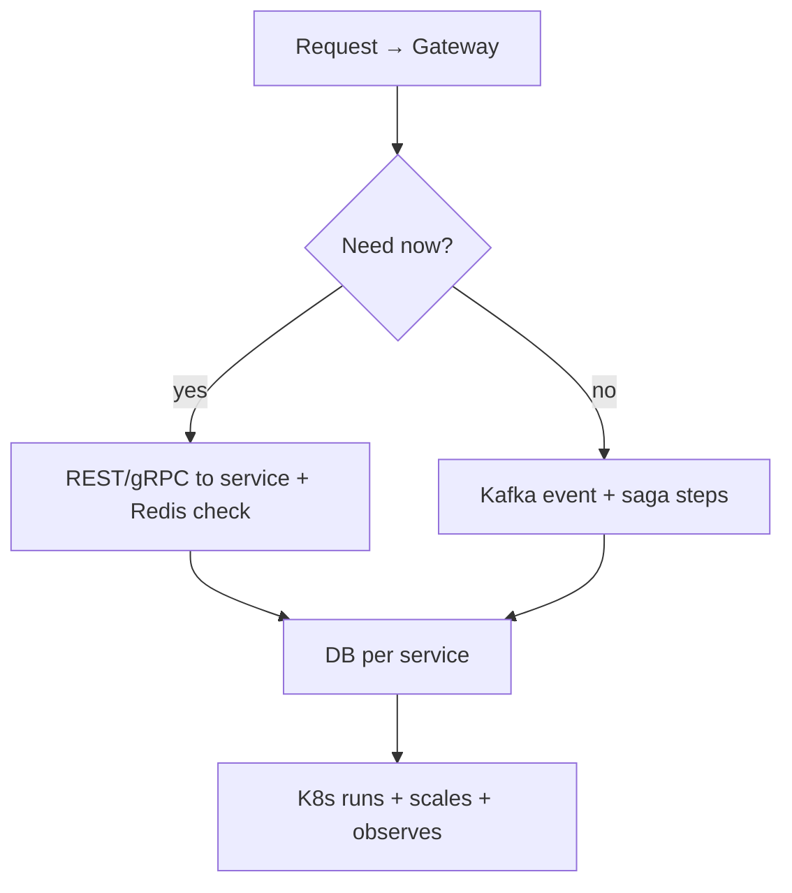
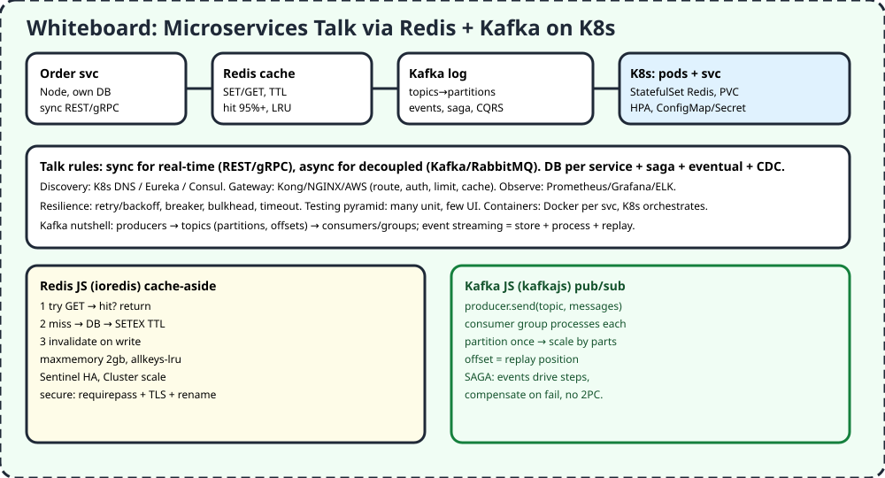

# M2 — Distributed Systems

> One big app breaks as one big lump. Split into small services with own DBs, talk sync for answers-now, via Kafka for fire-and-remember, speed with Redis, run all on K8s.

## 1. TL;DR + analogy
- Food court: each stall (service) has own kitchen (DB), shared menu board (gateway), delivery bikes (Kafka) for orders, fridge (Redis) for hot dishes, mall manager (K8s) assigns tables.

## 2. Why mid-level cares
- Video Domain 2: Redis, Kafka, K8s ("Cubanity"). Interviews probe sync/async choice, saga, discovery, resilience — not just definitions.

## 3. Core concepts in simple words
1. **Sync (REST/gRPC/WS) vs async (Kafka/RabbitMQ/SNS):** sync for real-time reply; events for decoupled, fault-tolerant flows. Name event sourcing + CQRS.
2. **DB per service:** loose coupling; sagas for transactions, eventual consistency, CDC (Debezium) to sync.
3. **Discovery/config:** K8s DNS / Eureka / Consul; ConfigMaps + Secrets, immutable prod, feature flags.
4. **Gateway:** Kong/NGINX/AWS — route, auth, limit, cache, aggregate. Different from LB (entry vs spread).
5. **Redis:** in-memory SET/GET, cache-aside with TTL, `maxmemory + allkeys-lru`, Sentinel HA, Cluster scale, secure (pass/TLS/rename), hit rate >95%.
6. **Kafka nutshell:** producers → topics → partitions (parallelism) → offsets (replay) → consumer groups (each msg once per group). Event streaming = store + process.
7. **K8s:** pods, StatefulSet + PVC for Redis, HPA scale, Helm charts, ConfigMaps. Docker per service, K8s orchestrates 5-6+ talking containers.
8. **Resilience/observe:** retry/backoff, breaker, timeout; Prometheus/Grafana/ELK; testing pyramid.

## 4. Detailed JS examples

### 4.1 Redis cache-aside (ioredis)
```js
import Redis from "ioredis";
const redis = new Redis(process.env.REDIS_URL);
async function getUser(id, dbGet) {
  const key = `user:${id}`;
  const hit = await redis.get(key);
  if (hit) return JSON.parse(hit);
  const row = await dbGet(id);
  await redis.setex(key, 300, JSON.stringify(row)); // TTL 5m
  return row;
}
// invalidate on write: await redis.del(`user:${id}`);
```

### 4.2 Kafka pub/sub (kafkajs)
```js
import { Kafka } from "kafkajs";
const kafka = new Kafka({ brokers: ["localhost:9092"] });
const producer = kafka.producer(), consumer = kafka.consumer({ groupId: "orders" });
await producer.send({ topic: "order.created", messages: [{ key: "A1", value: JSON.stringify({ id: "A1" }) }] });
await consumer.subscribe({ topic: "order.created" });
await consumer.run({ eachMessage: async ({ message }) => console.log("process", message.value.toString()) });
```

### 4.3 K8s deploy hint
```bash
helm install my-redis bitnami/redis --set auth.password=$SECRET --set replica.replicaCount=2
# StatefulSet + PVC for data, HPA for services, ConfigMap for non-secrets
```

## 5. Flowchart


## 6. Whiteboard diagram


## 7. Official notes (Firecrawl full-capture)
- Redis quick start: `https://redis.io/tutorials/howtos/quick-start`
  - Raw: `.firecrawl/raw/m2-redis-official.md` — 645 lines / 32681 bytes, verified
  - Used: Docker/Cloud install, redis-cli + JS/Python/C#, SET/GET/DEL, JSON, indexes, prob structures, time-series, Insight
- Kafka docs: `https://kafka.apache.org/documentation/`
  - Raw: `.firecrawl/raw/m2-kafka-official.md` — 284 lines / 26621 bytes, verified
  - Used: event streaming def, uses, platform meaning, nutshell, concepts, APIs
- Free cross-verify: Redis cache-aside (TTL staleness), client-side caching (tracking/invalidation), Confluent Redis+Kafka saga/CQRS, microservices banks

## 8. Cross-verify table
| Claim | Official | Second source | Verdict |
|---|---|---|---|
| Redis SET/GET + Docker fastest | Yes | Yes, Node+Redis guide | Agree |
| Cache-aside TTL, hit >95% | Yes, cache-aside | Yes, INFO metrics | Agree |
| Kafka topics/partitions/offsets/groups | Yes | Yes, 50 Kafka Qs | Agree |
| Sync vs async rule | Event guide | Yes, talent500 tip | Agree |
| K8s StatefulSet+PVC+Helm | Redis K8s docs | Yes, Bitnami chart | Agree |

## 9. Top-50 interview questions — M2
Main banks:
- Microservices: https://www.interviewbit.com/microservices-interview-questions
- Microservices 40+: https://interviewkickstart.com/interview-questions/skills/microservices-interview-questions
- Simplilearn 2026: https://www.simplilearn.com/microservices-interview-questions-article
- Redis DevOps: https://oneuptime.com/blog/post/2026-03-31-redis-interview-questions-devops-engineers/view
- K8s 50: https://www.edureka.co/blog/interview-questions/kubernetes-interview-questions
- Kafka 50: https://gist.github.com/bansalankit92/9414ef3614229cdca6053464fedf5038

| # | Question | Why asked | Answer link |
|---|---|---|---|
| 1 | Microservices vs monolith? | Split tradeoffs | [Answer](https://www.interviewbit.com/microservices-interview-questions) |
| 2 | Sync vs async comms? | REST vs Kafka | [Answer](https://talent500.com/blog/microservices-interview-questions-experienced) |
| 3 | DB per service? | Coupling | [Answer](https://talent500.com/blog/microservices-interview-questions-experienced) |
| 4 | Saga? | Distributed tx | [Answer](https://talent500.com/blog/microservices-interview-questions-experienced) |
| 5 | Resilience? | Retry/breaker | [Answer](https://talent500.com/blog/microservices-interview-questions-experienced) |
| 6 | Log/monitor? | Trace | [Answer](https://talent500.com/blog/microservices-interview-questions-experienced) |
| 7 | Challenges? | Consistency/deploy | [Answer](https://talent500.com/blog/microservices-interview-questions-experienced) |
| 8 | Config? | Central/external | [Answer](https://talent500.com/blog/microservices-interview-questions-experienced) |
| 9 | Gateway role? | Entry | [Answer](https://talent500.com/blog/microservices-interview-questions-experienced) |
| 10 | Deploy? | K8s/Docker | [Answer](https://talent500.com/blog/microservices-interview-questions-experienced) |
| 11 | Service discovery? | Find | [Answer](https://www.interviewbit.com/microservices-interview-questions) |
| 12 | PACT? | Contract test | [Answer](https://www.interviewbit.com/microservices-interview-questions) |
| 13 | Eureka? | Registry | [Answer](https://www.interviewbit.com/microservices-interview-questions) |
| 14 | E2E testing? | Pyramid | [Answer](https://www.interviewbit.com/microservices-interview-questions) |
| 15 | Docker role? | Containerize | [Answer](https://www.interviewbit.com/microservices-interview-questions) |
| 16 | Message broker? | Rabbit/Kafka | [Answer](https://www.interviewbit.com/microservices-interview-questions) |
| 17 | What is Redis? | In-memory | [Answer](https://redis.io/tutorials/howtos/quick-start) |
| 18 | Install via Docker? | Fast local | [Answer](https://redis.io/tutorials/howtos/quick-start) |
| 19 | SET/GET/DEL? | CRUD | [Answer](https://redis.io/tutorials/howtos/quick-start) |
| 20 | JSON + query? | Docs | [Answer](https://redis.io/tutorials/howtos/quick-start) |
| 21 | Cache-aside? | TTL read | [Answer](https://redis.io/docs/latest/develop/use-cases/cache-aside) |
| 22 | Secure Redis? | Pass/TLS | [Answer](https://oneuptime.com/blog/post/2026-03-31-redis-interview-questions-devops-engineers/view) |
| 23 | Memory tune? | maxmemory LRU | [Answer](https://oneuptime.com/blog/post/2026-03-31-redis-interview-questions-devops-engineers/view) |
| 24 | Replication? | RDB+stream | [Answer](https://oneuptime.com/blog/post/2026-03-31-redis-interview-questions-devops-engineers/view) |
| 25 | Sentinel? | Failover | [Answer](https://oneuptime.com/blog/post/2026-03-31-redis-interview-questions-devops-engineers/view) |
| 26 | Metrics? | Hit/mem/clients | [Answer](https://oneuptime.com/blog/post/2026-03-31-redis-interview-questions-devops-engineers/view) |
| 27 | K8s Redis? | Helm/Stateful | [Answer](https://oneuptime.com/blog/post/2026-03-31-redis-interview-questions-devops-engineers/view) |
| 28 | Event streaming? | Store+process | [Answer](https://kafka.apache.org/documentation/) |
| 29 | Kafka nutshell? | Prod→topic→consume | [Answer](https://kafka.apache.org/documentation/) |
| 30 | Topics/partitions? | Parallel | [Answer](https://gist.github.com/bansalankit92/9414ef3614229cdca6053464fedf5038) |
| 31 | Offset? | Replay pos | [Answer](https://gist.github.com/bansalankit92/9414ef3614229cdca6053464fedf5038) |
| 32 | ZooKeeper/KRaft? | Coord | [Answer](https://gist.github.com/bansalankit92/9414ef3614229cdca6053464fedf5038) |
| 33 | Kafka in microservices? | Events | [Answer](https://medium.com/%40meet2sudhakar/40-apache-kafka-interview-questions-every-experienced-java-developer-must-know-in-2026-c700d254c36a) |
| 34 | Message queue impl? | Spring/Kafka | [Answer](https://quescol.com/interview-preparation/docker-kubernetes-kafka-interview-questions) |
| 35 | Deploy Spring via K8s? | Pipeline | [Answer](https://quescol.com/interview-preparation/docker-kubernetes-kafka-interview-questions) |
| 36 | K8s config? | CM/Secret | [Answer](https://quescol.com/interview-preparation/docker-kubernetes-kafka-interview-questions) |
| 37 | What is K8s? | Orchestrate | [Answer](https://www.edureka.co/blog/interview-questions/kubernetes-interview-questions) |
| 38 | Clusters/nodes? | Pool | [Answer](https://www.edureka.co/blog/interview-questions/kubernetes-interview-questions) |
| 39 | Kube-proxy? | Net | [Answer](https://www.edureka.co/blog/interview-questions/kubernetes-interview-questions) |
| 40 | Mono→micro on K8s? | Piecewise | [Answer](https://www.edureka.co/blog/interview-questions/kubernetes-interview-questions) |
| 41 | Redis+Kafka combined? | Cache+events | [Answer](https://www.confluent.io/resources/kafka-summit-2020/redis-and-kafka-simplifying-advanced-design-patterns-within-microservices-architectures) |
| 42 | SAGA orchestrated? | Workflow | [Answer](https://www.confluent.io/resources/kafka-summit-2020/redis-and-kafka-simplifying-advanced-design-patterns-within-microservices-architectures) |
| 43 | CQRS? | Read/write split | [Answer](https://www.confluent.io/resources/kafka-summit-2020/redis-and-kafka-simplifying-advanced-design-patterns-within-microservices-architectures) |
| 44 | Reactive extensions? | Streams | [Answer](https://www.interviewbit.com/microservices-interview-questions) |
| 45 | Container? | Share kernel | [Answer](https://www.interviewbit.com/microservices-interview-questions) |
| 46 | Gateway vs LB? | Entry vs spread | [Answer](https://www.designgurus.io/blog/mastering-the-api-interview-common-questions-and-expert-answers) |
| 47 | Flaky 3rd-party? | Retry/key | [Answer](https://www.designgurus.io/blog/mastering-the-api-interview-common-questions-and-expert-answers) |
| 48 | Spring Boot Kafka? | Real-world | [Answer](https://www.simplilearn.com/microservices-interview-questions-article) |
| 49 | Monitor prod? | Prom/Grafana | [Answer](https://www.simplilearn.com/microservices-interview-questions-article) |
| 50 | When NOT microservices? | Overhead | [Answer](https://talent500.com/blog/microservices-interview-questions-experienced) |

## 10. Quiz + checklist
Quiz: 1) Sync vs async? 2) Cache-aside steps? 3) Partition why? 4) K8s object for Redis? 5) Saga?
Checklist: [ ] cached 1 route [ ] produced/consumed 1 topic [ ] charted 1 deploy
Next: [M3 — Applied Agentics](./m3-applied-agentics-rag.md)
