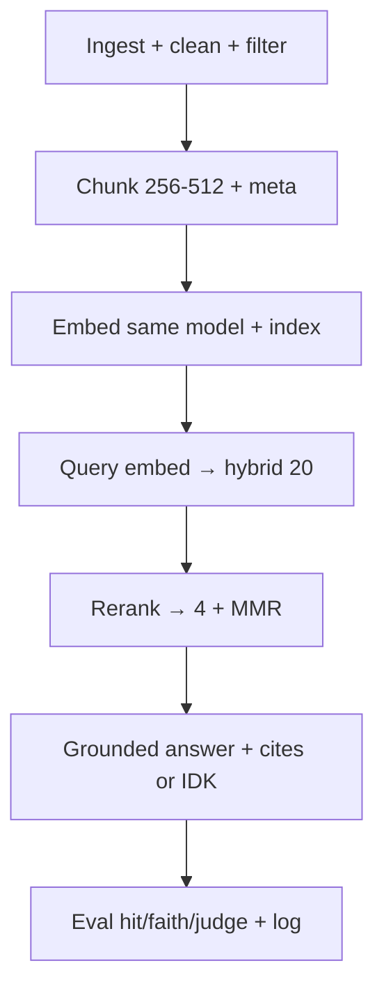
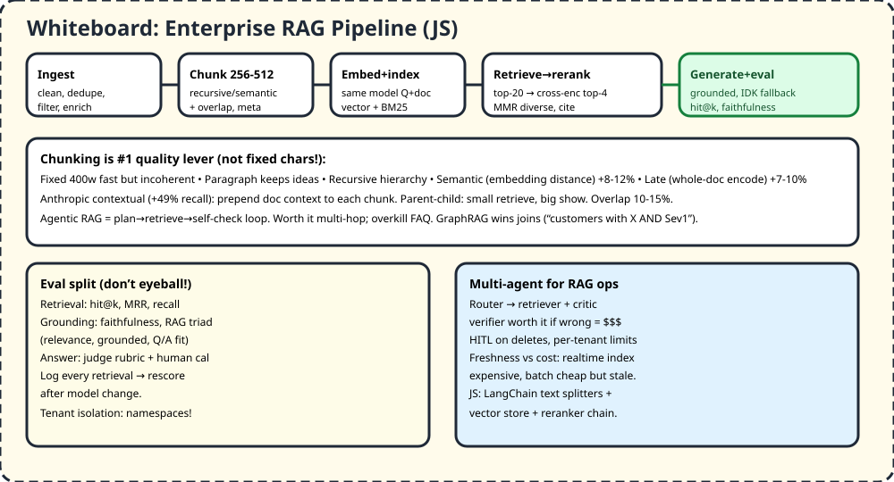

# M3 — Applied Agentics

> Open-book exam beats memory test. But only if chunks are smart, retrieval is measured, answers cite, and agents stop when they should.

## 1. TL;DR + analogy
- Library: ingest (collect books) → chunk (paragraphs, not random cuts) → embed ( Dewey numbers) → retrieve (librarian fetches 20) → rerank (head librarian picks 4) → answer with page numbers.
- Agentic RAG = librarian who re-asks, checks, re-shelves. Costs more — use for multi-hop mysteries, not FAQs.

## 2. Why mid-level cares
- Video Domain 3: enterprise RAG + multi-agent workflows. Interviews ask chunking tradeoffs, hybrid vs vector, eval split, tenant isolation, freshness vs cost.

## 3. Core concepts in simple words
1. **Pipeline 6:** corpus → clean/parse (MarkItDown) → enrich (title/meta) → filter → chunk → embed (same model Q+doc) → index.
2. **Chunking #1 lever:** fixed 400w fast/incoherent; paragraph natural; recursive hierarchy; semantic (+8-12%); late whole-doc (+7-10%); Anthropic contextual (+49% recall); parent-child (small find, big show); overlap 10-15%. Start 256-512 tokens.
3. **Embed/index:** same model both sides; clean so distance = meaning; multimodal via CLIP/schema; t-SNE to see Q-chunk gaps; economics: tokens + store + refresh.
4. **Retrieve:** hybrid BM25 + vector via RRF (exact codes/names win), top-20 → cross-encoder rerank → top-4 diverse (MMR). Query rewrite for multi-hop.
5. **Generate grounded:** "answer ONLY from context + cite [Doc:] + IDK if missing". Return sources for trace.
6. **Eval split:** retrieval (hit@k/MRR), grounding (faithfulness/RAG triad), answer (judge rubric + human cal). Log retrievals to rescore.
7. **Agentic vs classic:** classic one-shot; agentic loops plan/retrieve/revise. Worth it multi-hop; wrong for low-latency/strict/governed/simple.
8. **Multi-agent + prod:** router → retriever + critic (worth if wrong $$$), tenant namespaces (never prompt-level isolation), HITL, per-task budgets, freshness (realtime $$ vs batch stale).

## 4. Detailed JS examples

### 4.1 Chunk + retrieve skeleton (LangChain.js idea)
```js
import { RecursiveCharacterTextSplitter } from "langchain/text_splitter";
// 256-512 tokens, overlap 10-15%, keep titles in metadata for citations
const splitter = new RecursiveCharacterTextSplitter({ chunkSize: 400, chunkOverlap: 60 });
const docs = await splitter.createDocuments([bigText], [{ source: "policy.pdf", page: 3 }]);
// embed with same model for docs + query, store in vector DB, hybrid: vector + BM25 → RRF → rerank top-4
```

### 4.2 Grounded answer prompt (IDK fallback)
```js
const prompt = `<instructions>Answer ONLY from <context>. Cite [Doc: page]. If missing, say "I couldn't find this."</instructions>
<context>${top4.map(c => `[Doc: p${c.metadata.page}] ${c.pageContent}`).join("\n")}</context>
Question: ${userQ}`;
```

### 4.3 Multi-stage retrieval (cheap → smart)
```js
// 1) broad: BM25 + vector → 20 cands 2) rerank cross-encoder → 4 3) MMR diverse 4) compress
// naive fails: bad chunk, no rerank, wrong top, no rewrite, no eval — "works on 3 Qs" red flag
```

## 5. Flowchart


## 6. Whiteboard diagram


## 7. Official notes (Firecrawl full-capture)
- Microsoft RAG embeddings: `https://learn.microsoft.com/en-us/azure/architecture/ai-ml/guide/rag/rag-generate-embeddings`
  - Raw: `.firecrawl/raw/m3-rag-official.md` — 695 lines / 43044 bytes, verified
  - Used: chunk→embed same model, similarity/distance, multimodal (CLIP/schema), Azure AI Search index, t-SNE + distance eval, fine-tune/leaderboard, economics
- RAG Top-30: `https://www.datacamp.com/blog/rag-interview-questions`
  - Raw: `.firecrawl/raw/m3-rag-top30.md` — 796 lines / 68109 bytes, verified
  - Used: parts/benefits/apps, prompt engineering in RAG, retriever choice, hybrid, no-vector alternatives, long docs, multi-turn, chunking/late/contextual, CAG, latency, prod eval
- Free cross-verify: Databricks pipeline (filter/chunk/embed/index), IBM chunking, Ailog 8 strategies (+49% contextual), TechTarget 6 steps, AgentSwarms RAG depth

## 8. Cross-verify table
| Claim | Official | Second source | Verdict |
|---|---|---|---|
| Same model Q+doc, clean first | Yes, MS | Yes, Databricks | Agree |
| 256-512 + overlap + meta | MS sweet spot | Yes, Ailog/Databricks | Agree |
| Hybrid BM25+vector wins exact | MS search | Yes, RRF | Agree |
| Rerank 20→4 + MMR | DataCamp arch | Yes, LangChain guide | Agree |
| Eval split + log | MS visualize/distance | Yes, hit/faith/judge | Agree |

## 9. Top-50 interview questions — RAG + multi-agent
Main banks:
- RAG 30: https://www.datacamp.com/blog/rag-interview-questions
- RAG 40: https://www.analyticsvidhya.com/blog/2026/02/rag-interview-questions-and-answers
- RAG 603/52 types: https://github.com/ather-techie/rag-interview-system
- RAG 100+: https://github.com/KalyanKS-NLP/RAG-Interview-Questions-and-Answers-Hub
- GenAI 50: https://agentswarms.fyi/interview-questions

| # | Question | Why asked | Answer link |
|---|---|---|---|
| 1 | RAG parts how work? | Pipeline | [Answer](https://www.datacamp.com/blog/rag-interview-questions) |
| 2 | Benefits vs LLM alone? | Fresh+cited | [Answer](https://www.datacamp.com/blog/rag-interview-questions) |
| 3 | Apps? | Support/chat | [Answer](https://www.datacamp.com/blog/rag-interview-questions) |
| 4 | Knowledge sources? | Docs/APIs | [Answer](https://www.datacamp.com/blog/rag-interview-questions) |
| 5 | Prompting matters? | Grounding | [Answer](https://www.datacamp.com/blog/rag-interview-questions) |
| 6 | Retriever how? methods? | Vector/BM25 | [Answer](https://www.datacamp.com/blog/rag-interview-questions) |
| 7 | Combine+generation challenges? | Stitch | [Answer](https://www.datacamp.com/blog/rag-interview-questions) |
| 8 | Vector DB role? | Search | [Answer](https://www.datacamp.com/blog/rag-interview-questions) |
| 9 | Evaluate how? | BLEU/F1/judge | [Answer](https://www.datacamp.com/blog/rag-interview-questions) |
| 10 | Ambiguous queries? | Clarify | [Answer](https://www.datacamp.com/blog/rag-interview-questions) |
| 11 | Choose retriever? | Use-case | [Answer](https://www.datacamp.com/blog/rag-interview-questions) |
| 12 | Hybrid search? | Fuse | [Answer](https://www.datacamp.com/blog/rag-interview-questions) |
| 13 | Need vector DB? alts? | Options | [Answer](https://www.datacamp.com/blog/rag-interview-questions) |
| 14 | Relevant+accurate? | Rerank/filter | [Answer](https://www.datacamp.com/blog/rag-interview-questions) |
| 15 | Long docs? | Chunk/map | [Answer](https://www.datacamp.com/blog/rag-interview-questions) |
| 16 | Optimize acc+eff? | Tradeoffs | [Answer](https://www.datacamp.com/blog/rag-interview-questions) |
| 17 | Multi-turn ctx? | History | [Answer](https://www.datacamp.com/blog/rag-interview-questions) |
| 18 | Chunking techniques? | Pros/cons | [Answer](https://www.datacamp.com/blog/rag-interview-questions) |
| 19 | Large vs small chunks? | Recall/precision | [Answer](https://www.datacamp.com/blog/rag-interview-questions) |
| 20 | Late chunking? | Whole-doc encode | [Answer](https://www.datacamp.com/blog/rag-interview-questions) |
| 21 | Contextualization? | Prepend ctx | [Answer](https://www.datacamp.com/blog/rag-interview-questions) |
| 22 | Bias? | Checker agent | [Answer](https://www.datacamp.com/blog/rag-interview-questions) |
| 23 | Dynamic KB? | Refresh | [Answer](https://www.datacamp.com/blog/rag-interview-questions) |
| 24 | CAG vs RAG? | Cache vs retrieve | [Answer](https://www.datacamp.com/blog/rag-interview-questions) |
| 25 | Advanced RAGs? | Graph/self/correct | [Answer](https://www.datacamp.com/blog/rag-interview-questions) |
| 26 | Real-time latency? | Stream/cache | [Answer](https://www.datacamp.com/blog/rag-interview-questions) |
| 27 | Limits? | Garbage-in | [Answer](https://www.datacamp.com/blog/rag-interview-questions) |
| 28 | Prod eval/improve? | Loop | [Answer](https://www.datacamp.com/blog/rag-interview-questions) |
| 29 | Reliability? | Fallbacks | [Answer](https://www.datacamp.com/blog/rag-interview-questions) |
| 30 | Design for task? | Scope | [Answer](https://www.datacamp.com/blog/rag-interview-questions) |
| 31 | Problem RAG solves? | Stale/halluc | [Answer](https://www.analyticsvidhya.com/blog/2026/02/rag-interview-questions-and-answers) |
| 32 | Offline vs online? | Index vs query | [Answer](https://www.analyticsvidhya.com/blog/2026/02/rag-interview-questions-and-answers) |
| 33 | Agentic wrong when? | Simple/fast | [Answer](https://www.analyticsvidhya.com/blog/2026/02/rag-interview-questions-and-answers) |
| 34 | Multi-turn handle? | Rewrite | [Answer](https://www.analyticsvidhya.com/blog/2026/02/rag-interview-questions-and-answers) |
| 35 | Retrieval vs generation fail? | Diagnose | [Answer](https://www.analyticsvidhya.com/blog/2026/02/rag-interview-questions-and-answers) |
| 36 | RAG vs fine-tune? | Facts vs style | [Answer](https://www.analyticsvidhya.com/blog/2026/02/rag-interview-questions-and-answers) |
| 37 | Multi-stage? | Broad→rerank | [Answer](https://www.analyticsvidhya.com/blog/2026/02/rag-interview-questions-and-answers) |
| 38 | Agentic vs classic? | Loop vs once | [Answer](https://www.analyticsvidhya.com/blog/2026/02/rag-interview-questions-and-answers) |
| 39 | Agentic tradeoffs? | Cost/latency | [Answer](https://www.analyticsvidhya.com/blog/2026/02/rag-interview-questions-and-answers) |
| 40 | Naive vs advanced? | 12 vs 12 Qs | [Answer](https://github.com/ather-techie/rag-interview-system) |
| 41 | GraphRAG when? | Joins | [Answer](https://agentswarms.fyi/blog/agentic-ai-interview-questions-2026) |
| 42 | Naive fails? | 5 modes | [Answer](https://agentswarms.fyi/blog/agentic-ai-interview-questions-2026) |
| 43 | Agentic worth it? | Multi-hop | [Answer](https://agentswarms.fyi/blog/agentic-ai-interview-questions-2026) |
| 44 | Critic worth it? | High-stakes | [Answer](https://agentswarms.fyi/blog/agentic-ai-interview-questions-2026) |
| 45 | Multi-agent when? | Bloat/parallel | [Answer](https://agentswarms.fyi/interview-questions) |
| 46 | Delegate design? | Router pattern | [Answer](https://agentswarms.fyi/interview-questions) |
| 47 | Tenant RAG isolation? | Namespaces | [Answer](https://agentswarms.fyi/interview-questions) |
| 48 | Support 10k/day? | Router+cache | [Answer](https://agentswarms.fyi/interview-questions) |
| 49 | Eval platform 50 flows? | Shared schema | [Answer](https://agentswarms.fyi/interview-questions) |
| 50 | 52 types overview? | Map | [Answer](https://github.com/ather-techie/rag-interview-system) |

More: https://www.w4school.in/interview-questions/rag-interview-questions.php?category=RAG%20Evaluation (50+), https://github.com/KalyanKS-NLP/RAG-Interview-Questions-and-Answers-Hub (100+)

## 10. Quiz + checklist
Quiz: 1) Chunk size? 2) Same model why? 3) Hybrid why? 4) Rerank what? 5) Agentic when NOT?
Checklist: [ ] chunked 1 PDF [ ] hybrid top-20→4 [ ] eval split logged
Next: [M4 — AI Security](#docs_mid-level-roadmap_m4-ai-security)
