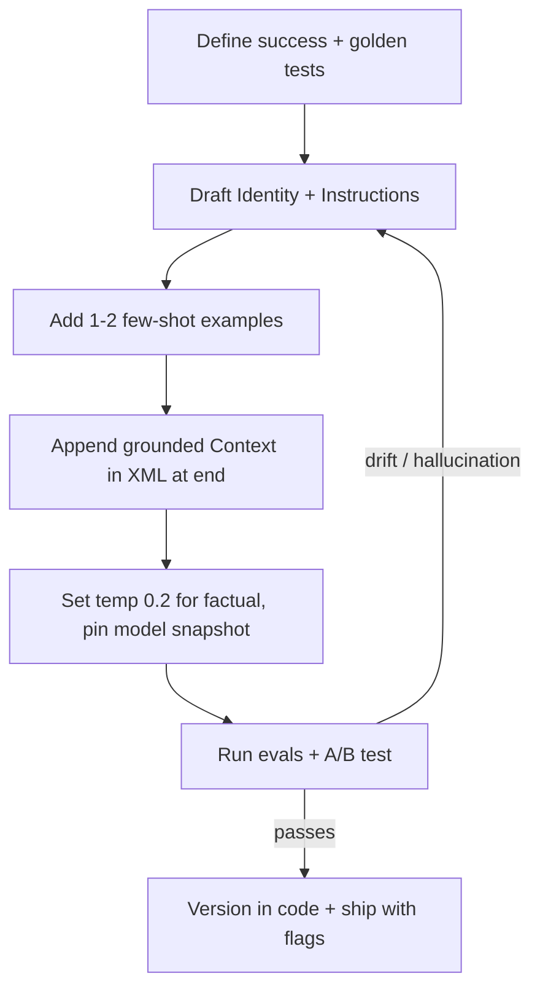
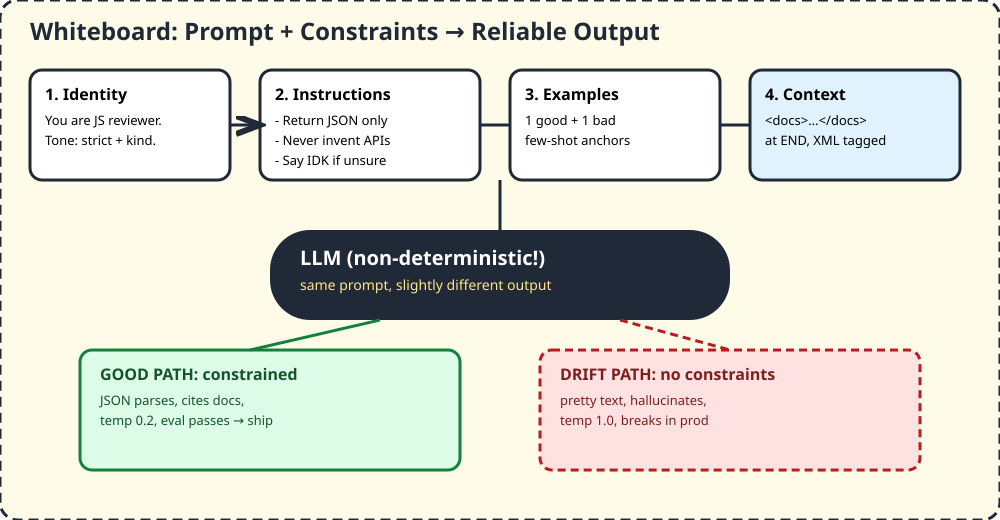

# 01 — Prompt Engineering & Constraint Design

> Think of AI like a super-fast junior who types instantly but guesses when unsure. Prompt engineering is writing the rule-book so it guesses less and follows your format every time.

## 1. TL;DR + analogy
- Restaurant analogy: bad prompt = "make food". Good prompt = "you are a pizza chef, use only these toppings, return bill as JSON, if topping missing say so".
- Video link: this is the "ceiling" on top of DSA. DSA is vocabulary, this is printing press rules.
- Core idea from official OpenAI docs: output is **non-deterministic**. Same prompt can give slightly different answers. Constraints make it consistent.

## 2. Why companies care
- Without constraints AI drifts: pretty locally, breaks in prod with hallucinations, wrong JSON, invented APIs.
- Interviews now ask you to whiteboard prompt architecture, debug drift, and show evals — not just "write a prompt".

## 3. Core concepts in simple words
1. **Instructions beat input.** OpenAI `instructions` param / system role outranks user text. Put tone, goals, do / never-do there.
2. **Identity → Instructions → Examples → Context.** Official order. Context (private docs) goes near END in XML tags like `<docs>...</docs>`.
3. **Markdown + XML for boundaries.** `# Identity`, bullet rules, `<user_query>` / `<assistant_response>` so model sees where docs start/end. Claude prefers XML; OpenAI accepts Markdown + XML.
4. **Few-shot = show 1-2 examples.** Zero-shot = no example. Few-shot anchors format. Many-shot = many examples (costly).
5. **Temperature / top-p = randomness dial.** Low temp 0.0-0.3 = strictfactual, JSON, code. High 0.8-1.0 = creative stories. Leave top-p default unless you know why.
6. **Version prompts in code, not dashboard objects.** OpenAI deprecating reusable prompt objects (`v1/prompts` shuts down Nov 30, 2026). Keep prompt builders in a module, typed args, tests, feature flags.
7. **Pin model snapshot + evals.** `gpt-4.1-2025-04-14`-style pinning + golden dataset, A/B tests, because same family snapshots behave differently.
8. **Cost/latency levers:** prompt caching, shorter context, Top-K 3-10 for RAG, structured output mode instead of free text.

## 4. Detailed JS examples

### 4.1 Bad vs good — the drift fix
```js
// BAD: vague, no constraints — AI invents fields
const badInput = "Summarize this invoice";
// → pretty paragraph, unparsable, sometimes hallucinates totals

// GOOD: identity + rules + format + escape hatch
import OpenAI from "openai";
const client = new OpenAI();

const instructions = `# Identity
You are a strict invoice parser for Acme Corp. Be concise, never guess.

# Instructions
- Return VALID JSON only with keys: vendor, total, date
- Use numbers for total, YYYY-MM-DD for date
- If a field is missing, use null. Never invent it.
- Do not add markdown fences.

# Examples
<user_query>Invoice from Foo, $12 on 2024-01-02</user_query>
<assistant_response>{"vendor":"Foo","total":12,"date":"2024-01-02"}</assistant_response>`;

const res = await client.responses.create({
  model: "gpt-5",
  instructions,
  input: "Invoice from Bar Corp, twelve dollars, Jan 5th",
});
console.log(res.output_text); // {"vendor":"Bar Corp","total":12,"date":"..."} or nulls, but always JSON
```

### 4.2 Grounding with context at the end
```js
const docs = `<docs>
Refund policy: 30 days, receipt required. No cash refunds over $100.
</docs>`;

const input = `${docs}
User question: Can I get $200 cash back without receipt?
Answer using ONLY the docs above. If not in docs, say "I couldn't find this in the documentation." Cite [Doc: refund_policy].`;

const r2 = await client.responses.create({
  model: "gpt-5",
  instructions: "Be friendly, cite sources, never invent policy.",
  input,
});
```

### 4.3 Temperature for strict vs creative
```js
// factual / code: low temp
await client.responses.create({ model: "gpt-5", instructions: "Return JSON only.", input: "Parse X", temperature: 0.2 });
// brainstorm: higher temp
await client.responses.create({ model: "gpt-5", instructions: "Brainstorm names.", input: "Dog food brand", temperature: 0.9 });
```

## 5. Flowchart


## 6. Whiteboard diagram

- Left to right: Identity → Instructions → Examples → Context → LLM → good path (constrained, JSON, cited, eval passes) vs drift path (no constraints, pretty but broken).

## 7. Official notes (Firecrawl full-capture, not truncated)
- Source 1 — OpenAI Prompt Engineering guide: `https://platform.openai.com/docs/guides/prompt-engineering`
  - Raw full capture: `.firecrawl/raw/a1-openai-official.md` — 1485 lines / 52986 bytes, tail ends with `Docs agent`, verified complete via `wc -l -c + tail`
  - Key takeaways used above: non-deterministic output, instructions priority, version-in-code + deprecation notice, Markdown+XML sections, context at end, pin snapshots + evals
- Source 2 — Anthropic Prompt Engineering overview (free fetch, no credit): `https://docs.anthropic.com/en/docs/build-with-claude/prompt-engineering/overview`
  - Key: establish success criteria + evals BEFORE tuning; technique reference lives in Claude prompting best practices; interactive tutorial available
  - Used to cross-check: both vendors agree evals-first, structured sections, XML boundaries

## 8. Cross-verify table
| Claim | OpenAI official | Anthropic / second source | Verdict |
|---|---|---|---|
| Output non-deterministic, need evals | Yes, mix art+science, build eval suites | Yes, define success + empirical tests first | Agree — evals-first in page |
| Instructions outrank user input | Yes, `instructions` param priority | Yes, system/chain-of-command hierarchy | Agree |
| Section order Identity→Instructions→Examples→Context, context at end | Yes | Yes, XML structuring + examples | Agree |
| Version prompts in code, prompt objects deprecated | Yes, Jun 3 2026 de-emphasis, Nov 30 2026 shutdown | N/A (OpenAI-specific) | Keep as OpenAI fact with link |
| Temp low=factual, high=creative; leave top-p default | Yes | Yes, temp/top-k/top-p balance | Agree |

## 9. Top-50 interview questions — prompt engineering
All answers live on the main Q&A page below — each row links there for one-click reference. Extra Q&A banks at bottom.

Main answer bank: https://sureprompts.com/blog/prompt-engineering-interview-questions — 50 real Qs with detailed answers, 46-min read, verified full capture `.firecrawl/raw/a1-top50-sureprompts.md` (1046 lines / 73450 bytes).

| # | Question | Why companies ask | Answer link |
|---|---|---|---|
| 1 | What is prompt engineering? | Checks foundation, not buzzwords | [Answer](https://sureprompts.com/blog/prompt-engineering-interview-questions) |
| 2 | Zero-shot vs few-shot vs many-shot? | Do you know cost/accuracy tradeoff? | [Answer](https://sureprompts.com/blog/prompt-engineering-interview-questions) |
| 3 | What is a system prompt and when to use one? | Authority hierarchy | [Answer](https://sureprompts.com/blog/prompt-engineering-interview-questions) |
| 4 | Explain chain-of-thought prompting | Reasoning tasks | [Answer](https://sureprompts.com/blog/prompt-engineering-interview-questions) |
| 5 | Temperature vs top-p? | Randomness control | [Answer](https://sureprompts.com/blog/prompt-engineering-interview-questions) |
| 6 | What is prompt injection and prevention? | Security mindset | [Answer](https://sureprompts.com/blog/prompt-engineering-interview-questions) |
| 7 | What is grounding? | Hallucination defense | [Answer](https://sureprompts.com/blog/prompt-engineering-interview-questions) |
| 8 | Tokens and why they matter? | Cost + context limits | [Answer](https://sureprompts.com/blog/prompt-engineering-interview-questions) |
| 9 | Prompt vs prompt template? | Production reuse | [Answer](https://sureprompts.com/blog/prompt-engineering-interview-questions) |
| 10 | How to evaluate prompt quality? | Evals, golden sets | [Answer](https://sureprompts.com/blog/prompt-engineering-interview-questions) |
| 11 | 3 techniques to reduce hallucinations? | Grounding, citations, IDK fallback | [Answer](https://sureprompts.com/blog/prompt-engineering-interview-questions) |
| 12 | Prompt for structured JSON output? | Parsable contracts | [Answer](https://sureprompts.com/blog/prompt-engineering-interview-questions) |
| 13 | Explain RAG | Retrieval + prompting | [Answer](https://sureprompts.com/blog/prompt-engineering-interview-questions) |
| 14 | Prompt chaining, when? | Multi-step decomposition | [Answer](https://sureprompts.com/blog/prompt-engineering-interview-questions) |
| 15 | Multi-turn conversations? | Memory / buffers | [Answer](https://sureprompts.com/blog/prompt-engineering-interview-questions) |
| 16 | Constitutional AI effect? | Built-in guardrails | [Answer](https://sureprompts.com/blog/prompt-engineering-interview-questions) |
| 17 | Role of few-shot examples? | Format anchoring | [Answer](https://sureprompts.com/blog/prompt-engineering-interview-questions) |
| 18 | Optimize prompts for cost? | Compression, caching | [Answer](https://sureprompts.com/blog/prompt-engineering-interview-questions) |
| 19 | Prompt caching how it works? | Latency + cost | [Answer](https://sureprompts.com/blog/prompt-engineering-interview-questions) |
| 20 | A/B test two prompts? | Measurement rigor | [Answer](https://sureprompts.com/blog/prompt-engineering-interview-questions) |
| 21 | ChatGPT vs Claude prompting differences? | Model-specific craft | [Answer](https://sureprompts.com/blog/prompt-engineering-interview-questions) |
| 22 | Gemini multimodal strategy? | Image+text placement | [Answer](https://sureprompts.com/blog/prompt-engineering-interview-questions) |
| 23 | Reasoning models prompted differently? | No CoT hacks, clear goals | [Answer](https://sureprompts.com/blog/prompt-engineering-interview-questions) |
| 24 | Claude XML preference why? | Boundary clarity | [Answer](https://sureprompts.com/blog/prompt-engineering-interview-questions) |
| 25 | GPT JSON mode when? | Schema guarantees | [Answer](https://sureprompts.com/blog/prompt-engineering-interview-questions) |
| 26 | Prompt for function/tool calling? | Tools + schema | [Answer](https://sureprompts.com/blog/prompt-engineering-interview-questions) |
| 27 | What is MCP, effect on prompting? | Tool context standard | [Answer](https://sureprompts.com/blog/prompt-engineering-interview-questions) |
| 28 | Handle context window limits? | Chunk, compress, retrieve | [Answer](https://sureprompts.com/blog/prompt-engineering-interview-questions) |
| 29 | Open vs closed models prompting? | Control vs convenience | [Answer](https://sureprompts.com/blog/prompt-engineering-interview-questions) |
| 30 | Fine-tune vs prompt when? | Data + cost tradeoff | [Answer](https://sureprompts.com/blog/prompt-engineering-interview-questions) |
| 31 | Design support chatbot prompts? | System design | [Answer](https://sureprompts.com/blog/prompt-engineering-interview-questions) |
| 32 | Legal doc review prompt? | Precision + citations | [Answer](https://sureprompts.com/blog/prompt-engineering-interview-questions) |
| 33 | RAG pipeline for docs search? | Chunk→embed→retrieve→answer | [Answer](https://sureprompts.com/blog/prompt-engineering-interview-questions) |
| 34 | Agent multi-step tasks? | Plan + tools + checks | [Answer](https://sureprompts.com/blog/prompt-engineering-interview-questions) |
| 35 | Extract structured data from invoices? | Schema + examples | [Answer](https://sureprompts.com/blog/prompt-engineering-interview-questions) |
| 36 | Content moderation with prompts? | Safety classifiers | [Answer](https://sureprompts.com/blog/prompt-engineering-interview-questions) |
| 37 | Adapt to user expertise? | Adaptive tone | [Answer](https://sureprompts.com/blog/prompt-engineering-interview-questions) |
| 38 | Evaluate/iterate in production? | Logs, evals, flags | [Answer](https://sureprompts.com/blog/prompt-engineering-interview-questions) |
| 39 | Code review assistant prompt? | Rules + diff context | [Answer](https://sureprompts.com/blog/prompt-engineering-interview-questions) |
| 40 | Works in test, fails in prod? | Distribution shift debug | [Answer](https://sureprompts.com/blog/prompt-engineering-interview-questions) |
| 41 | Ethical considerations? | Safety + disclosure | [Answer](https://sureprompts.com/blog/prompt-engineering-interview-questions) |
| 42 | Prevent injection attacks? | Defense in depth | [Answer](https://sureprompts.com/blog/prompt-engineering-interview-questions) |
| 43 | Jailbreaking defense? | Guardrails | [Answer](https://sureprompts.com/blog/prompt-engineering-interview-questions) |
| 44 | Bias via prompting? | Neutral phrasing + review | [Answer](https://sureprompts.com/blog/prompt-engineering-interview-questions) |
| 45 | Privacy in prompts? | PII redaction | [Answer](https://sureprompts.com/blog/prompt-engineering-interview-questions) |
| 46 | Regulatory compliance? | Audit trails | [Answer](https://sureprompts.com/blog/prompt-engineering-interview-questions) |
| 47 | Responsible AI disclosure? | User transparency | [Answer](https://sureprompts.com/blog/prompt-engineering-interview-questions) |
| 48 | Sensitive topics? | Refuse/redirect patterns | [Answer](https://sureprompts.com/blog/prompt-engineering-interview-questions) |
| 49 | Human oversight role? | Escalation paths | [Answer](https://sureprompts.com/blog/prompt-engineering-interview-questions) |
| 50 | Future of prompt engineering 2y? | Agents + evals judgment | [Answer](https://sureprompts.com/blog/prompt-engineering-interview-questions) |

More banks (free discovery, use if main link fails):
- https://agilemania.com/prompt-engineering-interview-questions — Top 50 with answers
- https://github.com/atryx/ai-engineer-interview-questions — 100+ AI eng Qs incl. prompting, RAG, agents
- https://github.com/ishandutta2007/Awesome-Prompt-Engineer-Interview-Questions — curated prompt-eng Qs with frameworks
- https://www.analyticsvidhya.com/blog/2025/06/prompt-engineering-interview-questions — 20 frequent Qs

## 10. Quiz + checklist
Quiz: 1) Why put context at end? 2) Temp for JSON? 3) Zero vs few-shot? 4) Why pin snapshot? 5) First step before tuning?
Checklist: [ ] shipped 1 JSON-only prompt with evals [ ] tried temp 0.2 vs 0.9 [ ] versioned prompt in git
Next: [02 — Agentic Thinking](./02-agentic-thinking.md)
