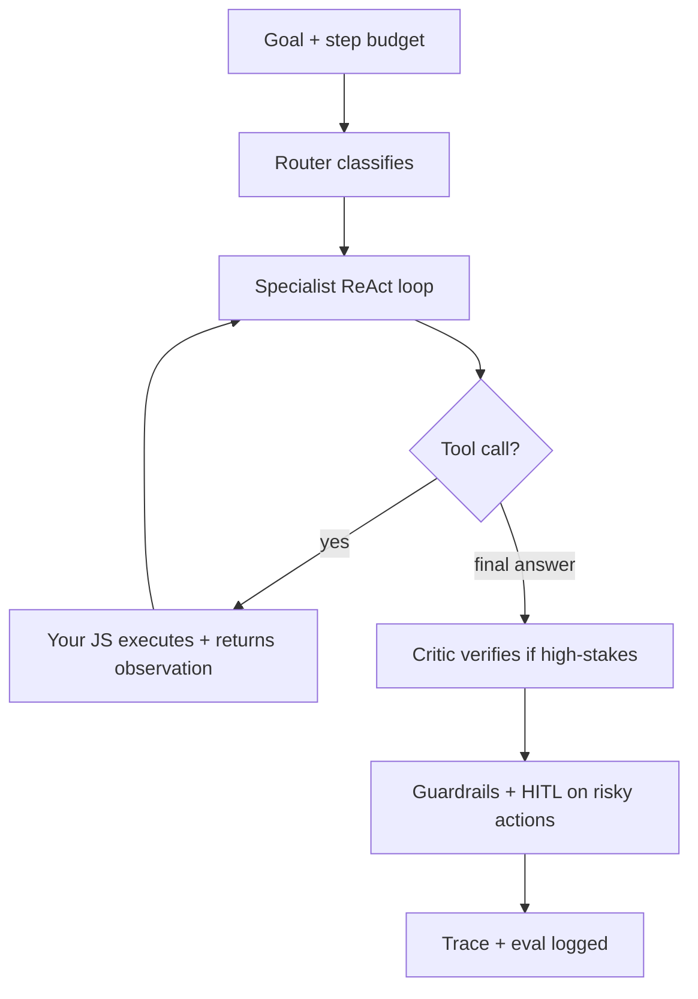
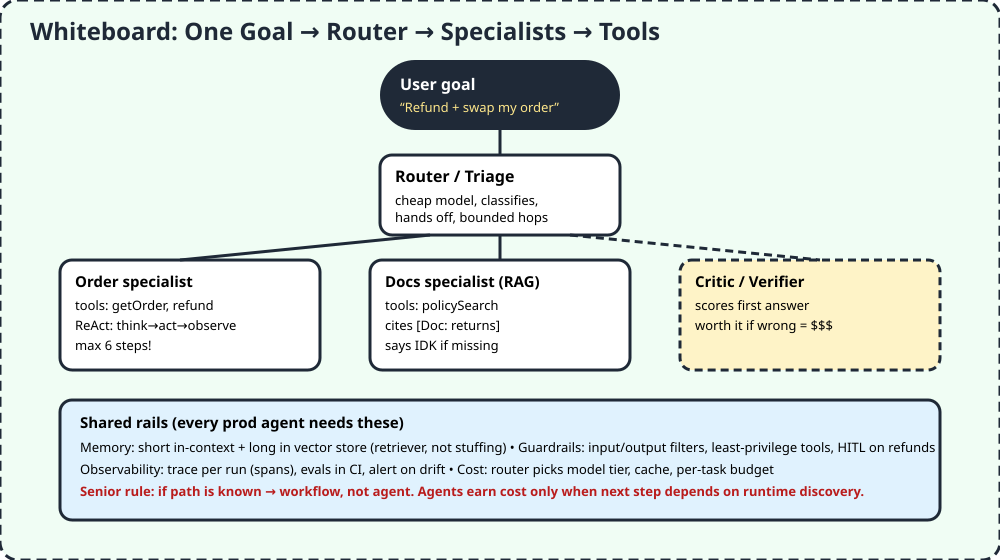

# 02 — Agentic Thinking

> A workflow is a fixed recipe. An agent is a cook who tastes, decides the next step, and can call helpers. Your job is thinking like the kitchen manager: who decides, who acts, when to stop.

## 1. TL;DR + analogy
- School group project: router (captain) splits work, specialists do parts, critic checks answers, all with a step budget so nobody talks forever.
- Video link: this is "how different AI models collaborate" — the ceiling skill that replaces typing code with orchestrating runs.

## 2. Why companies care
- Single prompts fail on multi-step tasks (look up order → check policy → refund → email). Agents loop with tools until done.
- Interviews test failure modes: loops, tool abuse, cost blowups, injection via retrieved docs — not just definitions.

## 3. Core concepts in simple words
1. **Agent vs workflow/chain.** Workflow = fixed path. Agent = chooses next action from tools based on observations. Autonomy is the axis.
2. **ReAct = Thought → Action → Observation, repeat.** Each action grounded in a real tool result, never a guess. Always bounded (`MAX_STEPS`, no-progress stop, wall-clock budget).
3. **Who runs code? You do.** Model emits JSON tool request; your JS executes, returns observation. Keeps keys/side-effects under control.
4. **Runtime options (OpenAI):** Agents API (OpenAI runs managed Codex harness, low effort, long tasks) vs Agents SDK (SDK loop in your app, medium effort, custom tools/handoffs) vs Responses API (you own the loop, high effort). Pick by who manages state.
5. **Handoffs vs agents-as-tools.** Handoff = specialist takes over turn. Agents-as-tools = orchestrator stays in control, calls specialists like functions. Start with one agent; split when tool list bloats context.
6. **Orchestrator–workers vs peer-to-peer.** Central router for accountability; peer debate only for reasoning tasks. Argue against swarms by default — cost + failure modes.
7. **MCP vs function calling.** Function calling = one model → your tools. MCP = standard protocol so any agent uses any server (n+m not n×m).
8. **Memory:** short-term in context, mid-term summarized, long-term in vector store with a recall tool. Don't stuff memory in prompt — put a retriever.
9. **Guardrails + HITL:** deterministic input/output filters, least privilege per tool, human approval queue on refunds/deletes. Retrieved content is untrusted.
10. **Observability + evals:** per-run traces (nested spans), golden sets + LLM-as-judge in CI, alerts on quality/cost/latency drift. Eyeballing logs is a fail.

## 4. Detailed JS examples

### 4.1 Single agent with a tool (OpenAI Agents SDK, JS)
```js
import { Agent, run, tool } from "@openai/agents";
import { z } from "zod";

const historyFunFact = tool({
  name: "history_fun_fact",
  description: "Return a short history fact.",
  parameters: z.object({}),
  async execute() { return "Sharks are older than trees."; },
});

const agent = new Agent({
  name: "History tutor",
  instructions: "Answer history clearly. Use history_fun_fact when it helps.",
  tools: [historyFunFact],
});

const result = await run(agent, "Tell me something surprising about ancient life.");
console.log(result.finalOutput);
// Model never runs code — it asks, your execute() runs, result fed back as observation.
```

### 4.2 Router with handoffs (the triage pattern)
```js
import { Agent, run } from "@openai/agents";

const historyTutor = new Agent({ name: "History tutor", instructions: "Answer history clearly." });
const mathTutor = new Agent({ name: "Math tutor", instructions: "Explain math step by step." });

const triage = Agent.create({
  name: "Homework triage",
  instructions: "Route each question to the right specialist.",
  handoffs: [historyTutor, mathTutor],
});

await run(triage, "Why did Rome fall? And what is 12x12?");
// Router delegates, specialists own their turn. Bounded hops prevent infinite handoff.
```

### 4.3 ReAct from scratch (what interviewers ask you to sketch)
```js
const MAX_STEPS = 6;
let messages = [systemPrompt, userQuestion];
for (let i = 0; i < MAX_STEPS; i++) {
  const step = await llm(messages, { tools: TOOLS });
  if (step.final_answer) return step.final_answer;
  const result = await runTool(step.tool_call); // YOUR code
  messages.push({ role: "observation", content: result });
}
return "Couldn't finish within budget."; // graceful give-up, never infinite loop
```

## 5. Flowchart


## 6. Whiteboard diagram


## 7. Official notes (Firecrawl full-capture, not truncated)
- Source 1 — OpenAI Agents guide: `https://platform.openai.com/docs/guides/agents`
  - Raw: `.firecrawl/raw/a2-openai-agents-official.md` — 253 lines / 14261 bytes, tail `Docs agent`, verified via `wc -l -c + tail`
  - Used: runtime table (Agents API vs SDK vs Responses), state ownership, tools/skills/caching links, runner handles loop + handoffs
- Source 2 — OpenAI Agents SDK quickstart excerpts (free websearch, no extra credit): tool + handoff JS snippets above, session vs `to_input_list()` vs server continuation
- Cross-check: Anthropic/MCP framing from A2 Top-50 page confirms tool-separation + protocol story

## 8. Cross-verify table
| Claim | OpenAI official | Second source (AgentSwarms / SDK docs) | Verdict |
|---|---|---|---|
| Agent chooses path, workflow fixed | Yes, plan + tools + state | Yes, autonomy is the axis | Agree |
| Model emits tool JSON, your code runs | Yes, function handlers + sandbox | Yes, separation keeps side-effects controlled | Agree |
| Start 1 agent, split on bloat; prefer boring workflow | SDK: shape 1 specialist first | Yes, argue against agents/swarms by default | Agree |
| Bounded loops, traces, evals required | Yes, runner lifecycle + tracing + sessions | Yes, MAX_STEPS + per-run spans + CI evals | Agree |
| MCP standardizes n+m integrations | Referenced in tools/MCP guides | Yes, protocol vs raw calling | Agree |

## 9. Top-50 interview questions — agentic AI
Main bank: https://agentswarms.fyi/blog/agentic-ai-interview-questions-2026 — tiered Junior→Staff, verified full capture `.firecrawl/raw/a2-top50-agentswarms.md` (303 lines / 25275 bytes). Interactive drill: https://agentswarms.fyi/interview-questions

| # | Question | Why asked | Answer link |
|---|---|---|---|
| 1 | Orchestrator-workers vs peer-to-peer? | Central control vs emergent cost | [Answer](https://agentswarms.fyi/blog/agentic-ai-interview-questions-2026) |
| 2 | MCP vs raw function calling? | n+m standardization | [Answer](https://agentswarms.fyi/blog/agentic-ai-interview-questions-2026) |
| 3 | Evaluate non-deterministic agent with LLM-as-judge? | Golden + rubric + calibration | [Answer](https://agentswarms.fyi/blog/agentic-ai-interview-questions-2026) |
| 4 | Walk through ReAct loop? | Thought→Action→Observation grounding | [Answer](https://agentswarms.fyi/blog/agentic-ai-interview-questions-2026) |
| 5 | Who runs tool code? | Model JSON vs your execution | [Answer](https://agentswarms.fyi/blog/agentic-ai-interview-questions-2026) |
| 6 | Why RAG reduces hallucination? | Open-book vs memory | [Answer](https://agentswarms.fyi/blog/agentic-ai-interview-questions-2026) |
| 7 | System vs user prompt? | Priority, not security boundary | [Answer](https://agentswarms.fyi/blog/agentic-ai-interview-questions-2026) |
| 8 | When NOT to use ReAct? | Known path → workflow | [Answer](https://agentswarms.fyi/blog/agentic-ai-interview-questions-2026) |
| 9 | Stop infinite loops? | Bounds + dedup + budget | [Answer](https://agentswarms.fyi/blog/agentic-ai-interview-questions-2026) |
| 10 | Tool-call failures in prod? | Typed errors + retry + breaker | [Answer](https://agentswarms.fyi/blog/agentic-ai-interview-questions-2026) |
| 11 | RAG vs tool-calling when? | Knowledge vs action | [Answer](https://agentswarms.fyi/blog/agentic-ai-interview-questions-2026) |
| 12 | Plan-and-Execute over ReAct when? | Expensive side-effects, replan trigger | [Answer](https://agentswarms.fyi/blog/agentic-ai-interview-questions-2026) |
| 13 | When reach for multi-agent? | Context bloat / parallelism | [Answer](https://agentswarms.fyi/blog/agentic-ai-interview-questions-2026) |
| 14 | Critic/verifier worth cost when? | Wrong-answer cost >> 2x inference | [Answer](https://agentswarms.fyi/blog/agentic-ai-interview-questions-2026) |
| 15 | Design delegating multi-agent? | Router→specialists, infinite-handoff guard | [Answer](https://agentswarms.fyi/blog/agentic-ai-interview-questions-2026) |
| 16 | Defend LangGraph vs CrewAI vs AutoGen vs SDK? | State, roles, chat, stack tradeoffs | [Answer](https://agentswarms.fyi/blog/agentic-ai-interview-questions-2026) |
| 17 | When roll own orchestration? | 3-step flow, framework tax | [Answer](https://agentswarms.fyi/blog/agentic-ai-interview-questions-2026) |
| 18 | Debug 3am misbehaving agent? | Trace diff, repro, regression eval | [Answer](https://agentswarms.fyi/blog/agentic-ai-interview-questions-2026) |
| 19 | Generative vs predictive ML? | Distribution modeling | [Answer](https://agentswarms.fyi/blog/agentic-ai-interview-questions-2026) |
| 20 | Self-attention why matters? | Parallel deps, O(n²) cost | [Answer](https://agentswarms.fyi/blog/agentic-ai-interview-questions-2026) |
| 21 | Large context challenges? | Lost-in-middle, retrieval wins | [Answer](https://agentswarms.fyi/blog/agentic-ai-interview-questions-2026) |
| 22 | Temp vs top-k vs top-p? | Distribution controls | [Answer](https://agentswarms.fyi/blog/agentic-ai-interview-questions-2026) |
| 23 | Base vs instruction-tuned? | Raw vs SFT/RLHF behavior | [Answer](https://agentswarms.fyi/blog/agentic-ai-interview-questions-2026) |
| 24 | What problem does RAG solve? | Stale + citation | [Answer](https://agentswarms.fyi/blog/agentic-ai-interview-questions-2026) |
| 25 | RAG vs fine-tune decide? | Facts vs behavior | [Answer](https://agentswarms.fyi/blog/agentic-ai-interview-questions-2026) |
| 26 | Chunking strategy? | 256-512 + eval hit-rate | [Answer](https://agentswarms.fyi/blog/agentic-ai-interview-questions-2026) |
| 27 | Hybrid search when? | BM25 + vectors via RRF | [Answer](https://agentswarms.fyi/blog/agentic-ai-interview-questions-2026) |
| 28 | Evaluate RAG in prod? | hit@k + faithfulness + judge | [Answer](https://agentswarms.fyi/blog/agentic-ai-interview-questions-2026) |
| 29 | GraphRAG when? | Multi-hop joins | [Answer](https://agentswarms.fyi/blog/agentic-ai-interview-questions-2026) |
| 30 | Naive RAG failure modes? | Chunking, reranker, rewriting | [Answer](https://agentswarms.fyi/blog/agentic-ai-interview-questions-2026) |
| 31 | Agentic RAG worth it when? | Multi-hop planning | [Answer](https://agentswarms.fyi/blog/agentic-ai-interview-questions-2026) |
| 32 | CoT when helps? | Math/logic scratchpad | [Answer](https://agentswarms.fyi/blog/agentic-ai-interview-questions-2026) |
| 33 | Zero/few-shot vs fine-tune? | Format vs volume | [Answer](https://agentswarms.fyi/blog/agentic-ai-interview-questions-2026) |
| 34 | Function calling / tool use? | Structured request flow | [Answer](https://agentswarms.fyi/blog/agentic-ai-interview-questions-2026) |
| 35 | MCP why matters? | Ecosystem compose | [Answer](https://agentswarms.fyi/blog/agentic-ai-interview-questions-2026) |
| 36 | Persistent memory how? | Context + summary + vector recall | [Answer](https://agentswarms.fyi/blog/agentic-ai-interview-questions-2026) |
| 37 | Lost in the Middle effect? | Edge-rank passages | [Answer](https://agentswarms.fyi/blog/agentic-ai-interview-questions-2026) |
| 38 | Eval harness why? | Golden + CI vs coinflip | [Answer](https://agentswarms.fyi/blog/agentic-ai-interview-questions-2026) |
| 39 | LLM-as-judge failures? | Positional/verbosity bias | [Answer](https://agentswarms.fyi/blog/agentic-ai-interview-questions-2026) |
| 40 | Test non-deterministic agent? | Trajectory + statistical asserts | [Answer](https://agentswarms.fyi/blog/agentic-ai-interview-questions-2026) |
| 41 | Prompt injection defense? | Untrusted content + HITL | [Answer](https://agentswarms.fyi/blog/agentic-ai-interview-questions-2026) |
| 42 | Agent-specific security risks? | Tool chains, exfiltration | [Answer](https://agentswarms.fyi/blog/agentic-ai-interview-questions-2026) |
| 43 | LoRA vs full fine-tune? | Adapters, swappable | [Answer](https://agentswarms.fyi/blog/agentic-ai-interview-questions-2026) |
| 44 | RLHF vs DPO? | Reward+PPO vs direct loss | [Answer](https://agentswarms.fyi/blog/agentic-ai-interview-questions-2026) |
| 45 | Support agent 10k/day <2s? | Router + cache + streaming | [Answer](https://agentswarms.fyi/blog/agentic-ai-interview-questions-2026) |
| 46 | Multi-tenant RAG isolation? | Namespaces + RLS, not prompts | [Answer](https://agentswarms.fyi/blog/agentic-ai-interview-questions-2026) |
| 47 | Eval platform for 50 workflows? | Shared traces + pluggable graders | [Answer](https://agentswarms.fyi/blog/agentic-ai-interview-questions-2026) |
| 48 | HITL approval flow? | Queue + resume as observation | [Answer](https://agentswarms.fyi/blog/agentic-ai-interview-questions-2026) |
| 49 | Reduce latency + cost? | Stream, cache, route, parallelize | [Answer](https://agentswarms.fyi/blog/agentic-ai-interview-questions-2026) |
| 50 | When argue AGAINST agents? | Deterministic → workflow wins | [Answer](https://agentswarms.fyi/blog/agentic-ai-interview-questions-2026) |

More banks (free discovery):
- https://www.analyticsvidhya.com/blog/2026/02/agentic-ai-interview-questions-and-answers — 30 Qs beginner→advanced
- https://www.datacamp.com/blog/agentic-ai-interview-questions — Top 30 2026
- https://www.projectpro.io/article/agentic-ai-interview-questions-and-answers/1127 — 50+ categorized
- https://www.datacamp.com/blog/langchain-interview-questions — LangChain agents/memory/architecture

## 10. Quiz + checklist
Quiz: 1) Agent vs workflow? 2) Who runs tool code? 3) Handoff vs agent-as-tool? 4) First split signal? 5) Senior anti-agent rule?
Checklist: [ ] ran 1 tool agent [ ] built triage handoff [ ] sketched ReAct with MAX_STEPS
Next: [03 — Auditing AI / Big-O](./03-auditing-ai-strategic-bigo.md)
