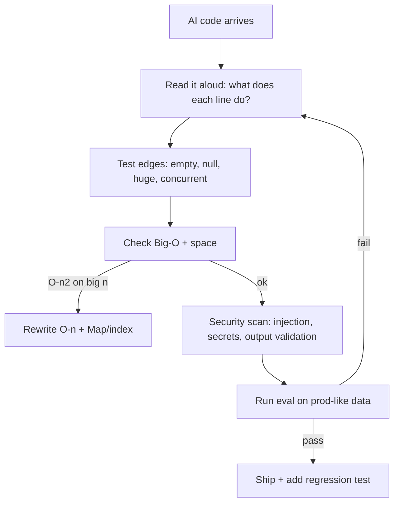
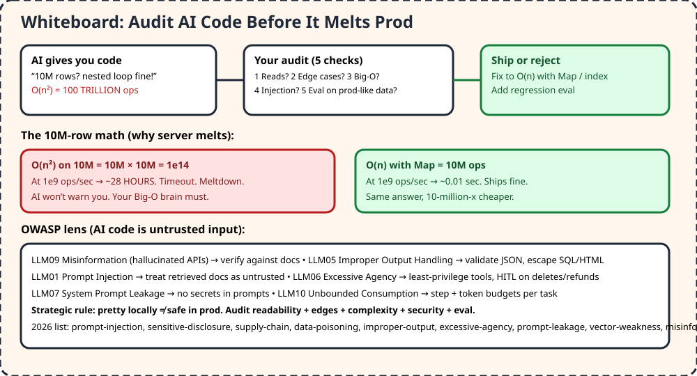

# 03 — Auditing AI Output / Strategic Thinking / Big-O Safety

> AI writes fast but can't feel prod pain. Your superpower is catching the O(n²) that melts a 10M-row server, the invented API, and the injection hiding in docs.

## 1. TL;DR + analogy
- Bouncer analogy: AI code lines up at the club door, you check ID (reads?), pockets (edges?), math (Big-O?), weapons (injection?), and only then let it into prod.
- Video example: AI gives O(n²) for 10M concurrent records, server melts, AI never warns you.

## 2. Why companies care
- New interviews hand you buggy AI-generated files (concurrency + security flaws) and watch you debug live — not memorize syntax.
- LinkedIn stat from video: hires with strategic/architectural skills win. Auditing is that skill.

## 3. Core concepts in simple words
1. **Probabilistic ≠ deterministic.** Same prompt, different output. Trust but verify with evals on prod-like data.
2. **5-check audit:** 1) Can you read it? 2) Edge cases? 3) Big-O? 4) Security (injection/secrets)? 5) Eval passes?
3. **Big-O in 5 hooks:** half→log n, one loop→n, loop-in-loop→n², sort→n log n, every combo→exponential. Drop constants + lower terms.
4. **Space matters:** recursion uses call-stack space; "O(1) space?" only if no hidden arrays.
5. **OWASP 2026 mental model:** misinformation (hallucinates), improper output handling (validate!), prompt injection (docs untrusted), excessive agency (least privilege), prompt leakage (no secrets), unbounded consumption (budgets).
6. **Overreliance is a vuln (LLM09).** Shipping unaudited code = you own the breach.

## 4. Detailed JS examples

### 4.1 The 10M-row meltdown vs fix
```js
// AI's naive version: O(n²) — finds pairs with same email, 10M rows → 1e14 compares
function findDupesNaive(users) {
  const dupes = [];
  for (let i = 0; i < users.length; i++)
    for (let j = i + 1; j < users.length; j++)
      if (users[i].email === users[j].email) dupes.push(users[i]);
  return dupes;
}
// Audit: reads fine, edges ok, but Big-O kills prod. REJECT.

// Fixed: O(n) with Map — 10M ops, ~0.01s
function findDupesFast(users) {
  const seen = new Map(), dupes = [];
  for (const u of users) {
    if (seen.has(u.email)) dupes.push(u);
    else seen.set(u.email, true);
  }
  return dupes;
}
```

### 4.2 Audit harness you can reuse on any AI snippet
```js
function auditAiSnippet({ code, complexity, handlesEdges, validatesOutput }) {
  const issues = [];
  if (complexity === "O(n^2)" ) issues.push("Big-O risk on large n — need O(n) or index");
  if (!handlesEdges) issues.push("Missing edges: empty, null, 10M rows, unicode");
  if (!validatesOutput) issues.push("No output validation — add JSON schema + escape SQL/HTML");
  if (/sk-|BEGIN PRIVATE|password/i.test(code)) issues.push("Secret leaked in code!");
  return issues.length ? { ship: false, issues } : { ship: true };
}
console.log(auditAiSnippet({ code: "const x = 1", complexity: "O(n^2)", handlesEdges: false, validatesOutput: false }));
```

### 4.3 Time it yourself (feel the gap)
```js
const n = 20000, arr = Array.from({ length: n }, (_, i) => i);
// O(n): ~instant. O(n²): watch it crawl even at 20k — imagine 10M.
console.time("O(n)"); let s = 0; for (const x of arr) s += x; console.timeEnd("O(n)");
console.time("O(n^2)"); let c = 0; for (let i = 0; i < arr.length; i++) for (let j = 0; j < arr.length; j++) c++; console.timeEnd("O(n^2)");
```

## 5. Flowchart


## 6. Whiteboard diagram


## 7. Official notes (Firecrawl full-capture)
- OWASP GenAI page: `https://genai.owasp.org/initiatives/top-10-for-llm-and-genai`
  - Raw: `.firecrawl/raw/a3-owasp-official.md` — 359 lines / 20301 bytes, verified via `wc -l -c`
  - 2026 list used: prompt-injection, sensitive-disclosure, supply-chain, data/model-poisoning, improper-output-handling, excessive-agency, system-prompt-leakage, vector/embedding-weaknesses, misinformation, unbounded-consumption
- Big-O bank: `https://github.com/Devinterview-io/big-o-notation-interview-questions`
  - Raw: `.firecrawl/raw/a3-bigo-top30.md` — 1244 lines / 57954 bytes, verified
  - Used: Big-O/Theta/Omega, constants/lower-terms dropped, amortized (dynamic array), binary search, coefficients vs growth
- Free cross-verify (no credit): OWASP Top 10 LLM Applications text (LLM01-LLM10 1.1 + 2025 PDF excerpts), GeeksforGeeks Top-30 Big-O, Shadecoder Big-O cheat sheet hooks

## 8. Cross-verify table
| Claim | OWASP / Big-O source | Second source | Verdict |
|---|---|---|---|
| Never trust LLM output, validate | Yes, improper-output-handling + overreliance | Yes, filter aggressively, HITL | Agree |
| Injection via docs/images, not just typing | Yes, direct + indirect + multimodal | Yes, invisible chars in resume demo | Agree |
| System prompt is not a secret/boundary | Yes, leakage entry | Yes, outranks but bypassable | Agree |
| Big-O drops constants/lower terms | Yes, 3n³+100n²→O(n³) | Yes, CTCI drop constants | Agree |
| O(n²) on 10M melts (28h vs 0.01s) | Math from hooks + array ops | Yes, nested loops = n², trade space/time | Agree |

## 9. Top-50 interview questions — audit + Big-O + debugging
Main banks (all linked, pick your depth):
- Big-O 30: https://github.com/Devinterview-io/big-o-notation-interview-questions
- Big-O 30: https://www.geeksforgeeks.org/dsa/big-o-notation-interview-questions-answers/
- Coding 50 with answers: https://www.byte-by-byte.com/wp-content/uploads/2019/01/50-Coding-Interview-Questions.pdf
- Debugging bank 2026: https://www.tryexponent.com/questions?type=debugging
- Handbook 50 (Blind 75→G attendant): https://www.techinterviewhandbook.org/best-practice-questions

| # | Question | Why asked | Answer link |
|---|---|---|---|
| 1 | What is Big-O? | Worst-case guarantee | [Answer](https://github.com/Devinterview-io/big-o-notation-interview-questions) |
| 2 | Big-O vs Theta vs Omega? | Upper/tight/lower | [Answer](https://github.com/Devinterview-io/big-o-notation-interview-questions) |
| 3 | Constants + lower terms role? | Drop non-dominant | [Answer](https://github.com/Devinterview-io/big-o-notation-interview-questions) |
| 4 | Amortized analysis example? | Dynamic array O(1) avg | [Answer](https://github.com/Devinterview-io/big-o-notation-interview-questions) |
| 5 | Coefficients vs growth? | Small n vs large n | [Answer](https://github.com/Devinterview-io/big-o-notation-interview-questions) |
| 6 | Probabilistic vs deterministic Big-O? | Sampling tradeoffs | [Answer](https://github.com/Devinterview-io/big-o-notation-interview-questions) |
| 7 | Array ops complexity? | Access O(1), search O(n) | [Answer](https://github.com/Devinterview-io/big-o-notation-interview-questions) |
| 8 | What is O(1)? example? | Hash / index | [Answer](https://www.geeksforgeeks.org/dsa/big-o-notation-interview-questions-answers/) |
| 9 | What is O(n)? example? | Single loop | [Answer](https://www.geeksforgeeks.org/dsa/big-o-notation-interview-questions-answers/) |
| 10 | What is O(log n)? | Halving, binary search | [Answer](https://www.geeksforgeeks.org/dsa/big-o-notation-interview-questions-answers/) |
| 11 | What is O(n log n)? | Sorting | [Answer](https://www.geeksforgeeks.org/dsa/big-o-notation-interview-questions-answers/) |
| 12 | What is O(n²)? | Nested loops | [Answer](https://www.geeksforgeeks.org/dsa/big-o-notation-interview-questions-answers/) |
| 13 | Recursion space cost? | Call stack | [Answer](https://www.geeksforgeeks.org/dsa/big-o-notation-interview-questions-answers/) |
| 14 | Trade space for time? | Map/cache vs recompute | [Answer](https://www.geeksforgeeks.org/dsa/big-o-notation-interview-questions-answers/) |
| 15 | Binary search complexity? | O(log n) time, O(1) space | [Answer](https://github.com/Devinterview-io/big-o-notation-interview-questions) |
| 16 | Fibonacci cached complexity? | Memo O(n) | [Answer](https://github.com/Devinterview-io/big-o-notation-interview-questions) |
| 17 | Drop constants example? | 3n+500 → O(n) | [Answer](https://github.com/Devinterview-io/big-o-notation-interview-questions) |
| 18 | Best/worst/avg case? | Linear search demo | [Answer](https://github.com/Devinterview-io/big-o-notation-interview-questions) |
| 19 | Log N runtimes? | BST, heaps | [Answer](https://www.crackingthecodinginterview.com/contents.html) |
| 20 | Amortized time? | Resizing arrays | [Answer](https://www.crackingthecodinginterview.com/contents.html) |
| 21 | Add vs multiply multipart? | Sequential vs nested | [Answer](https://www.crackingthecodinginterview.com/contents.html) |
| 22 | Find duplicates O(n²) vs O(n)? | Brute vs sort vs Set | [Answer](https://github.com/Devinterview-io/data-structures-interview-questions) |
| 23 | Reverse array in place? | O(n) time O(1) space | [Answer](https://github.com/Devinterview-io/data-structures-interview-questions) |
| 24 | Merge arrays complexity? | Two-pointer O(n) | [Answer](https://www.byte-by-byte.com/wp-content/uploads/2019/01/50-Coding-Interview-Questions.pdf) |
| 25 | Matrix search sorted? | Staircase O(n+m) | [Answer](https://www.byte-by-byte.com/wp-content/uploads/2019/01/50-Coding-Interview-Questions.pdf) |
| 26 | Zero-sum subarray? | Prefix Map O(n) | [Answer](https://www.byte-by-byte.com/wp-content/uploads/2019/01/50-Coding-Interview-Questions.pdf) |
| 27 | Consecutive sequence length? | Set O(n) | [Answer](https://www.byte-by-byte.com/wp-content/uploads/2019/01/50-Coding-Interview-Questions.pdf) |
| 28 | Invert binary tree? | DFS O(n) | [Answer](https://www.techinterviewhandbook.org/best-practice-questions) |
| 29 | Validate BST? | Bounds O(n) | [Answer](https://www.techinterviewhandbook.org/best-practice-questions) |
| 30 | Top K frequent? | Heap O(n log k) | [Answer](https://www.techinterviewhandbook.org/best-practice-questions) |
| 31 | Debug AI concurrency bug live? | New interview style | [Answer](https://www.tryexponent.com/questions?type=debugging) |
| 32 | Debug prod-only failure? | Distributional shift | [Answer](https://www.tryexponent.com/questions?type=debugging) |
| 33 | What is prompt injection? | Direct + indirect | [Answer](https://owasp.org/www-project-top-10-for-large-language-model-applications) |
| 34 | Insecure output handling? | Validate outputs | [Answer](https://owasp.org/www-project-top-10-for-large-language-model-applications) |
| 35 | Overreliance risk? | Hallucinated cases/fines | [Answer](https://owasp.org/www-project-top-10-for-large-language-model-applications) |
| 36 | Excessive agency? | Least privilege | [Answer](https://owasp.org/www-project-top-10-for-large-language-model-applications) |
| 37 | System prompt leakage? | No secrets in prompts | [Answer](https://owasp.org/www-project-top-10-for-large-language-model-applications) |
| 38 | Vector/embedding weakness? | RAG poisoning | [Answer](https://owasp.org/www-project-top-10-for-large-language-model-applications) |
| 39 | Unbounded consumption? | Budgets, DoS | [Answer](https://owasp.org/www-project-top-10-for-large-language-model-applications) |
| 40 | Sensitive disclosure? | PII in outputs | [Answer](https://owasp.org/www-project-top-10-for-large-language-model-applications) |
| 41 | Supply chain for LLMs? | Poisoned components | [Answer](https://owasp.org/www-project-top-10-for-large-language-model-applications) |
| 42 | Test non-deterministic code? | Trajectory asserts | [Answer](https://agentswarms.fyi/blog/agentic-ai-interview-questions-2026) |
| 43 | Eval harness for agents? | Golden + judge + CI | [Answer](https://agentswarms.fyi/blog/agentic-ai-interview-questions-2026) |
| 44 | LLM-as-judge biases? | Position/verbosity | [Answer](https://agentswarms.fyi/blog/agentic-ai-interview-questions-2026) |
| 45 | Handle bias via prompting? | Neutral + human review | [Answer](https://sureprompts.com/blog/prompt-engineering-interview-questions) |
| 46 | Structured JSON prompting? | Schema + examples | [Answer](https://sureprompts.com/blog/prompt-engineering-interview-questions) |
| 47 | Debug vague prompt? | Clarify + example | [Answer](https://sureprompts.com/blog/prompt-engineering-interview-questions) |
| 48 | Document/version prompts? | Git + evals | [Answer](https://sureprompts.com/blog/prompt-engineering-interview-questions) |
| 49 | RAG vs fine-tune for facts? | Retrieve vs behavior | [Answer](https://agentswarms.fyi/blog/agentic-ai-interview-questions-2026) |
| 50 | Support agent 10k/day design? | Router + cache + stream | [Answer](https://agentswarms.fyi/blog/agentic-ai-interview-questions-2026) |

## 10. Quiz + checklist
Quiz: 1) O(n²) on 10M = ? 2) First audit step? 3) OWASP overreliance = ? 4) Fix for nested dupes? 5) Why validate outputs?
Checklist: [ ] timed O(n) vs O(n²) [ ] audited 1 AI file with 5 checks [ ] added 1 regression eval
Next: [04 — Architectural Communication](#docs_modern-engineer-skills_04-architectural-communication-hld)
