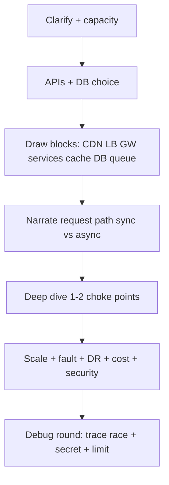
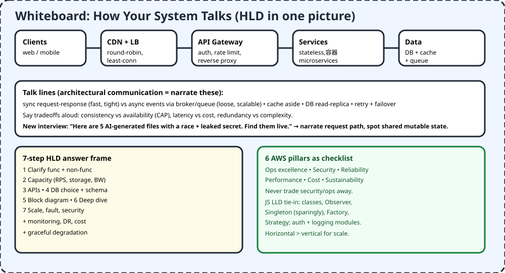

# 04 — Architectural Communication + HLD

> Senior skill = narrate how parts talk. "Client → CDN → LB → gateway → services → cache/DB/queue, async where possible, with failover." If you can draw it and defend tradeoffs, you pass.

## 1. TL;DR + analogy
- City analogy: clients = homes, CDN = local shops, LB = traffic police, gateway = toll gate (auth + rate limit), services = offices, DB/cache/queue = warehouses.
- Video link: AI didn't kill expertise, it moved it up — now you must do HLD + catch AI drift in architecture.

## 2. Why companies care
- Old: reverse linked list. New: "here are 5 AI files with a race condition + leaked key — find live." They watch you navigate the system, not recite syntax.
- LinkedIn 13.3% stat: strategic + communication wins.

## 3. Core concepts in simple words
1. **HLD blocks:** clients, CDN, LB (round-robin / least-conn / IP-hash), API gateway (auth, rate limit, reverse proxy), stateless services/microservices, DB + cache + broker/queue, monitoring, containers.
2. **Sync vs async:** request-response = fast/tight; events via broker = loose/scalable but complex. Say it aloud.
3. **Scaling:** horizontal (more boxes) beats vertical (bigger box) for scale. Redundancy + failover + graceful degradation.
4. **Data:** consistency vs availability (CAP), replication, sharding later in M1, caching strategies, CDN for static.
5. **7-step frame:** clarify → capacity → APIs → DB → block diagram → deep dive → scale/fault/security + monitoring/DR/cost.
6. **AWS 6 pillars:** ops excellence, security, reliability, performance, cost, sustainability. Never trade security/ops.
7. **LLD tie-in (JS):** classes, Observer, Factory, Strategy, Singleton sparingly; auth module; logging for distributed trace; versioning + backward compat.
8. **Debug interview tactic:** trace request path, find shared mutable state (race), missing await/lock, hardcoded secret, no rate limit. Narrate as you go.

## 4. Detailed JS examples

### 4.1 LLD snippet — Strategy + Observer in JS (interview-friendly)
```js
// Strategy: swap pricing rules without if-else soup
const pricing = { regular: (p) => p, premium: (p) => p * 0.9 };
function checkout(price, tier) { return pricing[tier](price); }

// Observer: service emits, monitoring listens — loose coupling like events
import { EventEmitter } from "node:events";
const bus = new EventEmitter();
bus.on("order.created", (o) => console.log("audit", o.id));
bus.emit("order.created", { id: "A1" });
```

### 4.2 Spot the AI race (new interview style)
```js
// AI-generated BUG: shared balance, concurrent refunds race
let balance = 100;
async function refund(amount) {
  if (balance >= amount) {
    await delay(10); // context switch here!
    balance -= amount; // two refunds both pass check → overdraft
  }
}
// FIX you must narrate: serialize with queue/lock or atomic DB decrement
import { Mutex } from "async-mutex";
const m = new Mutex();
async function refundSafe(amount) {
  await m.runExclusive(async () => { if (balance >= amount) balance -= amount; });
}
```

### 4.3 Rate limit + gateway sketch (HLD → code hint)
```js
// Token bucket hint: gateway rejects bursts, services stay alive
const buckets = new Map();
function allow(key, limit = 100, windowMs = 60000) {
  const now = Date.now(), b = buckets.get(key) ?? { n: 0, t: now };
  if (now - b.t > windowMs) { b.n = 0; b.t = now; }
  b.n++; buckets.set(key, b);
  return b.n <= limit;
}
```

## 5. Flowchart


## 6. Whiteboard diagram


## 7. Official notes (Firecrawl full-capture)
- AWS pillars: `https://docs.aws.amazon.com/wellarchitected/latest/framework/the-pillars-of-the-framework.html`
  - Raw: `.firecrawl/raw/a4-aws-pillars-official.md` — 1857 lines / 89865 bytes, verified via `wc -l -c`
  - Used: 6 pillars + tradeoff rule (security/ops not traded), building-like-foundation line
- System Design Top-50: `https://interviewkickstart.com/blogs/interview-questions/system-design-interview-questions`
  - Raw: `.firecrawl/raw/a4-top50-sysdesign.md` — 2742 lines / 97699 bytes, verified
  - Used: Q1-Q50 LLD→HLD progression, LB algorithms, HLD components, EDA, DR, REST, brokers, CDN, scaling
- Free cross-verify: 7-step HLD template (GitHub interview-template), GFG 100 (50 LLD + 50 HLD), getsdeready Top-50 designs

## 8. Cross-verify table
| Claim | AWS / IK official | Second source | Verdict |
|---|---|---|---|
| 6 pillars, don't trade security/ops | Yes, pillar table + tradeoff note | Yes, 6-pillar blogs | Agree |
| HLD blocks = clients,LB,GW,services,DB,cache,CDN,queue,monitor | Yes, Q21 components | Yes, 7-step step 5 | Agree |
| LB algos round-robin/least-conn/IP-hash | Yes, Q25 table | Yes, load impacts security/updates | Agree |
| Sync vs async tradeoffs | Yes, EDA Q34/37 | Yes, coupling/latency/scale | Agree |
| 7-step frame works for most HLD | Template steps 1-7 | Yes, clarify→capacity→API→DB→diagram→dive→scale | Agree |

## 9. Top-50 interview questions — architecture / LLD+HLD
Main bank: https://interviewkickstart.com/blogs/interview-questions/system-design-interview-questions — Q1-Q50 LLD→HLD, verified full capture `.firecrawl/raw/a4-top50-sysdesign.md`.

| # | Question | Why asked | Answer link |
|---|---|---|---|
| 1 | What is LLD? | Component design | [Answer](https://interviewkickstart.com/blogs/interview-questions/system-design-interview-questions) |
| 2 | DB indexing optimizes how? | Query speed | [Answer](https://interviewkickstart.com/blogs/interview-questions/system-design-interview-questions) |
| 3 | Relational schema design? | Keys, relations | [Answer](https://interviewkickstart.com/blogs/interview-questions/system-design-interview-questions) |
| 4 | Concurrency control why? | Races | [Answer](https://interviewkickstart.com/blogs/interview-questions/system-design-interview-questions) |
| 5 | UML behavioral diagrams? | Modeling | [Answer](https://interviewkickstart.com/blogs/interview-questions/system-design-interview-questions) |
| 6 | Sequence diagram login? | Flows | [Answer](https://interviewkickstart.com/blogs/interview-questions/system-design-interview-questions) |
| 7 | State diagram behavior? | States | [Answer](https://interviewkickstart.com/blogs/interview-questions/system-design-interview-questions) |
| 8 | Data structure choice in LLD? | Fit | [Answer](https://interviewkickstart.com/blogs/interview-questions/system-design-interview-questions) |
| 9 | Normalization benefits? | No dupes | [Answer](https://interviewkickstart.com/blogs/interview-questions/system-design-interview-questions) |
| 10 | Logging/monitoring LLD? | Debug | [Answer](https://interviewkickstart.com/blogs/interview-questions/system-design-interview-questions) |
| 11 | What are design patterns? | Reuse | [Answer](https://interviewkickstart.com/blogs/interview-questions/system-design-interview-questions) |
| 12 | Why patterns matter? | Maintainable | [Answer](https://interviewkickstart.com/blogs/interview-questions/system-design-interview-questions) |
| 13 | Singleton uses? | One instance | [Answer](https://interviewkickstart.com/blogs/interview-questions/system-design-interview-questions) |
| 14 | Observer pattern? | Pub/sub | [Answer](https://interviewkickstart.com/blogs/interview-questions/system-design-interview-questions) |
| 15 | Factory pros/cons? | Creation | [Answer](https://interviewkickstart.com/blogs/interview-questions/system-design-interview-questions) |
| 16 | Strategy pattern? | Swap algo | [Answer](https://interviewkickstart.com/blogs/interview-questions/system-design-interview-questions) |
| 17 | Distributed logging? | Correlation | [Answer](https://interviewkickstart.com/blogs/interview-questions/system-design-interview-questions) |
| 18 | DB replication why? | Reliability | [Answer](https://interviewkickstart.com/blogs/interview-questions/system-design-interview-questions) |
| 19 | Versioning + compat? | No breaks | [Answer](https://interviewkickstart.com/blogs/interview-questions/system-design-interview-questions) |
| 20 | Secure auth design? | AuthN/Z | [Answer](https://interviewkickstart.com/blogs/interview-questions/system-design-interview-questions) |
| 21 | HLD key components? | Blocks | [Answer](https://interviewkickstart.com/blogs/interview-questions/system-design-interview-questions) |
| 22 | High availability strategies? | Redundancy | [Answer](https://interviewkickstart.com/blogs/interview-questions/system-design-interview-questions) |
| 23 | Observability how? | Metrics/logs/traces | [Answer](https://interviewkickstart.com/blogs/interview-questions/system-design-interview-questions) |
| 24 | HA in HLD? | Failover | [Answer](https://interviewkickstart.com/blogs/interview-questions/system-design-interview-questions) |
| 25 | Load balancing why? | Distribute | [Answer](https://interviewkickstart.com/blogs/interview-questions/system-design-interview-questions) |
| 26 | Scalable system keys? | Degrade/failover | [Answer](https://interviewkickstart.com/blogs/interview-questions/system-design-interview-questions) |
| 27 | Security in HLD? | Threats | [Answer](https://interviewkickstart.com/blogs/interview-questions/system-design-interview-questions) |
| 28 | Caching why? | Latency | [Answer](https://interviewkickstart.com/blogs/interview-questions/system-design-interview-questions) |
| 29 | API design steps? | Contracts | [Answer](https://interviewkickstart.com/blogs/interview-questions/system-design-interview-questions) |
| 30 | Data consistency? | CAP/Paxos/Raft | [Answer](https://interviewkickstart.com/blogs/interview-questions/system-design-interview-questions) |
| 31 | Benefits of system design? | Scale thinking | [Answer](https://interviewkickstart.com/blogs/interview-questions/system-design-interview-questions) |
| 32 | Fault tolerance why? | Survive | [Answer](https://interviewkickstart.com/blogs/interview-questions/system-design-interview-questions) |
| 33 | Disaster recovery? | Backups | [Answer](https://interviewkickstart.com/blogs/interview-questions/system-design-interview-questions) |
| 34 | EDA what? | Events | [Answer](https://interviewkickstart.com/blogs/interview-questions/system-design-interview-questions) |
| 35 | Fault tolerance role? | Resilience | [Answer](https://interviewkickstart.com/blogs/interview-questions/system-design-interview-questions) |
| 36 | DR testing? | Game days | [Answer](https://interviewkickstart.com/blogs/interview-questions/system-design-interview-questions) |
| 37 | EDA tradeoffs? | Coupling/scale | [Answer](https://interviewkickstart.com/blogs/interview-questions/system-design-interview-questions) |
| 38 | Logging/monitoring HLD? | Centralize | [Answer](https://interviewkickstart.com/blogs/interview-questions/system-design-interview-questions) |
| 39 | Realtime design? | WebSockets | [Answer](https://interviewkickstart.com/blogs/interview-questions/system-design-interview-questions) |
| 40 | REST principles? | Stateless | [Answer](https://interviewkickstart.com/blogs/interview-questions/system-design-interview-questions) |
| 41 | Message broker? | Queue | [Answer](https://interviewkickstart.com/blogs/interview-questions/system-design-interview-questions) |
| 42 | CDN HA + latency? | Edge | [Answer](https://interviewkickstart.com/blogs/interview-questions/system-design-interview-questions) |
| 43 | Fault-tolerant network? | Multi-AZ | [Answer](https://interviewkickstart.com/blogs/interview-questions/system-design-interview-questions) |
| 44 | Containerization role? | Isolate/ship | [Answer](https://interviewkickstart.com/blogs/interview-questions/system-design-interview-questions) |
| 45 | Horizontal vs vertical? | Scale out vs up | [Answer](https://interviewkickstart.com/blogs/interview-questions/system-design-interview-questions) |
| 46 | DB for large scale? | SQL/NoSQL pick | [Answer](https://interviewkickstart.com/blogs/interview-questions/system-design-interview-questions) |
| 47 | Reverse proxy role? | Shield + LB | [Answer](https://interviewkickstart.com/blogs/interview-questions/system-design-interview-questions) |
| 48 | Microservices scale? | Split | [Answer](https://interviewkickstart.com/blogs/interview-questions/system-design-interview-questions) |
| 49 | API gateways? | Single entry | [Answer](https://interviewkickstart.com/blogs/interview-questions/system-design-interview-questions) |
| 50 | Rate limiting? | Token bucket | [Answer](https://interviewkickstart.com/blogs/interview-questions/system-design-interview-questions) |

More banks: https://www.geeksforgeeks.org/system-design/top-10-system-design-interview-questions-and-answers (100: 50 LLD + 50 HLD), https://getsdeready.com/top-50-system-design-interview-questions-2025 (URL shortener→auth), https://www.interviewbit.com/system-design-interview-questions (CAP, Uber, rate limiter)

## 10. Quiz + checklist
Quiz: 1) HLD blocks? 2) LB algos? 3) Sync vs async? 4) 7 steps? 5) Race fix?
Checklist: [ ] drew 1 HLD [ ] narrated tradeoffs [ ] fixed 1 race live
Next: Fresher F1 — [JS + OOP](#docs_fresher-roadmap_f1-js-oop)
