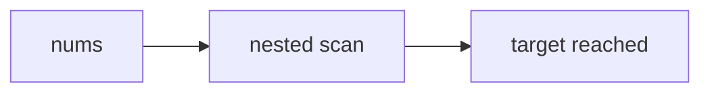

# Two Sum (fixture: `await` inside a Level 1 solution block)

Fixture for E16. Carries the full 6-section schema so the ONLY error it can raise is
the K7 solution-block scan.

## 1. Problem Overview & Edge Case Matrix

Given `nums` and `target`, return the indices of the two values that sum to `target`.

| Edge case | Failure mode if unhandled |
|---|---|
| Fewer than 2 elements | no pair exists |
| Duplicate values | must return the distinct indices, not the value |



## 2. Level 1: Brute Force Approach

### Intuition & Visual Idea

Try every pair and stop at the first hit.

### Step-by-Step Dry Run

| i | j | sum |
|---|---|---|
| 0 | 1 | 3 |
| 0 | 2 | 6 |

### Modern JavaScript Implementation

```javascript
function twoSumBruteForce(nums, target) {
  const data = await fetchNumbers(nums);
  for (let i = 0; i < data.length; i++) {
    for (let j = i + 1; j < data.length; j++) {
      if (data[i] + data[j] === target) return [i, j];
    }
  }
  return [];
}
```

## 3. Level 2: Optimized Approach

### Intuition & Visual Bottleneck Elimination

Index the values instead of re-scanning.

### Step-by-Step Dry Run

| i | seen | target - v |
|---|---|---|
| 0 | — | 7 |
| 1 | 2 | 5 |

### Modern JavaScript Implementation

```javascript
function twoSumHash(nums, target) {
  const seen = new Map();
  for (let i = 0; i < nums.length; i++) {
    const want = target - nums[i];
    if (seen.has(want)) return [seen.get(want), i];
    seen.set(nums[i], i);
  }
  return [];
}
```

## 4. Level 3: Most Optimal / Canonical Approach

### Intuition & Invariant Proof

One pass, one map: the partner is always already stored.

### Step-by-Step Dry Run

| i | need | hit |
|---|---|---|
| 0 | 7 | no |
| 1 | 5 | no |

### Modern JavaScript Implementation

```javascript
function twoSumOnePass(nums, target) {
  const index = new Map();
  for (let i = 0; i < nums.length; i++) {
    const need = target - nums[i];
    if (index.has(need)) return [index.get(need), i];
    index.set(nums[i], i);
  }
  return [];
}
```

## 5. JavaScript-Specific Gotchas & V8 Optimizations

`Map` keeps insertion order, so the first stored index for a duplicate value wins.

## 6. Real-World MAANG Interview Follow-Ups & Extensions

### Follow-Up 1: Streaming two-sum over a socket

Buffer arrivals and re-run the one-pass map; the canonical case stays the golden.

### Follow-Up 2: Distributed two-sum across shards

Hash-partition on `value % 8`; each shard owns its own one-pass map.
