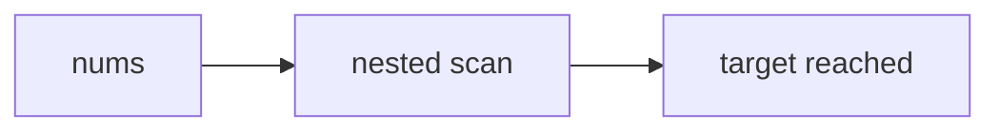

# Two Sum (fixture: three javascript fences but no Level 3 fence)

Fixture for K7's section-scoped half. The file carries three `javascript` fences, so
the old positional `jsBlocks.length < 3` check passes — but the third one lives in
section 5, not inside the `## 4.` heading, so there is no canonical/Level 3
solution block. The ONLY error it can raise is the K7 section-scoped check.

## 1. Problem Overview & Edge Case Matrix

Given `nums` and `target`, return the indices of the two values that sum to `target`.

| Edge case | Failure mode if unhandled |
|---|---|
| Fewer than 2 elements | no pair exists |
| Duplicate values | must return the distinct indices, not the value |



## 2. Level 1: Brute Force Approach

### Intuition & Visual Idea

Try every pair and stop at the first hit.

### Step-by-Step Dry Run

| i | j | sum |
|---|---|---|
| 0 | 1 | 3 |
| 0 | 2 | 6 |

### Modern JavaScript Implementation

```javascript
function twoSumBruteForce(nums, target) {
  for (let i = 0; i < nums.length; i++) {
    for (let j = i + 1; j < nums.length; j++) {
      if (nums[i] + nums[j] === target) return [i, j];
    }
  }
  return [];
}
```

## 3. Level 2: Optimized Approach

### Intuition & Visual Bottleneck Elimination

Index the values instead of re-scanning.

### Step-by-Step Dry Run

| i | seen | target - v |
|---|---|---|
| 0 | — | 7 |
| 1 | 2 | 5 |

### Modern JavaScript Implementation

```javascript
function twoSumHash(nums, target) {
  const seen = new Map();
  for (let i = 0; i < nums.length; i++) {
    const want = target - nums[i];
    if (seen.has(want)) return [seen.get(want), i];
    seen.set(nums[i], i);
  }
  return [];
}
```

## 4. Level 3: Most Optimal / Canonical Approach

### Intuition & Invariant Proof

The one-pass map is the interview answer, but its implementation fence is missing
from this section — the third `javascript` fence of the file sits in section 5.

### Step-by-Step Dry Run

| i | need | hit |
|---|---|---|
| 0 | 7 | no |
| 1 | 5 | no |

## 5. JavaScript-Specific Gotchas & V8 Optimizations

`Map` keeps insertion order, so the first stored index for a duplicate value wins.

```javascript
const reorderHint = 'a map keyed by value preserves insertion order';
```

## 6. Real-World MAANG Interview Follow-Ups & Extensions

### Follow-Up 1: Streaming two-sum over a socket

Buffer arrivals and re-run the one-pass map; the canonical case stays the golden.

### Follow-Up 2: Distributed two-sum across shards

Hash-partition on `value % 8`; each shard owns its own one-pass map.
